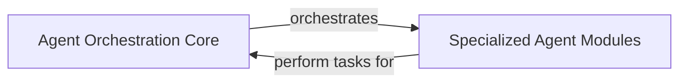

## Component Details

This framework is designed to manage and deploy diverse AI services and agent teams, facilitating task delegation and workflow management to achieve complex goals through orchestrated, specialized agents.

### Agent Orchestration Core

This component serves as the central intelligence and control layer for the entire framework. It is responsible for defining the foundational structures and mechanisms necessary for coordinating multiple AI agents, managing their interactions, delegating tasks, and overseeing complex workflows. It enables the creation and deployment of sophisticated multi-agent systems capable of addressing intricate problems by distributing tasks and synthesizing results from various specialized agents.

**Related Classes/Methods**:

- `agent_teams_orchestration` (1:1)

- <a href="https://github.com/Shubhamsaboo/awesome-llm-apps/blob/master/advanced_ai_agents/multi_agent_apps/ai_Self-Evolving_agent/ai_Self-Evolving_agent.py#L1-L1" target="_blank" rel="noopener noreferrer">`ai_Self-Evolving_agent` (1:1)</a>

- <a href="https://github.com/Shubhamsaboo/awesome-llm-apps/blob/master/advanced_ai_agents/multi_agent_apps/multi_agent_researcher/research_agent.py#L1-L1" target="_blank" rel="noopener noreferrer">`research_agent` (1:1)</a>

### Specialized Agent Modules

This component encompasses the individual, task-specific AI agents that are designed to perform distinct functions or provide specialized services. These modules act as the operational units that the `Agent Orchestration Core` leverages. They are the building blocks, each possessing expertise in a particular domain (e.g., financial analysis, customer support, game playing, legal research), allowing the overall framework to achieve complex goals by combining their capabilities.

**Related Classes/Methods**:

- `single_agent_apps` (1:1)

- `game_playing_agents` (1:1)

- `ai_aqi_analysis_agent` (1:1)

- <a href="https://github.com/Shubhamsaboo/awesome-llm-apps/blob/master/advanced_ai_agents/multi_agent_apps/ai_financial_coach_agent/ai_financial_coach_agent.py#L1-L1" target="_blank" rel="noopener noreferrer">`ai_financial_coach_agent` (1:1)</a>

- <a href="https://github.com/Shubhamsaboo/awesome-llm-apps/blob/master/advanced_ai_agents/multi_agent_apps/ai_mental_wellbeing_agent/ai_mental_wellbeing_agent.py#L1-L1" target="_blank" rel="noopener noreferrer">`ai_mental_wellbeing_agent` (1:1)</a>

- <a href="https://github.com/Shubhamsaboo/awesome-llm-apps/blob/master/advanced_ai_agents/multi_agent_apps/ai_domain_deep_research_agent/ai_domain_deep_research_agent.py#L1-L1" target="_blank" rel="noopener noreferrer">`ai_domain_deep_research_agent` (1:1)</a>

- <a href="https://github.com/Shubhamsaboo/awesome-llm-apps/blob/master/advanced_ai_agents/multi_agent_apps/product_launch_intelligence_agent/product_launch_intelligence_agent.py#L1-L1" target="_blank" rel="noopener noreferrer">`product_launch_intelligence_agent` (1:1)</a>

### [FAQ](https://github.com/CodeBoarding/GeneratedOnBoardings/tree/main?tab=readme-ov-file#faq)