```mermaid

graph LR

    Tarot_Chat_Application["Tarot Chat Application"]

    Document_Based_Chat_Applications["Document-Based Chat Applications"]

    Personalized_Memory_Applications["Personalized Memory Applications"]

    LLM_Interaction_Module["LLM Interaction Module"]

    Memory_Management_Layer["Memory Management Layer"]

    Tarot_Data_Store["Tarot Data Store"]

    External_Data_Connectors["External Data Connectors"]

    User_Interface_Streamlit_["User Interface (Streamlit)"]

    Vector_Database_Qdrant_["Vector Database (Qdrant)"]

    Tarot_Chat_Application -- "uses" --> LLM_Interaction_Module

    Tarot_Chat_Application -- "accesses" --> Tarot_Data_Store

    Tarot_Chat_Application -- "provides" --> User_Interface_Streamlit_

    Document_Based_Chat_Applications -- "uses" --> LLM_Interaction_Module

    Document_Based_Chat_Applications -- "accesses" --> External_Data_Connectors

    Document_Based_Chat_Applications -- "utilizes" --> Vector_Database_Qdrant_

    Document_Based_Chat_Applications -- "provides" --> User_Interface_Streamlit_

    Personalized_Memory_Applications -- "uses" --> LLM_Interaction_Module

    Personalized_Memory_Applications -- "manages" --> Memory_Management_Layer

    Personalized_Memory_Applications -- "provides" --> User_Interface_Streamlit_

    LLM_Interaction_Module -- "is used by" --> Tarot_Chat_Application

    LLM_Interaction_Module -- "is used by" --> Document_Based_Chat_Applications

    LLM_Interaction_Module -- "is used by" --> Personalized_Memory_Applications

    Memory_Management_Layer -- "is managed by" --> Personalized_Memory_Applications

    Memory_Management_Layer -- "stores data in" --> Vector_Database_Qdrant_

    Tarot_Data_Store -- "is accessed by" --> Tarot_Chat_Application

    External_Data_Connectors -- "are accessed by" --> Document_Based_Chat_Applications

    User_Interface_Streamlit_ -- "interacts with" --> Tarot_Chat_Application

    User_Interface_Streamlit_ -- "interacts with" --> Document_Based_Chat_Applications

    User_Interface_Streamlit_ -- "interacts with" --> Personalized_Memory_Applications

    Vector_Database_Qdrant_ -- "is used by" --> Memory_Management_Layer

    Vector_Database_Qdrant_ -- "is used by" --> Document_Based_Chat_Applications

```

## Component Details

The "Conversational LLM Applications" suite is designed to showcase diverse interactive LLM capabilities, including personalized memory, direct document interaction, and structured data integration. This overview details the core components, their responsibilities, and their interactions within this suite.

### Tarot Chat Application

An interactive Streamlit application providing personalized tarot card readings. It loads card meanings from a structured dataset, simulates card draws (including reversed cards), and uses an LLM to interpret the spread based on user context and card symbolism.

**Related Classes/Methods**:

- <a href="https://github.com/Shubhamsaboo/awesome-llm-apps/blob/master/mcp_ai_agents/browser_mcp_agent/main.py#L1-L1" target="_blank" rel="noopener noreferrer">`main` (1:1)</a>

- `st.session_state` (1:1)

- `load_tarot_data` (1:1)

- `get_tarot_card_image` (1:1)

- `get_llm_response` (1:1)

### Document-Based Chat Applications

A suite of applications enabling conversational interaction with various external data sources like GitHub, Gmail, PDF documents, research papers (Arxiv), Substack articles, and YouTube videos. These applications typically implement a Retrieval Augmented Generation (RAG) pattern, retrieving relevant information from the source and using an LLM to answer user queries based on that content.

**Related Classes/Methods**:

- `get_pdf_text` (1:1)

- `get_text_chunks` (1:1)

- `get_vectorstore` (1:1)

- `get_conversation_chain` (1:1)

- `handle_userinput` (1:1)

- <a href="https://github.com/Shubhamsaboo/awesome-llm-apps/blob/master/advanced_llm_apps/chat_with_X_tutorials/chat_with_github/chat_github.py#L1-L1" target="_blank" rel="noopener noreferrer">`advanced_llm_apps/chat_with_X_tutorials/chat_with_github/chat_github.py` (1:1)</a>

### Personalized Memory Applications

Applications focused on demonstrating and implementing personalized conversational memory. They utilize a dedicated memory layer (e.g., `mem0` integrated with a vector store like Qdrant) to store and retrieve past interactions, allowing the LLM to maintain context and provide more personalized responses over time.

**Related Classes/Methods**:

- `Mem0Client` (1:1)

- `st.session_state` (1:1)

- `st.chat_message` (1:1)

### LLM Interaction Module

This foundational component encapsulates the logic for interacting with various Large Language Models. It handles model initialization, prompt construction, sending requests to the LLM API (e.g., OpenAI, Ollama), and processing the LLM's responses. It acts as an abstraction layer for different LLM providers.

**Related Classes/Methods**:

- `get_llm_response` (1:1)

- `get_conversation_chain` (1:1)

- `Mem0Client` (1:1)

### Memory Management Layer

This component is responsible for the persistence and retrieval of conversational history and user-specific data, enabling personalized and stateful interactions. It typically integrates with a vector database (like Qdrant) for efficient semantic search of past memories.

**Related Classes/Methods**:

- `Mem0Client` (1:1)

### Tarot Data Store

A specific data component holding the structured information about tarot cards, including their meanings (upright and reversed) and symbolism. It serves as the knowledge base for the Tarot Chat Application.

**Related Classes/Methods**: _None_

### External Data Connectors

This component represents the various mechanisms and APIs used to connect to and retrieve data from external sources for the "Chat with X" applications. This includes libraries for interacting with GitHub, Gmail, PDF parsers, Arxiv APIs, etc.

**Related Classes/Methods**:

### User Interface (Streamlit)

The front-end component responsible for presenting the application to the user, capturing user input (questions, context), and displaying LLM-generated responses and other relevant information (e.g., drawn tarot cards). Streamlit is the primary framework used for these interactive UIs.

**Related Classes/Methods**:

- <a href="https://github.com/Shubhamsaboo/awesome-llm-apps/blob/master/rag_tutorials/agentic_rag_math_agent/app/streamlit.py#L1-L1" target="_blank" rel="noopener noreferrer">`streamlit.set_page_config` (1:1)</a>

- <a href="https://github.com/Shubhamsaboo/awesome-llm-apps/blob/master/rag_tutorials/agentic_rag_math_agent/app/streamlit.py#L1-L1" target="_blank" rel="noopener noreferrer">`streamlit.title` (1:1)</a>

- <a href="https://github.com/Shubhamsaboo/awesome-llm-apps/blob/master/rag_tutorials/agentic_rag_math_agent/app/streamlit.py#L1-L1" target="_blank" rel="noopener noreferrer">`streamlit.sidebar` (1:1)</a>

- <a href="https://github.com/Shubhamsaboo/awesome-llm-apps/blob/master/rag_tutorials/agentic_rag_math_agent/app/streamlit.py#L1-L1" target="_blank" rel="noopener noreferrer">`streamlit.chat_message` (1:1)</a>

- <a href="https://github.com/Shubhamsaboo/awesome-llm-apps/blob/master/rag_tutorials/agentic_rag_math_agent/app/streamlit.py#L1-L1" target="_blank" rel="noopener noreferrer">`streamlit.chat_input` (1:1)</a>

- <a href="https://github.com/Shubhamsaboo/awesome-llm-apps/blob/master/rag_tutorials/agentic_rag_math_agent/app/streamlit.py#L1-L1" target="_blank" rel="noopener noreferrer">`streamlit.button` (1:1)</a>

- <a href="https://github.com/Shubhamsaboo/awesome-llm-apps/blob/master/rag_tutorials/agentic_rag_math_agent/app/streamlit.py#L1-L1" target="_blank" rel="noopener noreferrer">`streamlit.image` (1:1)</a>

- <a href="https://github.com/Shubhamsaboo/awesome-llm-apps/blob/master/rag_tutorials/agentic_rag_math_agent/app/streamlit.py#L1-L1" target="_blank" rel="noopener noreferrer">`streamlit.write` (1:1)</a>

- <a href="https://github.com/Shubhamsaboo/awesome-llm-apps/blob/master/rag_tutorials/agentic_rag_math_agent/app/streamlit.py#L1-L1" target="_blank" rel="noopener noreferrer">`streamlit` (1:1)</a>

- <a href="https://github.com/Shubhamsaboo/awesome-llm-apps/blob/master/rag_tutorials/agentic_rag_math_agent/app/streamlit.py#L1-L1" target="_blank" rel="noopener noreferrer">`streamlit` (1:1)</a>

- <a href="https://github.com/Shubhamsaboo/awesome-llm-apps/blob/master/rag_tutorials/agentic_rag_math_agent/app/streamlit.py#L1-L1" target="_blank" rel="noopener noreferrer">`streamlit` (1:1)</a>

### Vector Database (Qdrant)

A vector database, specifically Qdrant, used for efficient semantic search and storage of conversational memories and document embeddings.

**Related Classes/Methods**:

### [FAQ](https://github.com/CodeBoarding/GeneratedOnBoardings/tree/main?tab=readme-ov-file#faq)