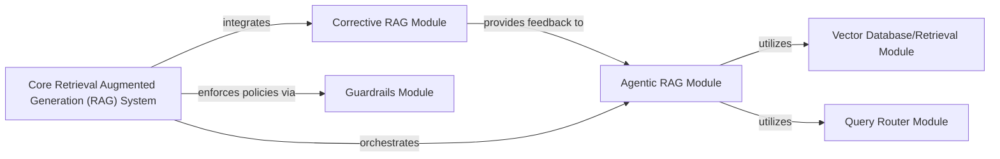

## Component Details

The Core Retrieval Augmented Generation (RAG) System is designed to enhance Language Model capabilities by providing up-to-date and contextually relevant information, thereby reducing hallucinations and enabling more accurate responses. This system integrates several key modules to achieve its purpose: intelligent retrieval (Agentic RAG, Vector Database, Query Router), quality assurance (Corrective RAG), and responsible AI (Guardrails). They form a robust and adaptive system for augmenting LLM capabilities.

### Agentic RAG Module

This module implements agent-like behavior within the RAG system, enabling dynamic and intelligent interaction with the knowledge base and the LLM. It is responsible for planning retrieval strategies, utilizing tools to interact with different data sources, and reasoning about the retrieved information while maintaining conversational context. This module is crucial for "history-aware retrieval" as agents can adapt their retrieval strategy based on past interactions.

**Related Classes/Methods**:

- <a href="https://github.com/Shubhamsaboo/awesome-llm-apps/blob/master/rag_tutorials/agentic_rag/rag_agent.py#L0-L0" target="_blank" rel="noopener noreferrer">`rag_agent` (0:0)</a>

### Corrective RAG Module

This module focuses on self-correction mechanisms within the RAG pipeline. It evaluates the initial retrieved information and the generated response, identifies potential inaccuracies or irrelevancies, and then iteratively refines the retrieval or generation process to correct these issues. This could involve re-querying the knowledge base, re-ranking documents, or adjusting the prompt to the LLM based on feedback.

**Related Classes/Methods**:

- <a href="https://github.com/Shubhamsaboo/awesome-llm-apps/blob/master/rag_tutorials/corrective_rag/corrective_rag.py#L0-L0" target="_blank" rel="noopener noreferrer">`corrective_rag` (0:0)</a>

### Vector Database/Retrieval Module

This foundational module is responsible for storing and efficiently retrieving relevant documents or chunks of information from the knowledge base. It typically involves creating vector embeddings of the text and using similarity search algorithms to find the most pertinent information based on a given query.

**Related Classes/Methods**:

- <a href="https://github.com/Shubhamsaboo/awesome-llm-apps/blob/master/rag_tutorials/agentic_rag_math_agent/rag/vector.py#L0-L0" target="_blank" rel="noopener noreferrer">`vector` (0:0)</a>

### Query Router Module

This module intelligently directs incoming queries to the most appropriate retrieval mechanism or knowledge base. In a complex RAG system with multiple data sources or retrieval strategies (e.g., different vector stores, traditional databases), a query router ensures that the correct information source is queried, optimizing retrieval efficiency and relevance.

**Related Classes/Methods**:

- <a href="https://github.com/Shubhamsaboo/awesome-llm-apps/blob/master/rag_tutorials/agentic_rag_math_agent/rag/query_router.py#L0-L0" target="_blank" rel="noopener noreferrer">`query_router` (0:0)</a>

### Guardrails Module

This module is responsible for ensuring that the RAG system operates within defined boundaries, preventing the generation of harmful, biased, or irrelevant content. It acts as a safety layer, filtering outputs and potentially guiding the retrieval and generation process to adhere to specific guidelines.

**Related Classes/Methods**:

- <a href="https://github.com/Shubhamsaboo/awesome-llm-apps/blob/master/rag_tutorials/agentic_rag_math_agent/rag/guardrails.py#L0-L0" target="_blank" rel="noopener noreferrer">`guardrails` (0:0)</a>

### Core Retrieval Augmented Generation (RAG) System

The Core Retrieval Augmented Generation (RAG) System is designed to enhance Language Model capabilities by providing up-to-date and contextually relevant information, thereby reducing hallucinations and enabling more accurate responses.

**Related Classes/Methods**: _None_

### [FAQ](https://github.com/CodeBoarding/GeneratedOnBoardings/tree/main?tab=readme-ov-file#faq)