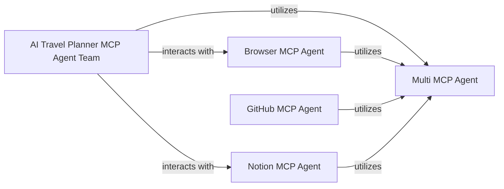

## Component Details

The "Multi-Component Platform (MCP) Agent Applications" subsystem is a collection of specialized AI agents designed to perform complex, multi-step tasks by leveraging a modular and collaborative framework. The core idea is to enable different agents to work together, often interacting with external services or platforms.

### Multi MCP Agent

This component serves as the foundational or generic multi-component agent. It likely provides the core framework and utilities for building other MCP agents, handling inter-agent communication, and managing the lifecycle of a multi-agent system. It acts as a base for specialized agents to build upon.

**Related Classes/Methods**:

- <a href="https://github.com/Shubhamsaboo/awesome-llm-apps/blob/master/mcp_ai_agents/multi_mcp_agent/multi_mcp_agent.py#L1-L1" target="_blank" rel="noopener noreferrer">`mcp_ai_agents/multi_mcp_agent/multi_mcp_agent.py` (1:1)</a>

### AI Travel Planner MCP Agent Team

This component represents a collaborative team of agents specifically designed for travel planning. It orchestrates various sub-agents (e.g., for itinerary generation, booking, and calendar management) to provide a comprehensive travel planning solution.

**Related Classes/Methods**:

- <a href="https://github.com/Shubhamsaboo/awesome-llm-apps/blob/master/mcp_ai_agents/ai_travel_planner_mcp_agent_team/app.py#L1-L1" target="_blank" rel="noopener noreferrer">`mcp_ai_agents/ai_travel_planner_mcp_agent_team/app.py` (1:1)</a>

- <a href="https://github.com/Shubhamsaboo/awesome-llm-apps/blob/master/mcp_ai_agents/ai_travel_planner_mcp_agent_team/calendar_mcp.py#L1-L1" target="_blank" rel="noopener noreferrer">`mcp_ai_agents/ai_travel_planner_mcp_agent_team/calendar_mcp.py` (1:1)</a>

### Browser MCP Agent

This component is an MCP agent specialized in interacting with web browsers. Its primary responsibility is to automate web navigation, extract data from web pages, and interact with web elements, enabling other agents to perform tasks that require web access.

**Related Classes/Methods**:

- <a href="https://github.com/Shubhamsaboo/awesome-llm-apps/blob/master/mcp_ai_agents/browser_mcp_agent/main.py#L1-L1" target="_blank" rel="noopener noreferrer">`mcp_ai_agents/browser_mcp_agent/main.py` (1:1)</a>

### GitHub MCP Agent

This component is an MCP agent focused on interacting with the GitHub platform. It can automate tasks related to repository management, issue tracking, code review, and other GitHub-specific operations.

**Related Classes/Methods**:

- <a href="https://github.com/Shubhamsaboo/awesome-llm-apps/blob/master/mcp_ai_agents/github_mcp_agent/github_agent.py#L1-L1" target="_blank" rel="noopener noreferrer">`mcp_ai_agents/github_mcp_agent/github_agent.py` (1:1)</a>

### Notion MCP Agent

This component is an MCP agent designed to interact with Notion, a popular workspace tool. It can automate tasks such as creating and updating pages, managing databases, and interacting with Notion content, facilitating organizational and productivity workflows.

**Related Classes/Methods**:

- <a href="https://github.com/Shubhamsaboo/awesome-llm-apps/blob/master/mcp_ai_agents/notion_mcp_agent/notion_mcp_agent.py#L1-L1" target="_blank" rel="noopener noreferrer">`mcp_ai_agents/notion_mcp_agent/notion_mcp_agent.py` (1:1)</a>

### [FAQ](https://github.com/CodeBoarding/GeneratedOnBoardings/tree/main?tab=readme-ov-file#faq)