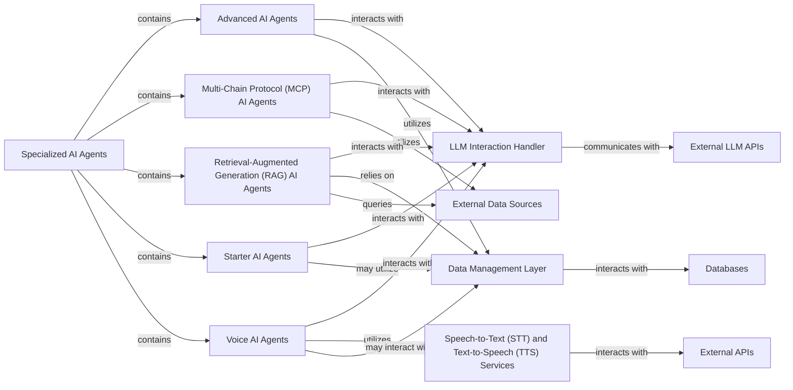

## Component Details

The `Specialized AI Agents` component serves as an umbrella for various AI agents tailored for specific, complex tasks. These agents are designed to be highly focused, often integrating with external tools and APIs to extend their capabilities. The fundamental nature of this component lies in its modularity and specialization, allowing for the development of AI solutions that precisely address distinct problem domains, from advanced research to multimodal interactions and voice-enabled services.

### Specialized AI Agents

The `Specialized AI Agents` component serves as an umbrella for various AI agents tailored for specific, complex tasks. These agents are designed to be highly focused, often integrating with external tools and APIs to extend their capabilities. The fundamental nature of this component lies in its modularity and specialization, allowing for the development of AI solutions that precisely address distinct problem domains, from advanced research to multimodal interactions and voice-enabled services.

**Related Classes/Methods**: _None_

### Advanced AI Agents

These agents are designed for highly complex tasks, often involving multi-agent collaboration, intricate problem-solving, or autonomous decision-making. They represent the pinnacle of agent sophistication within the system.

**Related Classes/Methods**:

- <a href="https://github.com/Shubhamsaboo/awesome-llm-apps/blob/master/advanced_ai_agents/multi_agent_apps/agent_teams/ai_finance_agent_team/finance_agent_team.py#L0-L0" target="_blank" rel="noopener noreferrer">`advanced_ai_agents.multi_agent_apps.agent_teams.ai_finance_agent_team.finance_agent_team` (0:0)</a>

### Multi-Chain Protocol (MCP) AI Agents

These agents specialize in interacting with external platforms and protocols (e.g., web browsers, GitHub, Notion, calendars). Their primary role is to automate actions and retrieve information from these external services, bridging the gap between AI capabilities and external digital environments.

**Related Classes/Methods**:

- <a href="https://github.com/Shubhamsaboo/awesome-llm-apps/blob/master/mcp_ai_agents/browser_mcp_agent/main.py#L0-L0" target="_blank" rel="noopener noreferrer">`mcp_ai_agents.browser_mcp_agent.main` (0:0)</a>

### Retrieval-Augmented Generation (RAG) AI Agents

These agents enhance the responses of Large Language Models (LLMs) by retrieving relevant information from various data sources (e.g., vector databases, traditional databases, web content). They are crucial for providing accurate, up-to-date, and contextually rich information.

**Related Classes/Methods**:

- <a href="https://github.com/Shubhamsaboo/awesome-llm-apps/blob/master/rag_tutorials/agentic_rag/rag_agent.py#L0-L0" target="_blank" rel="noopener noreferrer">`rag_tutorials.agentic_rag.rag_agent` (0:0)</a>

### Starter AI Agents

These are foundational or introductory AI agents designed for common, well-defined tasks. They serve as practical examples and starting points for understanding basic agent functionalities, such as data analysis, content generation, and simple research.

**Related Classes/Methods**:

- `starter_ai_agents.ai_data_analysis_agent.ai_data_analysis_agent` (0:0)

### Voice AI Agents

These agents integrate voice input and output capabilities, enabling natural language interactions. They are designed for applications requiring spoken communication, such as audio tours or customer support.

**Related Classes/Methods**:

- <a href="https://github.com/Shubhamsaboo/awesome-llm-apps/blob/master/voice_ai_agents/customer_support_voice_agent/customer_support_voice_agent.py#L0-L0" target="_blank" rel="noopener noreferrer">`voice_ai_agents.customer_support_voice_agent.customer_support_voice_agent` (0:0)</a>

### LLM Interaction Handler

This component is responsible for managing all interactions with Large Language Models, including prompt engineering, model invocation, and parsing the responses. It acts as an abstraction layer for various LLM providers.

**Related Classes/Methods**: _None_

### Data Management Layer

This layer handles data storage, retrieval, and persistence for various components. It includes functionalities for interacting with vector stores, traditional databases, and managing configuration data.

**Related Classes/Methods**: _None_

### External Data Sources

This represents various external data providers such as web APIs, public datasets, or internal document repositories that agents can query for information.

**Related Classes/Methods**: _None_

### Speech-to-Text (STT) and Text-to-Speech (TTS) Services

These are external services that convert spoken language into text and text into spoken language, respectively.

**Related Classes/Methods**: _None_

### External LLM APIs

External Large Language Model APIs.

**Related Classes/Methods**: _None_

### Databases

Various database systems (e.g., vector databases, relational databases).

**Related Classes/Methods**: _None_

### External APIs

External APIs for Speech-to-Text and Text-to-Speech services.

**Related Classes/Methods**: _None_

### [FAQ](https://github.com/CodeBoarding/GeneratedOnBoardings/tree/main?tab=readme-ov-file#faq)