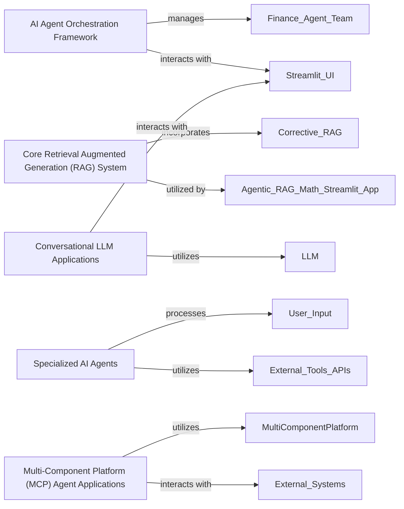

## Component Details

The `awesome-llm-apps` project demonstrates a diverse range of AI agent and LLM application architectures. These five components are fundamental because they collectively represent the core architectural patterns and key capabilities demonstrated within the `awesome-llm-apps` project: agent orchestration, advanced knowledge grounding (RAG), diverse user-facing LLM applications, specialized task-oriented agents, and a specific modular agent design framework (MCP).

### AI Agent Orchestration Framework

This component provides a meta-agent framework for managing and deploying various AI services or agent teams. It handles task delegation and workflow management, orchestrating specialized agents to achieve complex goals. It represents the project's capability to build and manage sophisticated multi-agent systems.

**Related Classes/Methods**:

- `unknown` (0:0)

- `unknown` (0:0)

### Core Retrieval Augmented Generation (RAG) System

This component implements advanced Retrieval Augmented Generation (RAG) techniques, including history-aware retrieval and self-correction mechanisms. Its purpose is to intelligently retrieve information from a knowledge base and augment LLM responses, thereby improving accuracy and relevance.

**Related Classes/Methods**:

- `unknown` (0:0)

- `unknown` (0:0)

### Conversational LLM Applications

This suite comprises interactive applications demonstrating various conversational LLM capabilities. These include personalized memory for continuous context, direct interaction with document content (e.g., PDFs), and integration with structured data (e.g., Tarot card meanings) to provide dynamic and engaging user experiences.

**Related Classes/Methods**:

- `unknown` (0:0)

- `unknown` (0:0)

- `unknown` (0:0)

### Specialized AI Agents

This category encompasses individual AI agents designed for specific, focused tasks. Examples include agents for in-depth web research, processing multimodal inputs (such as text and images), and providing voice-enabled customer support. These agents often integrate with external tools or APIs to extend their capabilities.

**Related Classes/Methods**:

- `unknown` (0:0)

- `unknown` (0:0)

- `unknown` (0:0)

### Multi-Component Platform (MCP) Agent Applications

These applications are built upon a Multi-Component Platform (MCP) framework, which facilitates the creation of collaborative agent teams (e.g., for travel planning) and enables automated interactions with web browsers. This architecture is designed for complex, multi-step tasks requiring modularity and inter-component communication.

**Related Classes/Methods**:

- `unknown` (0:0)

- `unknown` (0:0)

### [FAQ](https://github.com/CodeBoarding/GeneratedOnBoardings/tree/main?tab=readme-ov-file#faq)