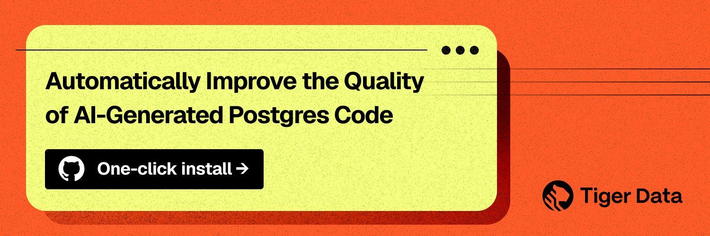
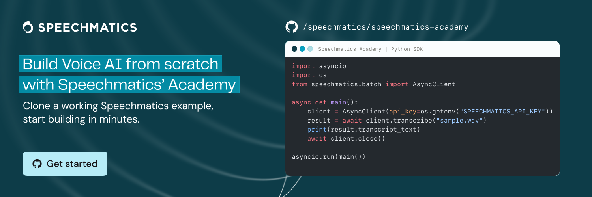
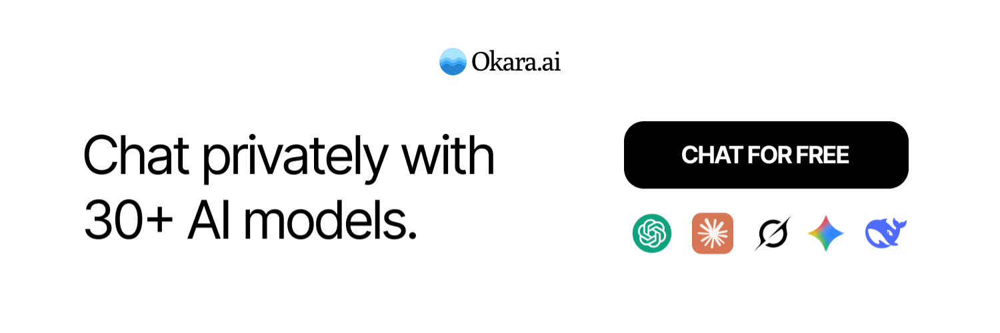
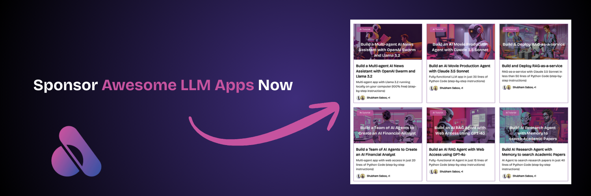

<p align="center">
  <a href="http://www.theunwindai.com">
    
  </a>
</p>

<p align="center">
  <a href="https://www.linkedin.com/in/shubhamsaboo/">
    
  </a>
  <a href="https://twitter.com/Saboo_Shubham_">
    
  </a>
</p>

<p align="center">
  <!-- Keep these links. Translations will automatically update with the README. -->
  <a href="https://www.readme-i18n.com/Shubhamsaboo/awesome-llm-apps?lang=de">Deutsch</a> | 
  <a href="https://www.readme-i18n.com/Shubhamsaboo/awesome-llm-apps?lang=es">Español</a> | 
  <a href="https://www.readme-i18n.com/Shubhamsaboo/awesome-llm-apps?lang=fr">français</a> | 
  <a href="https://www.readme-i18n.com/Shubhamsaboo/awesome-llm-apps?lang=ja">日本語</a> | 
  <a href="https://www.readme-i18n.com/Shubhamsaboo/awesome-llm-apps?lang=ko">한국어</a> | 
  <a href="https://www.readme-i18n.com/Shubhamsaboo/awesome-llm-apps?lang=pt">Português</a> | 
  <a href="https://www.readme-i18n.com/Shubhamsaboo/awesome-llm-apps?lang=ru">Русский</a> | 
  <a href="https://www.readme-i18n.com/Shubhamsaboo/awesome-llm-apps?lang=zh">中文</a>
</p>

<hr/>

# 🌟 Awesome LLM Apps

A curated collection of **Awesome LLM apps built with RAG, AI Agents, Multi-agent Teams, MCP, Voice Agents, and more.** This repository features LLM apps that use models from **OpenAI** , **Anthropic**, **Google**, **xAI** and open-source models like **Qwen** or  **Llama** that you can run locally on your computer.

<p align="center">
  <a href="https://trendshift.io/repositories/9876" target="_blank">
    
  </a>
</p>

## 🤔 Why Awesome LLM Apps?

- 💡 Discover practical and creative ways LLMs can be applied across different domains, from code repositories to email inboxes and more.
- 🔥 Explore apps that combine LLMs from OpenAI, Anthropic, Gemini, and open-source alternatives with AI Agents, Agent Teams, MCP & RAG.
- 🎓 Learn from well-documented projects and contribute to the growing open-source ecosystem of LLM-powered applications.

## 📊 App Complexity Guide

Each app is tagged with a complexity level to help you choose appropriate starting points:

| Level | Badge | Setup Time | Description |
|-------|-------|------------|-------------|
| **Beginner** | 🟢 | 5-15 min | Simple setup, single API key, minimal dependencies. Great for first-time users. |
| **Intermediate** | 🟡 | 15-30 min | Multiple components, 2-3 API keys, some configuration required. |
| **Advanced** | 🔴 | 30-60+ min | Complex architecture, multiple services, significant setup and configuration. |

<details>
<summary><strong>📋 Prerequisites by Level</strong></summary>

### 🟢 Beginner Prerequisites
- Basic Python knowledge
- Familiarity with pip and virtual environments
- One API key (OpenAI, Anthropic, or Google)
- Basic command line usage

### 🟡 Intermediate Prerequisites
- Everything in Beginner, plus:
- Understanding of RAG concepts
- Experience with Streamlit or similar frameworks
- Multiple API accounts (LLM + search/tools)
- Basic understanding of embeddings and vector stores

### 🔴 Advanced Prerequisites
- Everything in Intermediate, plus:
- Multi-agent system concepts
- Database setup (SQLite, PostgreSQL, etc.)
- Understanding of async programming
- Experience with Docker (for some apps)
- Knowledge of MCP (Model Context Protocol) for MCP apps

</details>

## 🙏 Thanks to our sponsors

<table align="center" cellpadding="16" cellspacing="12">
  <tr>
    <td align="center">
      <a href="https://tsdb.co/shubham-gh" target="_blank" rel="noopener" title="Tiger Data">
        
      </a>
      <br>
      <a href="https://tsdb.co/shubham-gh" target="_blank" rel="noopener" style="text-decoration: none; color: #333; font-weight: bold; font-size: 18px;">
        Tiger Data MCP
      </a>
    </td>
    <td align="center">
      <a href="https://github.com/speechmatics/speechmatics-academy" target="_blank" rel="noopener" title="Speechmatics">
        
      </a>
      <br>
      <a href="https://github.com/speechmatics/speechmatics-academy" target="_blank" rel="noopener" style="text-decoration: none; color: #333; font-weight: bold; font-size: 18px;">
        Speechmatics
      </a>
    </td>
  </tr>
  <tr>
    <td align="center">
      <a href="https://okara.ai/?utm_source=oss&utm_medium=sponsorship&utm_campaign=awesome-llm-apps" title="Okara">
        
      </a>
      <br>
      <a href="https://okara.ai/?utm_source=oss&utm_medium=sponsorship&utm_campaign=awesome-llm-apps" style="text-decoration: none; color: #333; font-weight: bold; font-size: 18px;">
        Okara AI
      </a>
    </td>
    <td align="center">
      <a href="https://sponsorunwindai.com/" title="Become a Sponsor">
        
      </a>
      <br>
      <a href="https://sponsorunwindai.com/" style="text-decoration: none; color: #333; font-weight: bold; font-size: 18px;">
        Become a Sponsor
      </a>
    </td>
  </tr>
</table>

## 📂 Featured AI Projects

### 🎯 Apps by Use Case

Looking for an app for a specific purpose? Browse by use case to find the right solution:

<details>
<summary><strong>💼 Business & Sales</strong> - Automate sales, marketing, and business operations</summary>

**Best for:** Sales teams, marketers, entrepreneurs, and business owners who want to automate lead generation, competitive analysis, customer outreach, and go-to-market strategies. These apps help scale business operations without scaling headcount.

| App | Level | Description |
|-----|-------|-------------|
| [AI Sales Intelligence Agent Team](advanced_ai_agents/multi_agent_apps/agent_teams/ai_sales_intelligence_agent_team) | 🔴 | Multi-agent team for sales research and outreach |
| [AI Email GTM Outreach Agent](advanced_ai_agents/multi_agent_apps/ai_email_gtm_outreach_agent/) | 🔴 | Automate go-to-market email campaigns |
| [AI Competitor Intelligence Agent Team](advanced_ai_agents/multi_agent_apps/agent_teams/ai_competitor_intelligence_agent_team/) | 🔴 | Research and analyze competitors |
| [AI Customer Support Agent](advanced_ai_agents/single_agent_apps/ai_customer_support_agent/) | 🟡 | Handle customer inquiries automatically |
| [Customer Support Voice Agent](voice_ai_agents/customer_support_voice_agent/) | 🟡 | Voice-based customer support |
| [AI Recruitment Agent Team](advanced_ai_agents/multi_agent_apps/agent_teams/ai_recruitment_agent_team/) | 🔴 | Streamline hiring processes |
| [AI Services Agency](advanced_ai_agents/multi_agent_apps/agent_teams/ai_services_agency/) | 🔴 | Multi-agent service delivery |
| [AI SEO Audit Team](advanced_ai_agents/multi_agent_apps/agent_teams/ai_seo_audit_team/) | 🔴 | Analyze and improve SEO |
| [AI Product Launch Intelligence](advanced_ai_agents/multi_agent_apps/product_launch_intelligence_agent) | 🟡 | Research for product launches |

</details>

<details>
<summary><strong>💰 Finance & Investment</strong> - Financial analysis, investing, and personal finance</summary>

**Best for:** Investors, financial advisors, fintech developers, and individuals managing personal finances. These apps analyze markets, evaluate investments, provide financial coaching, and help with due diligence on startups or insurance decisions.

| App | Level | Description |
|-----|-------|-------------|
| [AI Investment Agent](advanced_ai_agents/single_agent_apps/ai_investment_agent/) | 🟡 | Investment research and analysis |
| [AI Finance Agent Team](advanced_ai_agents/multi_agent_apps/agent_teams/ai_finance_agent_team/) | 🔴 | Comprehensive financial analysis |
| [AI Financial Coach Agent](advanced_ai_agents/multi_agent_apps/ai_financial_coach_agent/) | 🟡 | Personal financial guidance |
| [AI Personal Finance Agent](advanced_ai_agents/single_agent_apps/ai_personal_finance_agent/) | 🟡 | Manage personal finances |
| [xAI Finance Agent](starter_ai_agents/xai_finance_agent/) | 🟢 | Finance agent using xAI |
| [AI VC Due Diligence Agent Team](advanced_ai_agents/multi_agent_apps/agent_teams/ai_vc_due_diligence_agent_team) | 🔴 | Startup evaluation for VCs |
| [AI Life Insurance Advisor](starter_ai_agents/ai_life_insurance_advisor_agent/) | 🟢 | Insurance planning assistance |

</details>

<details>
<summary><strong>🔬 Research & Analysis</strong> - Deep research, data analysis, and knowledge discovery</summary>

**Best for:** Researchers, analysts, academics, and anyone who needs to synthesize information from multiple sources. These apps excel at deep-diving into topics, analyzing datasets, visualizing trends, and turning raw data into actionable insights.

| App | Description |
|-----|-------------|
| [AI Deep Research Agent](advanced_ai_agents/single_agent_apps/ai_deep_research_agent/) | In-depth research on any topic |
| [OpenAI Research Agent](starter_ai_agents/opeani_research_agent/) | Research agent using OpenAI |
| [AI Domain Deep Research Agent](advanced_ai_agents/multi_agent_apps/ai_domain_deep_research_agent/) | Domain-specific deep research |
| [Multi-Agent Researcher](advanced_ai_agents/multi_agent_apps/multi_agent_researcher/) | Collaborative research agents |
| [AI Data Analysis Agent](starter_ai_agents/ai_data_analysis_agent/) | Analyze datasets with AI |
| [AI Data Visualization Agent](starter_ai_agents/ai_data_visualisation_agent/) | Create visual data insights |
| [AI Startup Trend Analysis Agent](starter_ai_agents/ai_startup_trend_analysis_agent/) | Analyze startup trends |
| [AI AQI Analysis Agent](advanced_ai_agents/multi_agent_apps/ai_aqi_analysis_agent/) | Air quality data analysis |

</details>

<details>
<summary><strong>🎨 Content & Creative</strong> - Content creation, design, and media production</summary>

**Best for:** Content creators, designers, marketers, and media professionals who want to generate, repurpose, or enhance creative content. From turning blogs into podcasts to designing games and creating music, these apps boost creative productivity.

| App | Description |
|-----|-------------|
| [AI Movie Production Agent](advanced_ai_agents/single_agent_apps/ai_movie_production_agent/) | Assist with film production |
| [AI Blog to Podcast Agent](starter_ai_agents/ai_blog_to_podcast_agent/) | Convert blogs to podcasts |
| [AI Meme Generator Agent](starter_ai_agents/ai_meme_generator_agent_browseruse/) | Generate memes automatically |
| [AI Music Generator Agent](starter_ai_agents/ai_music_generator_agent/) | Create music with AI |
| [AI Journalist Agent](advanced_ai_agents/single_agent_apps/ai_journalist_agent/) | Assist with journalism |
| [AI Game Design Agent Team](advanced_ai_agents/multi_agent_apps/agent_teams/ai_game_design_agent_team/) | Design games collaboratively |
| [Multimodal Design Agent Team](advanced_ai_agents/multi_agent_apps/agent_teams/multimodal_design_agent_team/) | Multi-modal design assistance |
| [Multimodal UI/UX Feedback Agent Team](advanced_ai_agents/multi_agent_apps/agent_teams/multimodal_uiux_feedback_agent_team/) | UI/UX design feedback |
| [AI Social Media News and Podcast Agent](advanced_ai_agents/multi_agent_apps/ai_news_and_podcast_agents/) | Social media content creation |

</details>

<details>
<summary><strong>🏥 Health & Wellness</strong> - Health, fitness, and mental wellbeing</summary>

**Best for:** Health-conscious individuals, fitness enthusiasts, healthcare app developers, and anyone interested in AI-assisted wellness. These apps provide personalized health guidance, analyze medical images, support mental wellbeing, and help with meal planning.

| App | Description |
|-----|-------------|
| [AI Health & Fitness Agent](advanced_ai_agents/single_agent_apps/ai_health_fitness_agent/) | Health and fitness guidance |
| [AI Medical Imaging Agent](starter_ai_agents/ai_medical_imaging_agent/) | Analyze medical images |
| [AI Mental Wellbeing Agent](advanced_ai_agents/multi_agent_apps/ai_mental_wellbeing_agent/) | Mental health support |
| [AI Recipe & Meal Planning Agent](advanced_ai_agents/single_agent_apps/ai_recipe_meal_planning_agent/) | Meal planning and recipes |
| [AI Breakup Recovery Agent](starter_ai_agents/ai_breakup_recovery_agent/) | Emotional support agent |

</details>

<details>
<summary><strong>🎓 Education & Learning</strong> - Teaching, learning, and skill development</summary>

**Best for:** Educators, students, lifelong learners, and training professionals. These apps help create educational content, improve speaking skills, and enable interactive learning from documents, research papers, and video content.

| App | Description |
|-----|-------------|
| [AI Teaching Agent Team](advanced_ai_agents/multi_agent_apps/agent_teams/ai_teaching_agent_team/) | Educational content delivery |
| [AI Speech Trainer Agent](advanced_ai_agents/multi_agent_apps/ai_speech_trainer_agent/) | Improve speaking skills |
| [Chat with Research Papers](advanced_llm_apps/chat_with_X_tutorials/chat_with_research_papers/) | Learn from academic papers |
| [Chat with PDF](advanced_llm_apps/chat_with_X_tutorials/chat_with_pdf/) | Interactive PDF learning |
| [Chat with YouTube Videos](advanced_llm_apps/chat_with_X_tutorials/chat_with_youtube_videos/) | Learn from video content |

</details>

<details>
<summary><strong>💻 Development & Engineering</strong> - Coding, architecture, and technical work</summary>

**Best for:** Software developers, engineers, architects, and technical teams. These apps assist with system design, collaborative coding, technical consulting, web scraping automation, and exploring codebases—perfect for accelerating development workflows.

| App | Description |
|-----|-------------|
| [AI System Architect Agent](advanced_ai_agents/single_agent_apps/ai_system_architect_r1/) | System design assistance |
| [AI Consultant Agent](advanced_ai_agents/single_agent_apps/ai_consultant_agent) | Technical consulting |
| [Multimodal Coding Agent Team](advanced_ai_agents/multi_agent_apps/agent_teams/multimodal_coding_agent_team/) | Collaborative coding assistance |
| [Web Scraping AI Agent](starter_ai_agents/web_scrapping_ai_agent/) | Automated web scraping |
| [Chat with GitHub](advanced_llm_apps/chat_with_X_tutorials/chat_with_github/) | Explore GitHub repositories |
| [AI Self-Evolving Agent](advanced_ai_agents/multi_agent_apps/ai_Self-Evolving_agent/) | Self-improving agent |

</details>

<details>
<summary><strong>🏠 Real Estate & Home</strong> - Property, real estate, and home improvement</summary>

**Best for:** Real estate professionals, homeowners, and property investors. These apps help research property markets, analyze real estate opportunities, and plan home renovation projects.

| App | Description |
|-----|-------------|
| [AI Real Estate Agent Team](advanced_ai_agents/multi_agent_apps/agent_teams/ai_real_estate_agent_team) | Real estate research and analysis |
| [AI Home Renovation Agent](advanced_ai_agents/multi_agent_apps/ai_home_renovation_agent) | Home improvement planning |

</details>

<details>
<summary><strong>⚖️ Legal & Compliance</strong> - Legal research and document analysis</summary>

**Best for:** Legal professionals, compliance officers, and businesses needing legal research support. These apps assist with legal document analysis, research, and compliance-related tasks.

| App | Description |
|-----|-------------|
| [AI Legal Agent Team (Cloud & Local)](advanced_ai_agents/multi_agent_apps/agent_teams/ai_legal_agent_team/) | Legal research and analysis |

</details>

<details>
<summary><strong>✈️ Travel & Planning</strong> - Trip planning and travel assistance</summary>

**Best for:** Travelers, travel agencies, and trip planners. These apps help create personalized itineraries, provide destination recommendations, remember your travel preferences, and even offer voice-guided audio tours.

| App | Description |
|-----|-------------|
| [AI Travel Agent (Local & Cloud)](starter_ai_agents/ai_travel_agent/) | Plan trips with AI |
| [AI Travel Planner Agent Team](advanced_ai_agents/multi_agent_apps/agent_teams/ai_travel_planner_agent_team/) | Comprehensive travel planning |
| [AI Travel Planner MCP Agent](mcp_ai_agents/ai_travel_planner_mcp_agent_team) | Travel planning with MCP |
| [AI Travel Agent with Memory](advanced_llm_apps/llm_apps_with_memory_tutorials/ai_travel_agent_memory/) | Travel agent that remembers preferences |
| [AI Audio Tour Agent](voice_ai_agents/ai_audio_tour_agent/) | Voice-guided tours |

</details>

<details>
<summary><strong>📅 Productivity & Meetings</strong> - Meetings, email, and workplace productivity</summary>

**Best for:** Professionals, remote workers, and teams looking to streamline workplace tasks. These apps help manage meetings, organize email, and automate workflows in tools like Notion—saving time on routine tasks.

| App | Description |
|-----|-------------|
| [AI Meeting Agent](advanced_ai_agents/single_agent_apps/ai_meeting_agent/) | Meeting assistance and notes |
| [Chat with Gmail](advanced_llm_apps/chat_with_X_tutorials/chat_with_gmail/) | Manage email with AI |
| [Notion MCP Agent](mcp_ai_agents/notion_mcp_agent) | Automate Notion workflows |

</details>

---

### AI Agents

### 🌱 Starter AI Agents

*   [🎙️ AI Blog to Podcast Agent](starter_ai_agents/ai_blog_to_podcast_agent/)
*   [❤️‍🩹 AI Breakup Recovery Agent](starter_ai_agents/ai_breakup_recovery_agent/)
*   [📊 AI Data Analysis Agent](starter_ai_agents/ai_data_analysis_agent/)
*   [🩻 AI Medical Imaging Agent](starter_ai_agents/ai_medical_imaging_agent/)
*   [😂 AI Meme Generator Agent (Browser)](starter_ai_agents/ai_meme_generator_agent_browseruse/)
*   [🎵 AI Music Generator Agent](starter_ai_agents/ai_music_generator_agent/)
*   [🛫 AI Travel Agent (Local & Cloud)](starter_ai_agents/ai_travel_agent/)
*   [✨ Gemini Multimodal Agent](starter_ai_agents/gemini_multimodal_agent_demo/)
*   [🔄 Mixture of Agents](starter_ai_agents/mixture_of_agents/)
*   [📊 xAI Finance Agent](starter_ai_agents/xai_finance_agent/)
*   [🔍 OpenAI Research Agent](starter_ai_agents/opeani_research_agent/)
*   [🕸️ Web Scraping AI Agent (Local & Cloud SDK)](starter_ai_agents/web_scrapping_ai_agent/)

### 🚀 Advanced AI Agents
*   [🏚️ 🍌 AI Home Renovation Agent with Nano Banana Pro](advanced_ai_agents/multi_agent_apps/ai_home_renovation_agent)
*   [🔍 AI Deep Research Agent](advanced_ai_agents/single_agent_apps/ai_deep_research_agent/)
*   [📊 AI VC Due Diligence Agent Team](advanced_ai_agents/multi_agent_apps/agent_teams/ai_vc_due_diligence_agent_team)
*   [🔬 AI Research Planner & Executor (Google Interactions API)](advanced_ai_agents/single_agent_apps/research_agent_gemini_interaction_api)
*   [🤝 AI Consultant Agent](advanced_ai_agents/single_agent_apps/ai_consultant_agent)
*   [🏗️ AI System Architect Agent](advanced_ai_agents/single_agent_apps/ai_system_architect_r1/)
*   [💰 AI Financial Coach Agent](advanced_ai_agents/multi_agent_apps/ai_financial_coach_agent/)
*   [🎬 AI Movie Production Agent](advanced_ai_agents/single_agent_apps/ai_movie_production_agent/)
*   [📈 AI Investment Agent](advanced_ai_agents/single_agent_apps/ai_investment_agent/)
*   [🏋️‍♂️ AI Health & Fitness Agent](advanced_ai_agents/single_agent_apps/ai_health_fitness_agent/)
*   [🚀 AI Product Launch Intelligence Agent](advanced_ai_agents/multi_agent_apps/product_launch_intelligence_agent)
*   [🗞️ AI Journalist Agent](advanced_ai_agents/single_agent_apps/ai_journalist_agent/)
*   [🧠 AI Mental Wellbeing Agent](advanced_ai_agents/multi_agent_apps/ai_mental_wellbeing_agent/)
*   [📑 AI Meeting Agent](advanced_ai_agents/single_agent_apps/ai_meeting_agent/)
*   [🧬 AI Self-Evolving Agent](advanced_ai_agents/multi_agent_apps/ai_Self-Evolving_agent/)
*   [👨🏻‍💼 AI Sales Intelligence Agent Team](advanced_ai_agents/multi_agent_apps/agent_teams/ai_sales_intelligence_agent_team)
*   [🎧 AI Social Media News and Podcast Agent](advanced_ai_agents/multi_agent_apps/ai_news_and_podcast_agents/)

### 🎮 Autonomous Game Playing Agents

*   [🎮 AI 3D Pygame Agent](advanced_ai_agents/autonomous_game_playing_agent_apps/ai_3dpygame_r1/)
*   [♜ AI Chess Agent](advanced_ai_agents/autonomous_game_playing_agent_apps/ai_chess_agent/)
*   [🎲 AI Tic-Tac-Toe Agent](advanced_ai_agents/autonomous_game_playing_agent_apps/ai_tic_tac_toe_agent/)

### 🤝 Multi-agent Teams

*   [🧲 AI Competitor Intelligence Agent Team](advanced_ai_agents/multi_agent_apps/agent_teams/ai_competitor_intelligence_agent_team/)
*   [💲 AI Finance Agent Team](advanced_ai_agents/multi_agent_apps/agent_teams/ai_finance_agent_team/)
*   [🎨 AI Game Design Agent Team](advanced_ai_agents/multi_agent_apps/agent_teams/ai_game_design_agent_team/)
*   [👨‍⚖️ AI Legal Agent Team (Cloud & Local)](advanced_ai_agents/multi_agent_apps/agent_teams/ai_legal_agent_team/)
*   [💼 AI Recruitment Agent Team](advanced_ai_agents/multi_agent_apps/agent_teams/ai_recruitment_agent_team/)
*   [🏠 AI Real Estate Agent Team](advanced_ai_agents/multi_agent_apps/agent_teams/ai_real_estate_agent_team)
*   [👨‍💼 AI Services Agency (CrewAI)](advanced_ai_agents/multi_agent_apps/agent_teams/ai_services_agency/)
*   [👨‍🏫 AI Teaching Agent Team](advanced_ai_agents/multi_agent_apps/agent_teams/ai_teaching_agent_team/)
*   [💻 Multimodal Coding Agent Team](advanced_ai_agents/multi_agent_apps/agent_teams/multimodal_coding_agent_team/)
*   [✨ Multimodal Design Agent Team](advanced_ai_agents/multi_agent_apps/agent_teams/multimodal_design_agent_team/)
*   [🎨 🍌 Multimodal UI/UX Feedback Agent Team with Nano Banana](advanced_ai_agents/multi_agent_apps/agent_teams/multimodal_uiux_feedback_agent_team/)
*   [🌏 AI Travel Planner Agent Team](/advanced_ai_agents/multi_agent_apps/agent_teams/ai_travel_planner_agent_team/)

### 🗣️ Voice AI Agents

*   [🗣️ AI Audio Tour Agent](voice_ai_agents/ai_audio_tour_agent/)
*   [📞 Customer Support Voice Agent](voice_ai_agents/customer_support_voice_agent/)
*   [🔊 Voice RAG Agent (OpenAI SDK)](voice_ai_agents/voice_rag_openaisdk/)
*   [🎙️ OpenSource Voice Dictation Agent (like Wispr Flow](https://github.com/akshayaggarwal99/jarvis-ai-assistant)

###  MCP AI Agents 

*   [♾️ Browser MCP Agent](mcp_ai_agents/browser_mcp_agent/)
*   [🐙 GitHub MCP Agent](mcp_ai_agents/github_mcp_agent/)
*   [📑 Notion MCP Agent](mcp_ai_agents/notion_mcp_agent) 
*   [🌍 AI Travel Planner MCP Agent](mcp_ai_agents/ai_travel_planner_mcp_agent_team)

### 📀 RAG (Retrieval Augmented Generation)
*   [🔥 Agentic RAG with Embedding Gemma](rag_tutorials/agentic_rag_embedding_gemma)
*   [🧐 Agentic RAG with Reasoning](rag_tutorials/agentic_rag_with_reasoning/)
*   [📰 AI Blog Search (RAG)](rag_tutorials/ai_blog_search/)
*   [🔍 Autonomous RAG](rag_tutorials/autonomous_rag/)
*   [🔄 Contextual AI RAG Agent](rag_tutorials/contextualai_rag_agent/)
*   [🔄 Corrective RAG (CRAG)](rag_tutorials/corrective_rag/)
*   [🐋 Deepseek Local RAG Agent](rag_tutorials/deepseek_local_rag_agent/)
*   [🤔 Gemini Agentic RAG](rag_tutorials/gemini_agentic_rag/)
*   [👀 Hybrid Search RAG (Cloud)](rag_tutorials/hybrid_search_rag/)
*   [🔄 Llama 3.1 Local RAG](rag_tutorials/llama3.1_local_rag/)
*   [🖥️ Local Hybrid Search RAG](rag_tutorials/local_hybrid_search_rag/)
*   [🦙 Local RAG Agent](rag_tutorials/local_rag_agent/)
*   [🧩 RAG-as-a-Service](rag_tutorials/rag-as-a-service/)
*   [✨ RAG Agent with Cohere](rag_tutorials/rag_agent_cohere/)
*   [⛓️ Basic RAG Chain](rag_tutorials/rag_chain/)
*   [📠 RAG with Database Routing](rag_tutorials/rag_database_routing/)
*   [🖼️ Vision RAG](rag_tutorials/vision_rag/)

### 💾 LLM Apps with Memory Tutorials

*   [💾 AI ArXiv Agent with Memory](advanced_llm_apps/llm_apps_with_memory_tutorials/ai_arxiv_agent_memory/)
*   [🛩️ AI Travel Agent with Memory](advanced_llm_apps/llm_apps_with_memory_tutorials/ai_travel_agent_memory/)
*   [💬 Llama3 Stateful Chat](advanced_llm_apps/llm_apps_with_memory_tutorials/llama3_stateful_chat/)
*   [📝 LLM App with Personalized Memory](advanced_llm_apps/llm_apps_with_memory_tutorials/llm_app_personalized_memory/)
*   [🗄️ Local ChatGPT Clone with Memory](advanced_llm_apps/llm_apps_with_memory_tutorials/local_chatgpt_with_memory/)
*   [🧠 Multi-LLM Application with Shared Memory](advanced_llm_apps/llm_apps_with_memory_tutorials/multi_llm_memory/)


### 💬 Chat with X Tutorials

*   [💬 Chat with GitHub (GPT & Llama3)](advanced_llm_apps/chat_with_X_tutorials/chat_with_github/)
*   [📨 Chat with Gmail](advanced_llm_apps/chat_with_X_tutorials/chat_with_gmail/)
*   [📄 Chat with PDF (GPT & Llama3)](advanced_llm_apps/chat_with_X_tutorials/chat_with_pdf/)
*   [📚 Chat with Research Papers (ArXiv) (GPT & Llama3)](advanced_llm_apps/chat_with_X_tutorials/chat_with_research_papers/)
*   [📝 Chat with Substack](advanced_llm_apps/chat_with_X_tutorials/chat_with_substack/)
*   [📽️ Chat with YouTube Videos](advanced_llm_apps/chat_with_X_tutorials/chat_with_youtube_videos/)

### 🎯 LLM Optimization Tools

*   [🎯 Toonify Token Optimization](advanced_llm_apps/llm_optimization_tools/toonify_token_optimization/) - Reduce LLM API costs by 30-60% using TOON format

### 🔧 LLM Fine-tuning Tutorials

*  [Gemma 3 Fine-tuning](advanced_llm_apps/llm_finetuning_tutorials/gemma3_finetuning/)
*  [Llama 3.2 Fine-tuning](advanced_llm_apps/llm_finetuning_tutorials/llama3.2_finetuning/)


### 🧑‍🏫 AI Agent Framework Crash Course

 [Google ADK Crash Course](ai_agent_framework_crash_course/google_adk_crash_course/)
  - Starter agent; model‑agnostic (OpenAI, Claude)
  - Structured outputs (Pydantic)
  - Tools: built‑in, function, third‑party, MCP tools
  - Memory; callbacks; Plugins
  - Simple multi‑agent; Multi‑agent patterns

 [OpenAI Agents SDK Crash Course](ai_agent_framework_crash_course/openai_sdk_crash_course/)
  - Starter agent; function calling; structured outputs
  - Tools: built‑in, function, third‑party integrations
  - Memory; callbacks; evaluation
  - Multi‑agent patterns; agent handoffs
  - Swarm orchestration; routing logic

## 🚀 Getting Started

**New to this repo?** Check out our comprehensive **[Getting Started Guide](GETTING_STARTED.md)** for a complete walkthrough with troubleshooting tips!

### Quick Start

1. **Clone the repository**

    ```bash
    git clone https://github.com/Shubhamsaboo/awesome-llm-apps.git
    ```

2. **Navigate to the desired project directory**

    ```bash
    cd awesome-llm-apps/starter_ai_agents/ai_travel_agent
    ```

3. **Install the required dependencies**

    ```bash
    pip install -r requirements.txt
    ```

4. **Validate your environment** (optional but recommended)

    ```bash
    python scripts/validate_env.py
    ```

5. **Follow the project-specific instructions** in each project's `README.md` file to set up and run the app.

## ❓ Frequently Asked Questions

<details>
<summary><strong>What are the system requirements?</strong></summary>

- **Python**: Version 3.8 or higher is recommended
- **RAM**: At least 8GB for cloud-based LLMs, 16GB+ for running local models
- **GPU**: Only required for local models (Ollama, Llama) - not needed for cloud APIs
- **Storage**: Varies by project; local models require 4-8GB per model

</details>

<details>
<summary><strong>Which project should I start with as a beginner?</strong></summary>

Start with projects in the **🌱 Starter AI Agents** category. Good first projects include:
- [AI Travel Agent](starter_ai_agents/ai_travel_agent/) - Simple and practical
- [AI Data Analysis Agent](starter_ai_agents/ai_data_analysis_agent/) - Great for learning agent basics
- [Basic RAG Chain](rag_tutorials/rag_chain/) - Understand RAG fundamentals

These have clear documentation and minimal setup requirements.

**📖 See our [Getting Started Guide](GETTING_STARTED.md) for a complete step-by-step walkthrough!**

</details>

<details>
<summary><strong>Do I need paid API keys to run these apps?</strong></summary>

It depends on the project:
- **Cloud LLMs** (OpenAI, Anthropic, Google): Require API keys with usage-based pricing
- **Local LLMs** (Ollama, Llama): Free to run but require more computing resources
- Many projects offer both options - look for "Local" variants in the project names

**Tip**: OpenAI and Anthropic offer free trial credits. Google's Gemini API has a generous free tier.

</details>

<details>
<summary><strong>How do I get API keys for different providers?</strong></summary>

| Provider | Sign Up Link | Free Tier |
|----------|--------------|-----------|
| OpenAI | [platform.openai.com](https://platform.openai.com) | $5 free credit |
| Anthropic | [console.anthropic.com](https://console.anthropic.com) | $5 free credit |
| Google (Gemini) | [aistudio.google.com](https://aistudio.google.com) | Generous free tier |
| Groq | [console.groq.com](https://console.groq.com) | Free tier available |
| Cohere | [cohere.com](https://cohere.com) | Free tier available |

</details>

<details>
<summary><strong>How do I run local models instead of cloud APIs?</strong></summary>

1. **Install Ollama**: Download from [ollama.ai](https://ollama.ai)
2. **Pull a model**: `ollama pull llama3.1` or `ollama pull qwen2.5`
3. **Look for local variants**: Many projects have a `*_local.py` file or "Local" in the name
4. Projects in [Local RAG Agent](rag_tutorials/local_rag_agent/) and [Llama 3.1 Local RAG](rag_tutorials/llama3.1_local_rag/) are fully local

</details>

<details>
<summary><strong>What's the difference between Single Agents, Multi-Agents, and Agent Teams?</strong></summary>

- **Single Agents**: One AI agent handling all tasks (simpler, good for focused use cases)
- **Multi-Agents**: Multiple agents working together on complex tasks
- **Agent Teams**: Specialized multi-agent systems with defined roles (e.g., researcher, writer, reviewer)

Start with single agents, then explore multi-agent patterns as you advance.

</details>

<details>
<summary><strong>What is RAG and when should I use it?</strong></summary>

**RAG (Retrieval-Augmented Generation)** enhances LLMs by providing relevant context from your own data.

Use RAG when you want to:
- Query your own documents, PDFs, or databases
- Get accurate answers grounded in specific information
- Reduce hallucinations by providing source material

Explore the [📀 RAG Tutorials](rag_tutorials/) section to get started.

</details>

<details>
<summary><strong>Why am I getting API rate limit or quota errors?</strong></summary>

Common causes and solutions:
- **Rate limits**: Add delays between requests or use exponential backoff
- **Quota exceeded**: Check your billing/usage dashboard, upgrade your plan if needed
- **Invalid key**: Verify your API key is correct and has proper permissions
- **Free tier limits**: Some providers limit free tier usage - consider upgrading or switching to local models

</details>

<details>
<summary><strong>How do I contribute my own LLM app?</strong></summary>

We welcome contributions! See our [CONTRIBUTING.md](CONTRIBUTING.md) guide for:
- Project structure requirements
- Documentation templates
- Code style guidelines
- Pull request process

</details>

<details>
<summary><strong>Where can I get help if I'm stuck?</strong></summary>

- **GitHub Issues**: Open an issue with the "question" label
- **Project READMEs**: Each project has specific setup instructions
- **GitHub Discussions**: For general questions and community help
- **Follow [@Saboo_Shubham_](https://twitter.com/Saboo_Shubham_)**: For updates and tips

</details>

###  Thank You, Community, for the Support! 🙏

[](https://star-history.com/#Shubhamsaboo/awesome-llm-apps&Date)

🌟 **Don’t miss out on future updates! Star the repo now and be the first to know about new and exciting LLM apps with RAG and AI Agents.**
