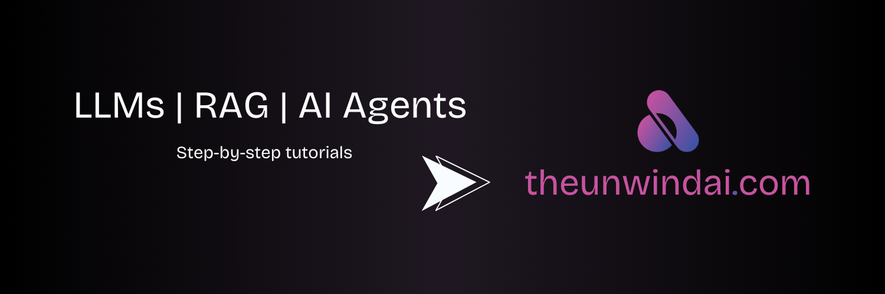

<p align="center">
  <a href="http://www.theunwindai.com">
    
  </a>
</p>

<p align="center">
  <a href="https://www.linkedin.com/in/shubhamsaboo/">
    
  </a>
  <a href="https://twitter.com/Saboo_Shubham_">
    
  </a>
</p>

<hr/>

# 🌟 Awesome LLM Apps

A curated collection of awesome LLM apps built with RAG and AI agents. This repository features LLM apps that use models from OpenAI, Anthropic, Google, and open-source models like DeepSeek, Qwen or Llama that you can run locally on your computer.

<p align="center">
  <a href="https://trendshift.io/repositories/9876" target="_blank">
    
  </a>
</p>

## 🤔 Why Awesome LLM Apps?

- 💡 Discover practical and creative ways LLMs can be applied across different domains, from code repositories to email inboxes and more.
- 🔥 Explore apps that combine LLMs from OpenAI, Anthropic, Gemini, and open-source alternatives with RAG and AI Agents.
- 🎓 Learn from well-documented projects and contribute to the growing open-source ecosystem of LLM-powered applications.

## 📂 Featured AI Projects

### AI Agents
- [💼 AI Customer Support Agent](https://github.com/Shubhamsaboo/awesome-llm-apps/tree/main/ai_agent_tutorials/ai_customer_support_agent)
- [📈 AI Investment Agent](https://github.com/Shubhamsaboo/awesome-llm-apps/tree/main/ai_agent_tutorials/ai_investment_agent)
- [👨‍⚖️ AI Legal Agent Team](https://github.com/Shubhamsaboo/awesome-llm-apps/tree/main/ai_agent_tutorials/ai_legal_agent_team)
- [💼 AI Recruitment Agent Team](https://github.com/Shubhamsaboo/awesome-llm-apps/tree/main/ai_agent_tutorials/ai_recruitment_agent_team)
- [👨‍💼 AI Services Agency](https://github.com/Shubhamsaboo/awesome-llm-apps/tree/main/ai_agent_tutorials/ai_services_agency)
- [🧲 AI Competitor Intelligence Agent Team](https://github.com/Shubhamsaboo/awesome-llm-apps/tree/main/ai_agent_tutorials/ai_competitor_intelligence_agent_team)
- [🏋️‍♂️ AI Health & Fitness Planner Agent](https://github.com/Shubhamsaboo/awesome-llm-apps/tree/main/ai_agent_tutorials/ai_health_fitness_agent)
- [📈 AI Startup Trend Analysis Agent](https://github.com/Shubhamsaboo/awesome-llm-apps/tree/main/ai_agent_tutorials/ai_startup_trend_analysis_agent)
- [🗞️ AI Journalist Agent](https://github.com/Shubhamsaboo/awesome-llm-apps/tree/main/ai_agent_tutorials/ai_journalist_agent)
- [💲 AI Finance Agent Team](https://github.com/Shubhamsaboo/awesome-llm-apps/tree/main/ai_agent_tutorials/ai_finance_agent_team)
- [🧲 AI Competitor Intelligence Agent Team](https://github.com/Shubhamsaboo/awesome-llm-apps/tree/main/ai_agent_tutorials/ai_competitor_intelligence_agent_team)
- [🎯 AI Lead Generation Agent](https://github.com/Shubhamsaboo/awesome-llm-apps/tree/main/ai_agent_tutorials/ai_lead_generation_agent)
- [💰 AI Personal Finance Agent](https://github.com/Shubhamsaboo/awesome-llm-apps/tree/main/ai_agent_tutorials/ai_personal_finance_agent)
- [🩻 AI Medical Scan Diagnosis Agent](https://github.com/Shubhamsaboo/awesome-llm-apps/tree/main/ai_agent_tutorials/ai_medical_imaging_agent)
- [👨‍🏫 AI Teaching Agent Team](https://github.com/Shubhamsaboo/awesome-llm-apps/tree/main/ai_agent_tutorials/ai_teaching_agent_team)
- [🛫 AI Travel Agent](https://github.com/Shubhamsaboo/awesome-llm-apps/tree/main/ai_agent_tutorials/ai_travel_agent)
- [🎬 AI Movie Production Agent](https://github.com/Shubhamsaboo/awesome-llm-apps/tree/main/ai_agent_tutorials/ai_movie_production_agent)
- [📰 Multi-Agent AI Researcher](https://github.com/Shubhamsaboo/awesome-llm-apps/tree/main/ai_agent_tutorials/multi_agent_researcher)
- [💻 Multimodal AI Coding Agent Team with o3-mini and Gemini](https://github.com/Shubhamsaboo/awesome-llm-apps/tree/main/ai_agent_tutorials/ai_coding_agent_o3-mini)
- [📑 AI Meeting Agent](https://github.com/Shubhamsaboo/awesome-llm-apps/tree/main/ai_agent_tutorials/ai_meeting_agent)
- [♜ AI Chess Agent Game](https://github.com/Shubhamsaboo/awesome-llm-apps/tree/main/ai_agent_tutorials/ai_chess_agent)
- [🏠 AI Real Estate Agent](https://github.com/Shubhamsaboo/awesome-llm-apps/tree/main/ai_agent_tutorials/ai_real_estate_agent)
- [🌐 Local News Agent OpenAI Swarm](https://github.com/Shubhamsaboo/awesome-llm-apps/tree/main/ai_agent_tutorials/local_news_agent_openai_swarm)
- [📊 AI Finance Agent with xAI Grok](https://github.com/Shubhamsaboo/awesome-llm-apps/tree/main/ai_agent_tutorials/xai_finance_agent)
- [🎮 AI 3D PyGame Visualizer with DeepSeek R1](https://github.com/Shubhamsaboo/awesome-llm-apps/tree/main/ai_agent_tutorials/ai_3dpygame_r1)
- [🧠 AI Reasoning Agent](https://github.com/Shubhamsaboo/awesome-llm-apps/tree/main/ai_agent_tutorials/ai_reasoning_agent)
- [🧬 Multimodal AI Agent](https://github.com/Shubhamsaboo/awesome-llm-apps/tree/main/ai_agent_tutorials/multimodal_ai_agent)

### RAG (Retrieval Augmented Generation)
- [🔍 Autonomous RAG](https://github.com/Shubhamsaboo/awesome-llm-apps/tree/main/rag_tutorials/autonomous_rag)
- [🔗 Agentic RAG](https://github.com/Shubhamsaboo/awesome-llm-apps/tree/main/rag_tutorials/agentic_rag)
- [🤔 Agentic RAG with Gemini Flash Thinking](https://github.com/Shubhamsaboo/awesome-llm-apps/tree/main/rag_tutorials/gemini_agentic_rag)
- [🐋 Deepseek Local RAG Reasoning Agent](https://github.com/Shubhamsaboo/awesome-llm-apps/tree/main/rag_tutorials/deepseek_local_rag_agent)
- [🔄 Llama3.1 Local RAG](https://github.com/Shubhamsaboo/awesome-llm-apps/tree/main/rag_tutorials/llama3.1_local_rag)
- [🧩 RAG-as-a-Service](https://github.com/Shubhamsaboo/awesome-llm-apps/tree/main/rag_tutorials/rag-as-a-service)
- [🦙 Local RAG Agent](https://github.com/Shubhamsaboo/awesome-llm-apps/tree/main/rag_tutorials/local_rag_agent)
- [👀 RAG App with Hybrid Search](https://github.com/Shubhamsaboo/awesome-llm-apps/tree/main/rag_tutorials/hybrid_search_rag)
- [🖥️ Local RAG App with Hybrid Search](https://github.com/Shubhamsaboo/awesome-llm-apps/tree/main/rag_tutorials/local_hybrid_search_rag)
- [📠 RAG Agent with Database Routing](https://github.com/Shubhamsaboo/awesome-llm-apps/tree/main/rag_tutorials/rag_database_routing)
- [🔄 Corrective RAG Agent](https://github.com/Shubhamsaboo/awesome-llm-apps/tree/main/rag_tutorials/corrective_rag)

### LLM Apps with Memory
- [💾 AI Arxiv Agent with Memory](https://github.com/Shubhamsaboo/awesome-llm-apps/tree/main/llm_apps_with_memory_tutorials/ai_arxiv_agent_memory)
- [📝 LLM App with Personalized Memory](https://github.com/Shubhamsaboo/awesome-llm-apps/tree/main/llm_apps_with_memory_tutorials/llm_app_personalized_memory)
- [🛩️ AI Travel Agent with Memory](https://github.com/Shubhamsaboo/awesome-llm-apps/tree/main/llm_apps_with_memory_tutorials/ai_travel_agent_memory)
- [🗄️ Local ChatGPT with Memory](https://github.com/Shubhamsaboo/awesome-llm-apps/tree/main/llm_apps_with_memory_tutorials/local_chatgpt_with_memory)

### Chat with X
- [💬 Chat with GitHub Repo](https://github.com/Shubhamsaboo/awesome-llm-apps/tree/main/chat_with_X_tutorials/chat_with_github)
- [📨 Chat with Gmail](https://github.com/Shubhamsaboo/awesome-llm-apps/tree/main/chat_with_X_tutorials/chat_with_gmail)
- [📄 Chat with PDF](https://github.com/Shubhamsaboo/awesome-llm-apps/tree/main/chat_with_X_tutorials/chat_with_pdf)
- [📚 Chat with Research Papers](https://github.com/Shubhamsaboo/awesome-llm-apps/tree/main/chat_with_X_tutorials/chat_with_research_papers)
- [📝 Chat with Substack Newsletter](https://github.com/Shubhamsaboo/awesome-llm-apps/tree/main/chat_with_X_tutorials/chat_with_substack)
- [📽️ Chat with YouTube Videos](https://github.com/Shubhamsaboo/awesome-llm-apps/tree/main/chat_with_X_tutorials/chat_with_youtube_videos)

### LLM Finetuning
- [🌐 Llama3.2 Finetuning](https://github.com/Shubhamsaboo/awesome-llm-apps/tree/main/llm_finetuning_tutorials/llama3.2_finetuning)

### Advanced Tools and Frameworks
- [🧪 Gemini Multimodal Chatbot](https://github.com/Shubhamsaboo/awesome-llm-apps/tree/main/advanced_tools_frameworks/gemini_multimodal_chatbot)
- [🔄 Mixture of Agents](https://github.com/Shubhamsaboo/awesome-llm-apps/tree/main/advanced_tools_frameworks/mixture_of_agents)
- [🌐 MultiLLM Chat Playground](https://github.com/Shubhamsaboo/awesome-llm-apps/tree/main/advanced_tools_frameworks/multillm_chat_playground)
- [🔗 LLM Router App](https://github.com/Shubhamsaboo/awesome-llm-apps/tree/main/advanced_tools_frameworks/llm_router_app)
- [💬 Local ChatGPT Clone](https://github.com/Shubhamsaboo/awesome-llm-apps/tree/main/advanced_tools_frameworks/local_chatgpt_clone)
- [🌍 Web Scraping AI Agent](https://github.com/Shubhamsaboo/awesome-llm-apps/tree/main/advanced_tools_frameworks/web_scrapping_ai_agent)
- [🔍 Web Search AI Assistant](https://github.com/Shubhamsaboo/awesome-llm-apps/tree/main/advanced_tools_frameworks/web_search_ai_assistant)
- [🧪 Cursor AI Experiments](https://github.com/Shubhamsaboo/awesome-llm-apps/tree/main/advanced_tools_frameworks/cursor_ai_experiments)

## 🚀 Getting Started

1. **Clone the repository** 

    ```bash 
    git clone https://github.com/Shubhamsaboo/awesome-llm-apps.git 
    ```

2. **Navigate to the desired project directory**

    ```bash 
    cd awesome-llm-apps/chat_with_X_tutorials/chat_with_gmail
    ```

3. **Install the required dependencies**

    ```bash
    pip install -r requirements.txt
    ```

4. **Follow the project-specific instructions** in each project's `README.md` file to set up and run the app.

## 🤝 Contributing to Open Source

Contributions are welcome! If you have any ideas, improvements, or new apps to add, please create a new [GitHub Issue](https://github.com/Shubhamsaboo/awesome-llm-apps/issues) or submit a pull request. Make sure to follow the existing project structure and include a detailed `README.md` for each new app.

### Thank You, Community, for the Support! 🙏

[](https://star-history.com/#Shubhamsaboo/awesome-llm-apps&Date)

🌟 **Don’t miss out on future updates! Star the repo now and be the first to know about new and exciting LLM apps with RAG and AI Agents.**
