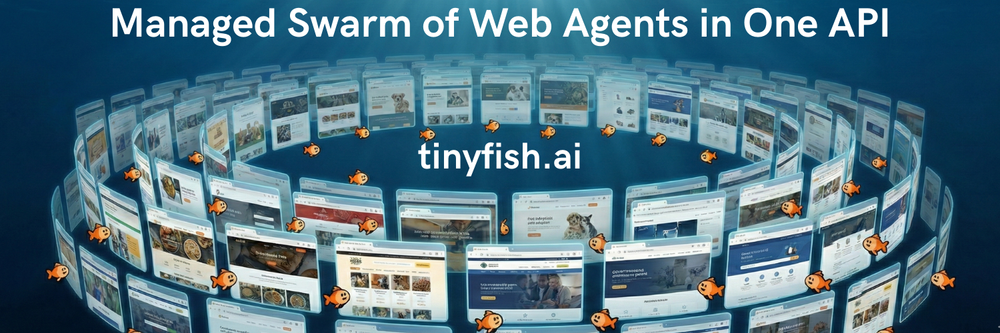
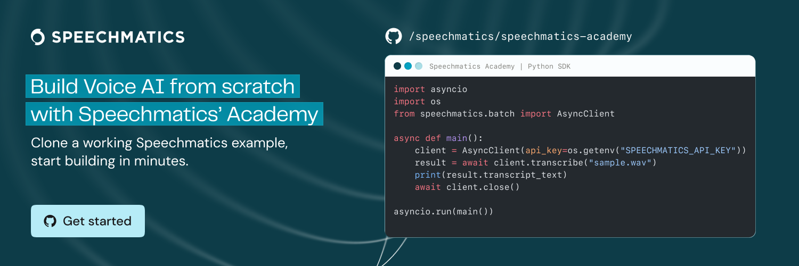

  

  
  

  <!-- Keep these links. Translations will automatically update with the README. -->
  <a href="https://www.readme-i18n.com/Shubhamsaboo/awesome-llm-apps?lang=de">Deutsch</a> | 
  <a href="https://www.readme-i18n.com/Shubhamsaboo/awesome-llm-apps?lang=es">Español</a> | 
  <a href="https://www.readme-i18n.com/Shubhamsaboo/awesome-llm-apps?lang=fr">français</a> | 
  <a href="https://www.readme-i18n.com/Shubhamsaboo/awesome-llm-apps?lang=ja">日本語</a> | 
  <a href="https://www.readme-i18n.com/Shubhamsaboo/awesome-llm-apps?lang=ko">한국어</a> | 
  <a href="https://www.readme-i18n.com/Shubhamsaboo/awesome-llm-apps?lang=pt">Português</a> | 
  <a href="https://www.readme-i18n.com/Shubhamsaboo/awesome-llm-apps?lang=ru">Русский</a> | 
  <a href="https://www.readme-i18n.com/Shubhamsaboo/awesome-llm-apps?lang=zh">中文</a>

# 🌟 Awesome LLM Apps

A curated collection of **Awesome LLM apps built with RAG, AI Agents, Multi-agent Teams, MCP, Voice Agents, and more.** This repository features LLM apps that use models from **OpenAI** , **Anthropic**, **Google**, **xAI** and open-source models like **Qwen** or  **Llama** that you can run locally on your computer.

  

## 🤔 Why Awesome LLM Apps?

- 💡 Discover practical and creative ways LLMs can be applied across different domains, from code repositories to email inboxes and more.
- 🔥 Explore apps that combine LLMs from OpenAI, Anthropic, Gemini, and open-source alternatives with AI Agents, Agent Teams, MCP & RAG.
- 🎓 Learn from well-documented projects and contribute to the growing open-source ecosystem of LLM-powered applications.

## 🙏 Thanks to our sponsors

<table align="center" cellpadding="16" cellspacing="12">
  <tr>
    <td align="center">
      
       
      <a href="https://github.com/tinyfish-io/tinyfish-cookbook" target="_blank" rel="noopener" style="text-decoration: none; color: #333; font-weight: bold; font-size: 18px;">
        TinyFish
      </a>
    </td>
    <td align="center">
      
       
      <a href="https://tsdb.co/shubham-gh" target="_blank" rel="noopener" style="text-decoration: none; color: #333; font-weight: bold; font-size: 18px;">
        Tiger Data MCP
      </a>
    </td>
  </tr>
  <tr>
    <td align="center">
      
       
      <a href="https://github.com/speechmatics/speechmatics-academy" target="_blank" rel="noopener" style="text-decoration: none; color: #333; font-weight: bold; font-size: 18px;">
        Speechmatics
      </a>
    </td>
    <td align="center">
      
       
      <a href="https://sponsorunwindai.com/" style="text-decoration: none; color: #333; font-weight: bold; font-size: 18px;">
        Become a Sponsor
      </a>
    </td>
  </tr>
</table>

## 📂 Featured AI Projects

### AI Agents

### 🌱 Starter AI Agents

*   [🎙️ AI Blog to Podcast Agent](starter_ai_agents/ai_blog_to_podcast_agent/)
*   [❤️‍🩹 AI Breakup Recovery Agent](starter_ai_agents/ai_breakup_recovery_agent/)
*   [📊 AI Data Analysis Agent](starter_ai_agents/ai_data_analysis_agent/)
*   [🩻 AI Medical Imaging Agent](starter_ai_agents/ai_medical_imaging_agent/)
*   [😂 AI Meme Generator Agent (Browser)](starter_ai_agents/ai_meme_generator_agent_browseruse/)
*   [🎵 AI Music Generator Agent](starter_ai_agents/ai_music_generator_agent/)
*   [🛫 AI Travel Agent (Local & Cloud)](starter_ai_agents/ai_travel_agent/)
*   [✨ Gemini Multimodal Agent](starter_ai_agents/gemini_multimodal_agent_demo/)
*   [🔄 Mixture of Agents](starter_ai_agents/mixture_of_agents/)
*   [📊 xAI Finance Agent](starter_ai_agents/xai_finance_agent/)
*   [🔍 OpenAI Research Agent](starter_ai_agents/openai_research_agent/)
*   [🕸️ Web Scraping AI Agent (Local & Cloud SDK)](starter_ai_agents/web_scraping_ai_agent/)

### 🚀 Advanced AI Agents
*   [🏚️ 🍌 AI Home Renovation Agent with Nano Banana Pro](advanced_ai_agents/multi_agent_apps/ai_home_renovation_agent)
*   [🧠 DevPulse AI — Multi-Agent Signal Intelligence](advanced_ai_agents/multi_agent_apps/devpulse_ai/)
*   [🔍 AI Deep Research Agent](advanced_ai_agents/single_agent_apps/ai_deep_research_agent/)
*   [📊 AI VC Due Diligence Agent Team](advanced_ai_agents/multi_agent_apps/agent_teams/ai_vc_due_diligence_agent_team)
*   [🔬 AI Research Planner & Executor (Google Interactions API)](advanced_ai_agents/single_agent_apps/research_agent_gemini_interaction_api)
*   [🤝 AI Consultant Agent](advanced_ai_agents/single_agent_apps/ai_consultant_agent)
*   [🏗️ AI System Architect Agent](advanced_ai_agents/single_agent_apps/ai_system_architect_r1/)
*   [💰 AI Financial Coach Agent](advanced_ai_agents/multi_agent_apps/ai_financial_coach_agent/)
*   [🎬 AI Movie Production Agent](advanced_ai_agents/single_agent_apps/ai_movie_production_agent/)
*   [📈 AI Investment Agent](advanced_ai_agents/single_agent_apps/ai_investment_agent/)
*   [🏋️‍♂️ AI Health & Fitness Agent](advanced_ai_agents/single_agent_apps/ai_health_fitness_agent/)
*   [🚀 AI Product Launch Intelligence Agent](advanced_ai_agents/single_agent_apps/ai_product_launch_intelligence_agent/)
*   [🌐 Anchor Browser](https://anchorbrowser.io) - Agentic browser infrastructure platform for AI agents and browser automation.