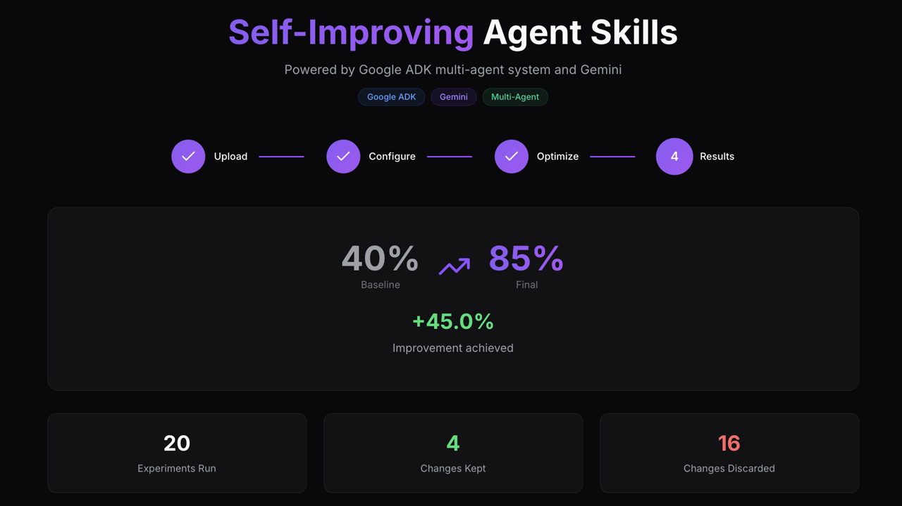
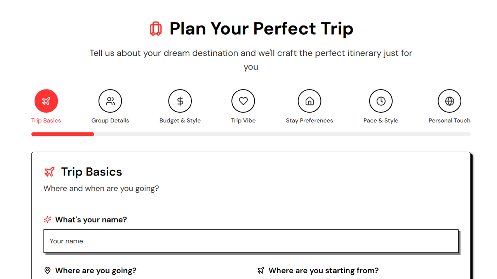
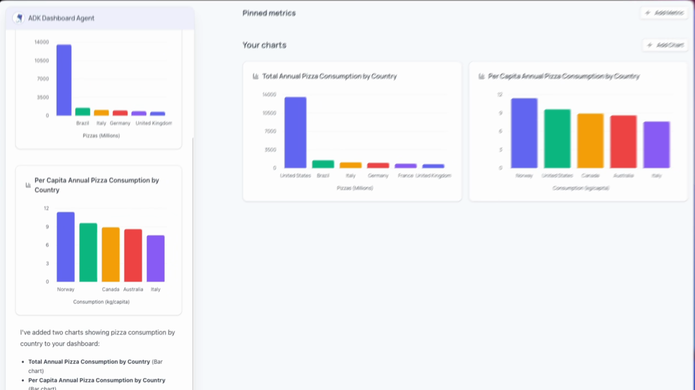
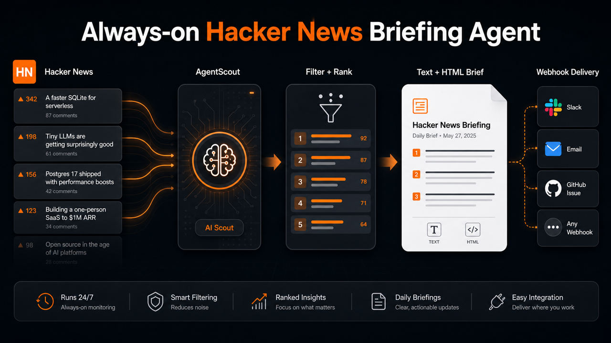
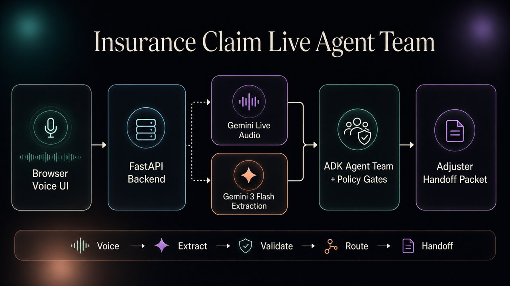
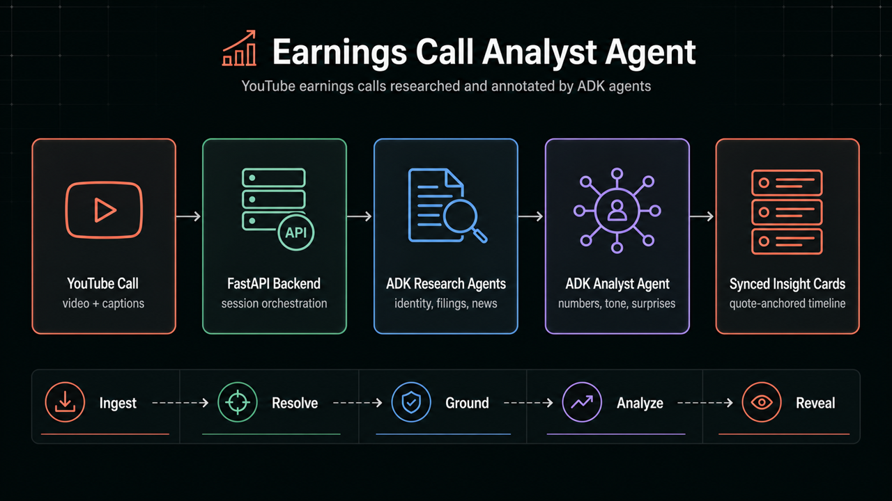

<p align="center">
  <a href="http://www.theunwindai.com">
    
  </a>
</p>

<div align="center">

# Awesome LLM Apps

**100+ open-source AI agents, agent skills, and RAG apps. Hand-built, tested end-to-end, Apache-2.0.**

Every tile below is a real app in this repo. Clone it, run it, ship it.

**[Step-by-step tutorials on Unwind AI](https://www.theunwindai.com)** · **[Quick start](#-run-one-now)** · **[Browse all templates](#-browse-all-templates)**

</div>

<table>
  <tr>
    <td width="33.3%" align="center">
      <a href="agent_skills/self-improving-agent-skills/"></a>
      <sub><b>♾️ Self-Improving Agent Skills</b><br>Skills that rewrite themselves against evals</sub>
    </td>
    <td width="33.3%" align="center">
      <a href="advanced_ai_agents/multi_agent_apps/agent_teams/ai_travel_planner_agent_team/"></a>
      <sub><b>🌏 AI Travel Planner Agent Team</b><br>A full trip, planned by an agent team</sub>
    </td>
    <td width="33.3%" align="center">
      <a href="generative_ui_agents/ai-dashboard-canvas-agent/"></a>
      <sub><b>📊 AI Dashboard Canvas Agent</b><br>Describe a dashboard, watch it build itself</sub>
    </td>
  </tr>
  <tr>
    <td align="center">
      <a href="always_on_agents/always_on_hn_briefing_agent/"></a>
      <sub><b>📰 Always-on HN Briefing Agent</b><br>A scout that reads Hacker News so you don't</sub>
    </td>
    <td align="center">
      <a href="voice_ai_agents/insurance_claim_live_agent_team/"></a>
      <sub><b>🛡️ Insurance Claim Live Agent Team</b><br>Real-time voice claim intake with Gemini Live</sub>
    </td>
    <td align="center">
      <a href="advanced_ai_agents/single_agent_apps/earnings_call_analyst_agent/"></a>
      <sub><b>📡 Earnings Call Analyst Agent</b><br>YouTube earnings calls, annotated by agents</sub>
    </td>
  </tr>
</table>

<div align="center">

Model-agnostic: Claude, Gemini, GPT, DeepSeek, Llama, Qwen and more. Skills run in Claude Code, Codex, and Cursor.

</div>

## 🚀 Run one now

Give your coding agent a new skill in 10 seconds:

```bash
npx skills add https://github.com/Shubhamsaboo/awesome-llm-apps/tree/main/agent_skills/project-graveyard
```

Then ask it: *"why do I never finish my side projects?"*

Or clone and run any agent in 30 seconds:

```bash
git clone https://github.com/Shubhamsaboo/awesome-llm-apps.git
cd awesome-llm-apps/starter_ai_agents/ai_travel_agent
pip install -r requirements.txt
streamlit run travel_agent.py
```

## 🧭 Start here

| 🌱 Never built an agent | ⚙️ Shipping something real | 🎓 Going deep |
|---|---|---|
| [AI Travel Agent](starter_ai_agents/ai_travel_agent/) | [AI Deep Research Agent](advanced_ai_agents/single_agent_apps/ai_deep_research_agent/) | [AI VC Due Diligence Agent Team](advanced_ai_agents/multi_agent_apps/agent_teams/ai_vc_due_diligence_agent_team) |
| [AI Data Analysis Agent](starter_ai_agents/ai_data_analysis_agent/) | [AI Sales Intelligence Agent Team](advanced_ai_agents/multi_agent_apps/agent_teams/ai_sales_intelligence_agent_team) | [Trust-Gated Multi-Agent Research Team](advanced_ai_agents/multi_agent_apps/trust_gated_agent_team/) |
| [Basic RAG Chain](rag_tutorials/rag_chain/) | [Customer Support Voice Agent](voice_ai_agents/customer_support_voice_agent/) | [AI Self-Evolving Agent](advanced_ai_agents/multi_agent_apps/ai_self_evolving_agent/) |

## 🔥 New in July 2026

| Template | What it does | Stack |
|---|---|---|
| [⚰️ Project Graveyard Skill](agent_skills/project-graveyard/) | Finds your dead side projects, tells you why each one died, and helps you finish the one worth going back to | Agent Skill · Runs locally |
| [📰 Always-on Hacker News Briefing Agent](always_on_agents/always_on_hn_briefing_agent/) | Scheduled Hacker News scout that filters AI agent and LLM app signals into a delivery-ready daily brief | ADK + Agent Runtime |
| [🛡️ Insurance Claim Live Agent Team](voice_ai_agents/insurance_claim_live_agent_team/) | Real-time voice claim intake with Gemini Live and ADK | Voice + ADK |
| [🏠 Home Renovation Agent](advanced_ai_agents/multi_agent_apps/ai_home_renovation_agent) | Photo to AI redesign with Nano Banana Pro | Vision + Multi-agent |
| [♾️ Self-Improving Agent Skills](agent_skills/self-improving-agent-skills/) | Automatically optimize agent skills using Gemini and ADK | Agent Skills + ADK |

> 📬 New templates drop weekly. [Get them in your inbox on Unwind AI](https://www.theunwindai.com).

## 📂 Browse all templates

### 🧩 Agent Skills

*Give your coding agent new abilities. One command to install, plain English to use. Every skill ships real code and passes a security + eval CI gate. Works with Claude Code, Codex, Cursor, and other coding agents. [Browse all skills →](agent_skills/)*

*   [⚰️ Project Graveyard](agent_skills/project-graveyard/) - Finds every side project you abandoned, tells you why each one died, and helps you finish the one worth going back to
*   [🧠 Advisor Orchestrator Worker](agent_skills/advisor-orchestrator-worker/) - Your agent runs a model team: cheap models do the work in parallel, a stronger model reviews the plan, your agent manages it all
*   [♾️ Self-Improving Agent Skills](agent_skills/self-improving-agent-skills/) - Automatically optimize agent skills using Gemini and ADK

### 🌱 Starter AI Agents

*Single-file agents that run with just an API key - a great place to start.*

*   [🎙️ AI Blog to Podcast Agent](starter_ai_agents/ai_blog_to_podcast_agent/) - Turn any blog URL into a narrated podcast episode
*   [❤️‍🩹 AI Breakup Recovery Agent](starter_ai_agents/ai_breakup_recovery_agent/) - An agent team that talks you through the post-breakup spiral
*   [📊 AI Data Analysis Agent](starter_ai_agents/ai_data_analysis_agent/) - Ask questions of any CSV or Excel file in plain English
*   [🩻 AI Medical Imaging Agent](starter_ai_agents/ai_medical_imaging_agent/) - Diagnostic analysis of X-rays and scans with Gemini
*   [😂 AI Meme Generator Agent (Browser)](starter_ai_agents/ai_meme_generator_agent_browseruse/) - Makes memes by driving a real browser, not an image API
*   [🎵 AI Music Generator Agent](starter_ai_agents/ai_music_generator_agent/) - Prompt in, MP3 track out
*   [🛫 AI Travel Agent (Local & Cloud)](starter_ai_agents/ai_travel_agent/) - Personalized day-by-day travel itineraries
*   [✨ Gemini Multimodal Agent](starter_ai_agents/multimodal_ai_agent/) - Video analysis plus web search in one agent
*   [🔄 Mixture of Agents](starter_ai_agents/mixture_of_agents/) - Multiple LLMs answer, one aggregates the best response
*   [📊 xAI Finance Agent](starter_ai_agents/xai_finance_agent/) - Real-time stock analysis powered by Grok
*   [🔍 OpenAI Research Agent](starter_ai_agents/openai_research_agent/) - Multi-agent topic research with the OpenAI Agents SDK
*   [🕸️ Web Scraping AI Agent](starter_ai_agents/web_scraping_ai_agent/) - Describe what to extract and the agent scrapes it

### 🚀 Advanced AI Agents

*Production-style agents with tools, memory, and multi-step reasoning.*

*   [🏚️ 🍌 AI Home Renovation Agent with Nano Banana Pro](advanced_ai_agents/multi_agent_apps/ai_home_renovation_agent) - Photos of your space in, renovation plan and photorealistic renders out
*   [🧠 DevPulse AI - Multi-Agent Signal Intelligence](advanced_ai_agents/multi_agent_apps/devpulse_ai/) - Aggregates and scores technical signals into a daily intelligence digest
*   [🔍 AI Deep Research Agent](advanced_ai_agents/single_agent_apps/ai_deep_research_agent/) - Comprehensive web research with the OpenAI Agents SDK and Firecrawl
*   [📊 AI VC Due Diligence Agent Team](advanced_ai_agents/multi_agent_apps/agent_teams/ai_vc_due_diligence_agent_team) - Multi-agent startup investment analysis with Gemini 3
*   [🔬 AI Research Planner & Executor (Google Interactions API)](advanced_ai_agents/single_agent_apps/research_agent_gemini_interaction_api) - Multi-phase research with stateful conversations and auto-generated infographics
*   [🤝 AI Consultant Agent](advanced_ai_agents/single_agent_apps/ai_consultant_agent) - Market analysis and strategy recommendations with live web research
*   [🏗️ AI System Architect Agent](advanced_ai_agents/single_agent_apps/ai_system_architect_r1/) - Architecture reviews using DeepSeek R1 reasoning plus Claude
*   [💰 AI Financial Coach Agent](advanced_ai_agents/multi_agent_apps/ai_financial_coach_agent/) - Personalized budget, debt, and savings analysis
*   [🎬 AI Movie Production Agent](advanced_ai_agents/single_agent_apps/ai_movie_production_agent/) - Script drafts and casting ideas from a one-line movie concept
*   [📈 AI Investment Agent](advanced_ai_agents/single_agent_apps/ai_investment_agent/) - Stock comparison reports built on Yahoo Finance data
*   [📡 Earnings Call Analyst Agent](advanced_ai_agents/single_agent_apps/earnings_call_analyst_agent/) - Turns YouTube earnings calls into a playback-synced analyst workspace
*   [🏋️‍♂️ AI Health & Fitness Agent](advanced_ai_agents/single_agent_apps/ai_health_fitness_agent/) - Tailored diet and workout plans from your goals
*   [🚀 AI Product Launch Intelligence Agent](advanced_ai_agents/multi_agent_apps/product_launch_intelligence_agent) - Go-to-market intelligence on competitor launches
*   [🔍 AI Fraud Investigation Agent](advanced_ai_agents/single_agent_apps/ai_fraud_investigation_agent/) - Cross-references public records to flag facilities that don't add up
*   [🗞️ AI Journalist Agent](advanced_ai_agents/single_agent_apps/ai_journalist_agent/) - Researches, writes, and edits articles on any topic
*   [🧠 AI Mental Wellbeing Agent](advanced_ai_agents/multi_agent_apps/ai_mental_wellbeing_agent/) - A coordinated agent team for mental health support plans
*   [📑 AI Meeting Agent](advanced_ai_agents/single_agent_apps/ai_meeting_agent/) - Context, industry insights, and strategy briefs before you walk in
*   [🧬 AI Self-Evolving Agent](advanced_ai_agents/multi_agent_apps/ai_self_evolving_agent/) - Agents that rewrite their own workflows with EvoAgentX
*   [👨🏻‍💼 AI Sales Intelligence Agent Team](advanced_ai_agents/multi_agent_apps/agent_teams/ai_sales_intelligence_agent_team) - Generates competitive sales battle cards in real time
*   [🎧 AI Social Media News and Podcast Agent](advanced_ai_agents/multi_agent_apps/ai_news_and_podcast_agents/) - Curates your trusted sources into briefs and generated podcasts
*   [🌐 Openwork - Open Browser Automation Agent](https://github.com/accomplish-ai/openwork) <sub>↗ external</sub> - Open-source agent that operates a real browser
*   [🛡️ Trust-Gated Multi-Agent Research Team](advanced_ai_agents/multi_agent_apps/trust_gated_agent_team/) - Every agent verified, every action in a hash-chained audit trail

### 🛰️ Always-on Agents

*Background agents that run on schedules or events, monitor changing context, decide what needs attention, and proactively deliver updates, artifacts, or actions.*

*   [📰 Always-on Hacker News Briefing Agent](always_on_agents/always_on_hn_briefing_agent/)

### 🤝 Multi-agent Teams

*Multiple agents collaborating to accomplish complex, cross-domain tasks.*

*   [🧲 AI Competitor Intelligence Agent Team](advanced_ai_agents/multi_agent_apps/agent_teams/ai_competitor_intelligence_agent_team/)
*   [💲 AI Finance Agent Team](advanced_ai_agents/multi_agent_apps/agent_teams/ai_finance_agent_team/)
*   [🎨 AI Game Design Agent Team](advanced_ai_agents/multi_agent_apps/agent_teams/ai_game_design_agent_team/)
*   [🧭 AG2 Adaptive Research Team](advanced_ai_agents/multi_agent_apps/agent_teams/ag2_adaptive_research_team/)
*   [👨‍⚖️ AI Legal Agent Team (Cloud & Local)](advanced_ai_agents/multi_agent_apps/agent_teams/ai_legal_agent_team/)
*   [💼 AI Recruitment Agent Team](advanced_ai_agents/multi_agent_apps/agent_teams/ai_recruitment_agent_team/)
*   [🏠 AI Real Estate Agent Team](advanced_ai_agents/multi_agent_apps/agent_teams/ai_real_estate_agent_team)
*   [👨‍💼 AI Services Agency (CrewAI)](advanced_ai_agents/multi_agent_apps/agent_teams/ai_services_agency/)
*   [👨‍🏫 AI Teaching Agent Team](advanced_ai_agents/multi_agent_apps/agent_teams/ai_teaching_agent_team/)
*   [💻 Multimodal Coding Agent Team](advanced_ai_agents/multi_agent_apps/agent_teams/multimodal_coding_agent_team/)
*   [✨ Multimodal Design Agent Team](advanced_ai_agents/multi_agent_apps/agent_teams/multimodal_design_agent_team/)
*   [🎨 🍌 Multimodal UI/UX Feedback Agent Team with Nano Banana](advanced_ai_agents/multi_agent_apps/agent_teams/multimodal_uiux_feedback_agent_team/)
*   [🌏 AI Travel Planner Agent Team](/advanced_ai_agents/multi_agent_apps/agent_teams/ai_travel_planner_agent_team/)

### 🗣️ Voice AI Agents

*Speech-in, speech-out agents using real-time voice APIs.*

*   [🗣️ AI Audio Tour Agent](voice_ai_agents/ai_audio_tour_agent/)
*   [📞 Customer Support Voice Agent](voice_ai_agents/customer_support_voice_agent/)
*   [🛡️ Insurance Claim Live Agent Team](voice_ai_agents/insurance_claim_live_agent_team/)
*   [🔊 Voice RAG Agent (OpenAI SDK)](voice_ai_agents/voice_rag_openaisdk/)
*   [🎙️ OpenSource Voice Dictation Agent (Wispr Flow clone)](https://github.com/akshayaggarwal99/jarvis-ai-assistant) <sub>↗ external</sub>

### 🖼️ Generative UI and Agentic Frontends

*Agents that render interactive UI components, not just text: forms, cards, charts, editable plans.*

*   [🗂️ Generative UI Starter Project](generative_ui_agents/generative-ui-starter-project/)
*   [🪙 AI Financial Coach Agent](generative_ui_agents/ai-financial-coach-agent/)
*   [📊 AI Dashboard Canvas Agent](generative_ui_agents/ai-dashboard-canvas-agent/)
*   [🛠️ AI MCP App Builder](generative_ui_agents/ai-mcp-app-builder/)
*   [✈️ MCP Apps Generative UI Showcase](generative_ui_agents/mcp-apps-generative-ui-showcase/)
*   [🎛️ AI Shadcn Component Generator](generative_ui_agents/ai-shadcn-component-generator/)
*   [🔍 AI Deep Research Agent](generative_ui_agents/ai-deep-research-agent/)

### 🎮 Autonomous Game-Playing Agents

*Agents that play games end-to-end: reasoning, strategy, and action.*

*   [🎮 AI 3D Pygame Agent](advanced_ai_agents/autonomous_game_playing_agent_apps/ai_3dpygame_r1/)
*   [♜ AI Chess Agent](advanced_ai_agents/autonomous_game_playing_agent_apps/ai_chess_agent/)
*   [🎲 AI Tic-Tac-Toe Agent](advanced_ai_agents/autonomous_game_playing_agent_apps/ai_tic_tac_toe_agent/)

### ♾️ MCP AI Agents

*Agents that connect to external tools and data via Model Context Protocol.*

*   [♾️ Browser MCP Agent](mcp_ai_agents/browser_mcp_agent/)
*   [🐙 GitHub MCP Agent](mcp_ai_agents/github_mcp_agent/)
*   [📑 Notion MCP Agent](mcp_ai_agents/notion_mcp_agent)
*   [🌍 AI Travel Planner MCP Agent](mcp_ai_agents/ai_travel_planner_mcp_agent_team)
*   [🔀 Multi-MCP Agent Router](mcp_ai_agents/multi_mcp_agent_router/)

### 📀 RAG (Retrieval Augmented Generation)

*Retrieval pipelines, from simple chains to agentic and multi-source.*

*   [🔥 Agentic RAG with Embedding Gemma](rag_tutorials/agentic_rag_embedding_gemma)
*   [🧐 Agentic RAG with Reasoning](rag_tutorials/agentic_rag_with_reasoning/)
*   [📰 AI Blog Search (RAG)](rag_tutorials/ai_blog_search/)
*   [🔍 Autonomous RAG](rag_tutorials/autonomous_rag/)
*   [🔄 Contextual AI RAG Agent](rag_tutorials/contextualai_rag_agent/)
*   [🔄 Corrective RAG (CRAG)](rag_tutorials/corrective_rag/)
*   [🐋 Deepseek Local RAG Agent](rag_tutorials/deepseek_local_rag_agent/)
*   [🤔 Gemini Agentic RAG](rag_tutorials/gemini_agentic_rag/)
*   [👀 Hybrid Search RAG (Cloud)](rag_tutorials/hybrid_search_rag/)
*   [🔄 Llama 3.1 Local RAG](rag_tutorials/llama3.1_local_rag/)
*   [🖥️ Local Hybrid Search RAG](rag_tutorials/local_hybrid_search_rag/)
*   [🧬 Multimodal Agentic RAG](rag_tutorials/multimodal_agentic_rag/)
*   [🦙 Local RAG Agent](rag_tutorials/local_rag_agent/)
*   [🧩 RAG-as-a-Service](rag_tutorials/rag-as-a-service/)
*   [✨ RAG Agent with Cohere](rag_tutorials/rag_agent_cohere/)
*   [⛓️ Basic RAG Chain](rag_tutorials/rag_chain/)
*   [📠 RAG with Database Routing](rag_tutorials/rag_database_routing/)
*   [🖼️ Vision RAG](rag_tutorials/vision_rag/)
*   [🩺 RAG Failure Diagnostics Clinic](rag_tutorials/rag_failure_diagnostics_clinic/)
*   [🕸️ Knowledge Graph RAG with Citations](rag_tutorials/knowledge_graph_rag_citations/)

### 💾 LLM Apps with Memory

*Agents and chatbots that remember conversations and user state across sessions.*

*   [💾 AI ArXiv Agent with Memory](advanced_llm_apps/llm_apps_with_memory_tutorials/ai_arxiv_agent_memory/)
*   [🛩️ AI Travel Agent with Memory](advanced_llm_apps/llm_apps_with_memory_tutorials/ai_travel_agent_memory/)
*   [💬 Llama3 Stateful Chat](advanced_llm_apps/llm_apps_with_memory_tutorials/llama3_stateful_chat/)
*   [📝 LLM App with Personalized Memory](advanced_llm_apps/llm_apps_with_memory_tutorials/llm_app_personalized_memory/)
*   [🗄️ Local ChatGPT Clone with Memory](advanced_llm_apps/llm_apps_with_memory_tutorials/local_chatgpt_with_memory/)
*   [🧠 Multi-LLM Application with Shared Memory](advanced_llm_apps/llm_apps_with_memory_tutorials/multi_llm_memory/)

### 💬 Chat with X

*Turn any data source into a chat interface.*

*   [💬 Chat with GitHub (GPT & Llama3)](advanced_llm_apps/chat_with_X_tutorials/chat_with_github/)
*   [📨 Chat with Gmail](advanced_llm_apps/chat_with_X_tutorials/chat_with_gmail/)
*   [📄 Chat with PDF (GPT & Llama3)](advanced_llm_apps/chat_with_X_tutorials/chat_with_pdf/)
*   [📚 Chat with Research Papers (ArXiv) (GPT & Llama3)](advanced_llm_apps/chat_with_X_tutorials/chat_with_research_papers/)
*   [📝 Chat with Substack](advanced_llm_apps/chat_with_X_tutorials/chat_with_substack/)
*   [📽️ Chat with YouTube Videos](advanced_llm_apps/chat_with_X_tutorials/chat_with_youtube_videos/)

### 🎯 LLM Optimization Tools

*Reduce token usage, context size, and API cost without losing quality.*

*   [🎯 Toonify Token Optimization](advanced_llm_apps/llm_optimization_tools/toonify_token_optimization/) - Reduce LLM API costs by 30-60% using TOON format
*   [🧠 Headroom Context Optimization](advanced_llm_apps/llm_optimization_tools/headroom_context_optimization/) - Reduce LLM API costs by 50-90%

### 🔧 LLM Fine-tuning

*End-to-end fine-tuning recipes for open-source models.*

*   [Gemma 3 Fine-tuning](advanced_llm_apps/llm_finetuning_tutorials/gemma3_finetuning/)
*   [Llama 3.2 Fine-tuning](advanced_llm_apps/llm_finetuning_tutorials/llama3.2_finetuning/)

### 🧑‍🏫 AI Agent Framework Crash Courses

*Deep-dive tutorials on the major agent frameworks.*

*   [Google ADK Crash Course](ai_agent_framework_crash_course/google_adk_crash_course/) - Starter agent, structured outputs, tools (built-in, function, third-party, MCP), memory, callbacks, plugins, and multi-agent patterns. Model-agnostic.
*   [OpenAI Agents SDK Crash Course](ai_agent_framework_crash_course/openai_sdk_crash_course/) - Starter agent, function calling, structured outputs, tools, memory, evaluation, handoffs, swarm orchestration, and routing logic.

---

<div align="center">

⭐ **[Star the repo](https://github.com/Shubhamsaboo/awesome-llm-apps/stargazers)** to get notified when new templates drop.

<sub>
<!-- Keep these links. Translations will automatically update with the README. -->
<a href="https://www.readme-i18n.com/Shubhamsaboo/awesome-llm-apps?lang=de">Deutsch</a> ·
<a href="https://www.readme-i18n.com/Shubhamsaboo/awesome-llm-apps?lang=es">Español</a> ·
<a href="https://www.readme-i18n.com/Shubhamsaboo/awesome-llm-apps?lang=fr">français</a> ·
<a href="https://www.readme-i18n.com/Shubhamsaboo/awesome-llm-apps?lang=ja">日本語</a> ·
<a href="https://www.readme-i18n.com/Shubhamsaboo/awesome-llm-apps?lang=ko">한국어</a> ·
<a href="https://www.readme-i18n.com/Shubhamsaboo/awesome-llm-apps?lang=pt">Português</a> ·
<a href="https://www.readme-i18n.com/Shubhamsaboo/awesome-llm-apps?lang=ru">Русский</a> ·
<a href="https://www.readme-i18n.com/Shubhamsaboo/awesome-llm-apps?lang=zh">中文</a>
</sub>

<sub>Apache-2.0 · See <a href="LICENSE">LICENSE</a> · Fork it, ship it, sell it.</sub>

</div>
