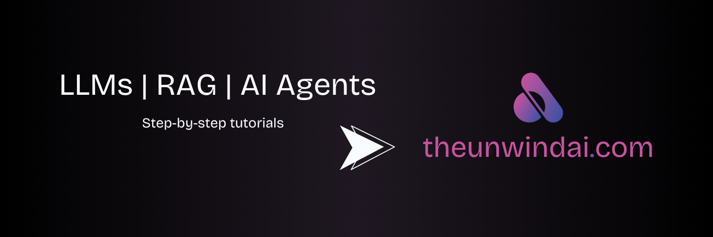

<p align="center">
  <a href="http://www.theunwindai.com">
    
  </a>
</p>

<p align="center">
  <a href="https://www.linkedin.com/in/shubhamsaboo/">
    
  </a>
  <a href="https://twitter.com/Saboo_Shubham_">
    
  </a>
</p>

<p align="center">
  <!-- Keep these links. Translations will automatically update with the README. -->
  <a href="https://www.readme-i18n.com/Shubhamsaboo/awesome-llm-apps?lang=de">Deutsch</a> | 
  <a href="https://www.readme-i18n.com/Shubhamsaboo/awesome-llm-apps?lang=es">Español</a> | 
  <a href="https://www.readme-i18n.com/Shubhamsaboo/awesome-llm-apps?lang=fr">français</a> | 
  <a href="https://www.readme-i18n.com/Shubhamsaboo/awesome-llm-apps?lang=ja">日本語</a> | 
  <a href="https://www.readme-i18n.com/Shubhamsaboo/awesome-llm-apps?lang=ko">한국어</a> | 
  <a href="https://www.readme-i18n.com/Shubhamsaboo/awesome-llm-apps?lang=pt">Português</a> | 
  <a href="https://www.readme-i18n.com/Shubhamsaboo/awesome-llm-apps?lang=ru">Русский</a> | 
  <a href="https://www.readme-i18n.com/Shubhamsaboo/awesome-llm-apps?lang=zh">中文</a>
</p>

<hr/>

<div align="center">

# 🌟 Awesome LLM Apps

<p><strong>100+ AI Agent & RAG apps you can actually run — clone, customize, ship.</strong><br/>
AI Agents · Multi-agent Teams · MCP Agents · RAG · Voice Agents · Agent Skills · Fine-tuning</p>

<p>
<strong>Free step-by-step tutorials on <a href="https://www.theunwindai.com">Unwind AI</a></strong><br/>
<strong>Works with Claude · Gemini · OpenAI · xAI · Qwen · Llama</strong>
</p>

<p>
<a href="https://github.com/Shubhamsaboo/awesome-llm-apps/stargazers"></a>
<a href="https://github.com/Shubhamsaboo/awesome-llm-apps/network/members"></a>
<a href="https://github.com/Shubhamsaboo/awesome-llm-apps/graphs/contributors"></a>
<a href="LICENSE"></a>

</p>

<p>
<a href="#-quick-start"><kbd> &nbsp; 🚀 Quick Start &nbsp; </kbd></a>
<a href="#-featured-ai-projects"><kbd> &nbsp; 📂 Browse Templates &nbsp; </kbd></a>
<a href="https://www.theunwindai.com"><kbd> &nbsp; 📚 Step-by-Step Tutorials &nbsp; </kbd></a>
</p>

<a href="https://trendshift.io/repositories/9876" target="_blank">
  
</a>

</div>

---

## 💡 Why this exists

You shouldn't have to rebuild the same RAG pipeline, agent loop, or MCP integration from scratch every time you start a new LLM project.

**Awesome LLM Apps is a cookbook of ready-to-run templates** - starter code you can fork, customize, and ship as a production LLM app. Every template here is self-contained with full source code, not collected from elsewhere.

- 🛠️ **Hand-built, not curated** - every template is original work, tested end-to-end before it ships.
- 🧪 **Runs in 3 commands** - no broken `requirements.txt`, no "figure it out yourself" scaffolding.
- 🧠 **Covers the modern AI stack** - AI Agents, Multi-agent Teams, MCP Agents, Voice AI Agents, RAG, Agent Skills, Fine-tuning.
- 🌐 **Provider-agnostic** - switch between Claude, Gemini, GPT, Llama, Qwen, xAI and others with a config change.
- 📚 **Step-by-step tutorials** - every featured template has a free walkthrough on [Unwind AI](https://www.theunwindai.com).
- 💸 **Apache-2.0** - fork it, ship it, sell it. No paywall, no signup, no telemetry.

> ⭐ **If this saves you time, [star the repo](https://github.com/Shubhamsaboo/awesome-llm-apps/stargazers) - that's how the next developer discovers it.**

## 🚀 Quick Start

Run your first agent in **30 seconds**:

```bash
git clone https://github.com/Shubhamsaboo/awesome-llm-apps.git
cd awesome-llm-apps/starter_ai_agents/ai_travel_agent
pip install -r requirements.txt
streamlit run travel_agent.py
```


## 🔥 Featured This Month

| Template | What it does | Stack |
|---|---|---|
| [🧠 DevPulse AI](advanced_ai_agents/multi_agent_apps/devpulse_ai/) | Multi-agent signal intelligence for dev teams | Multi-agent |
| [🏠 Home Renovation Agent](advanced_ai_agents/multi_agent_apps/ai_home_renovation_agent) | Photo → AI redesign with Nano Banana Pro | Vision + Multi-agent |
| [♾️ Self-Improving Agent Skills](awesome_agent_skills/self-improving-agent-skills/) | Automatically optimize agent skills using Gemini and ADK | Agent Skills + ADK |

> 📬 [Subscribe on Unwind AI](https://www.theunwindai.com) to get new template drops + tutorials in your inbox.

## 📑 Table of Contents

<details open>
<summary><strong>13 categories · Click to expand</strong></summary>

- [🌱 Starter AI Agents](#-starter-ai-agents)
- [🚀 Advanced AI Agents](#-advanced-ai-agents)
- [🎮 Autonomous Game-Playing Agents](#-autonomous-game-playing-agents)
- [🤝 Multi-agent Teams](#-multi-agent-teams)
- [🗣️ Voice AI Agents](#️-voice-ai-agents)
- [♾️ MCP AI Agents](#-mcp-ai-agents)
- [📀 RAG Tutorials](#-rag-retrieval-augmented-generation)
- [🧩 Awesome Agent Skills](#-awesome-agent-skills)
- [💾 LLM Apps with Memory](#-llm-apps-with-memory-tutorials)
- [💬 Chat with X Tutorials](#-chat-with-x-tutorials)
- [🎯 LLM Optimization Tools](#-llm-optimization-tools)
- [🔧 LLM Fine-tuning Tutorials](#-llm-fine-tuning-tutorials)
- [🧑‍🏫 AI Agent Framework Crash Courses](#-ai-agent-framework-crash-course)

</details>

## 📂 Featured AI Projects

### 🌱 Starter AI Agents
*Single-file agents that run with just an API key - a great place to start.*

*   [🎙️ AI Blog to Podcast Agent](starter_ai_agents/ai_blog_to_podcast_agent/)
*   [❤️‍🩹 AI Breakup Recovery Agent](starter_ai_agents/ai_breakup_recovery_agent/)
*   [📊 AI Data Analysis Agent](starter_ai_agents/ai_data_analysis_agent/)
*   [🩻 AI Medical Imaging Agent](starter_ai_agents/ai_medical_imaging_agent/)
*   [😂 AI Meme Generator Agent (Browser)](starter_ai_agents/ai_meme_generator_agent_browseruse/)
*   [🎵 AI Music Generator Agent](starter_ai_agents/ai_music_generator_agent/)
*   [🛫 AI Travel Agent (Local & Cloud)](starter_ai_agents/ai_travel_agent/)
*   [✨ Gemini Multimodal Agent](starter_ai_agents/gemini_multimodal_agent_demo/)
*   [🔄 Mixture of Agents](starter_ai_agents/mixture_of_agents/)
*   [📊 xAI Finance Agent](starter_ai_agents/xai_finance_agent/)
*   [🔍 OpenAI Research Agent](starter_ai_agents/openai_research_agent/)
*   [🕸️ Web Scraping AI Agent (Local & Cloud SDK)](starter_ai_agents/web_scraping_ai_agent/)

### 🚀 Advanced AI Agents
*Production-style agents with tools, memory, and multi-step reasoning.*

*   [🏚️ 🍌 AI Home Renovation Agent with Nano Banana Pro](advanced_ai_agents/multi_agent_apps/ai_home_renovation_agent)
*   [🧠 DevPulse AI - Multi-Agent Signal Intelligence](advanced_ai_agents/multi_agent_apps/devpulse_ai/)
*   [🔍 AI Deep Research Agent](advanced_ai_agents/single_agent_apps/ai_deep_research_agent/)
*   [📊 AI VC Due Diligence Agent Team](advanced_ai_agents/multi_agent_apps/agent_teams/ai_vc_due_diligence_agent_team)
*   [🔬 AI Research Planner & Executor (Google Interactions API)](advanced_ai_agents/single_agent_apps/research_agent_gemini_interaction_api)
*   [🤝 AI Consultant Agent](advanced_ai_agents/single_agent_apps/ai_consultant_agent)
*   [🏗️ AI System Architect Agent](advanced_ai_agents/single_agent_apps/ai_system_architect_r1/)
*   [💰 AI Financial Coach Agent](advanced_ai_agents/multi_agent_apps/ai_financial_coach_agent/)
*   [🎬 AI Movie Production Agent](advanced_ai_agents/single_agent_apps/ai_movie_production_agent/)
*   [📈 AI Investment Agent](advanced_ai_agents/single_agent_apps/ai_investment_agent/)
*   [🏋️‍♂️ AI Health & Fitness Agent](advanced_ai_agents/single_agent_apps/ai_health_fitness_agent/)
*   [🚀 AI Product Launch Intelligence Agent](advanced_ai_agents/multi_agent_apps/product_launch_intelligence_agent)
*   [🔍 AI Fraud Investigation Agent](advanced_ai_agents/single_agent_apps/ai_fraud_investigation_agent/)
*   [🗞️ AI Journalist Agent](advanced_ai_agents/single_agent_apps/ai_journalist_agent/)
*   [🧠 AI Mental Wellbeing Agent](advanced_ai_agents/multi_agent_apps/ai_mental_wellbeing_agent/)
*   [📑 AI Meeting Agent](advanced_ai_agents/single_agent_apps/ai_meeting_agent/)
*   [🧬 AI Self-Evolving Agent](advanced_ai_agents/multi_agent_apps/ai_self_evolving_agent/)
*   [👨🏻‍💼 AI Sales Intelligence Agent Team](advanced_ai_agents/multi_agent_apps/agent_teams/ai_sales_intelligence_agent_team)
*   [🎧 AI Social Media News and Podcast Agent](advanced_ai_agents/multi_agent_apps/ai_news_and_podcast_agents/)
*   [🌐 Openwork - Open Browser Automation Agent](https://github.com/accomplish-ai/openwork) <sub>↗ external</sub>
*   [🛡️ Trust-Gated Multi-Agent Research Team](advanced_ai_agents/multi_agent_apps/trust_gated_agent_team/)

### 🎮 Autonomous Game-Playing Agents
*Agents that play games end-to-end - reasoning, strategy, and action.*

*   [🎮 AI 3D Pygame Agent](advanced_ai_agents/autonomous_game_playing_agent_apps/ai_3dpygame_r1/)
*   [♜ AI Chess Agent](advanced_ai_agents/autonomous_game_playing_agent_apps/ai_chess_agent/)
*   [🎲 AI Tic-Tac-Toe Agent](advanced_ai_agents/autonomous_game_playing_agent_apps/ai_tic_tac_toe_agent/)

### 🤝 Multi-agent Teams
*Multiple agents collaborating to accomplish complex, cross-domain tasks.*

*   [🧲 AI Competitor Intelligence Agent Team](advanced_ai_agents/multi_agent_apps/agent_teams/ai_competitor_intelligence_agent_team/)
*   [💲 AI Finance Agent Team](advanced_ai_agents/multi_agent_apps/agent_teams/ai_finance_agent_team/)
*   [🎨 AI Game Design Agent Team](advanced_ai_agents/multi_agent_apps/agent_teams/ai_game_design_agent_team/)
*   [🧭 AG2 Adaptive Research Team](advanced_ai_agents/multi_agent_apps/agent_teams/ag2_adaptive_research_team/)
*   [👨‍⚖️ AI Legal Agent Team (Cloud & Local)](advanced_ai_agents/multi_agent_apps/agent_teams/ai_legal_agent_team/)
*   [💼 AI Recruitment Agent Team](advanced_ai_agents/multi_agent_apps/agent_teams/ai_recruitment_agent_team/)
*   [🏠 AI Real Estate Agent Team](advanced_ai_agents/multi_agent_apps/agent_teams/ai_real_estate_agent_team)
*   [👨‍💼 AI Services Agency (CrewAI)](advanced_ai_agents/multi_agent_apps/agent_teams/ai_services_agency/)
*   [👨‍🏫 AI Teaching Agent Team](advanced_ai_agents/multi_agent_apps/agent_teams/ai_teaching_agent_team/)
*   [💻 Multimodal Coding Agent Team](advanced_ai_agents/multi_agent_apps/agent_teams/multimodal_coding_agent_team/)
*   [✨ Multimodal Design Agent Team](advanced_ai_agents/multi_agent_apps/agent_teams/multimodal_design_agent_team/)
*   [🎨 🍌 Multimodal UI/UX Feedback Agent Team with Nano Banana](advanced_ai_agents/multi_agent_apps/agent_teams/multimodal_uiux_feedback_agent_team/)
*   [🌏 AI Travel Planner Agent Team](/advanced_ai_agents/multi_agent_apps/agent_teams/ai_travel_planner_agent_team/)

### 🗣️ Voice AI Agents
*Speech-in, speech-out agents using real-time voice APIs.*

*   [🗣️ AI Audio Tour Agent](voice_ai_agents/ai_audio_tour_agent/)
*   [📞 Customer Support Voice Agent](voice_ai_agents/customer_support_voice_agent/)
*   [🔊 Voice RAG Agent (OpenAI SDK)](voice_ai_agents/voice_rag_openaisdk/)
*   [🎙️ OpenSource Voice Dictation Agent (Wispr Flow clone)](https://github.com/akshayaggarwal99/jarvis-ai-assistant) <sub>↗ external</sub>

### ♾️ MCP AI Agents
*Agents that connect to external tools and data via Model Context Protocol.*

*   [♾️ Browser MCP Agent](mcp_ai_agents/browser_mcp_agent/)
*   [🐙 GitHub MCP Agent](mcp_ai_agents/github_mcp_agent/)
*   [📑 Notion MCP Agent](mcp_ai_agents/notion_mcp_agent)
*   [🌍 AI Travel Planner MCP Agent](mcp_ai_agents/ai_travel_planner_mcp_agent_team)
*   [🔀 Multi-MCP Agent Router](mcp_ai_agents/multi_mcp_agent_router/)

### 📀 RAG (Retrieval Augmented Generation)
*Retrieval pipelines - from simple chains to agentic and multi-source.*

*   [🔥 Agentic RAG with Embedding Gemma](rag_tutorials/agentic_rag_embedding_gemma)
*   [🧐 Agentic RAG with Reasoning](rag_tutorials/agentic_rag_with_reasoning/)
*   [📰 AI Blog Search (RAG)](rag_tutorials/ai_blog_search/)
*   [🔍 Autonomous RAG](rag_tutorials/autonomous_rag/)
*   [🔄 Contextual AI RAG Agent](rag_tutorials/contextualai_rag_agent/)
*   [🔄 Corrective RAG (CRAG)](rag_tutorials/corrective_rag/)
*   [🐋 Deepseek Local RAG Agent](rag_tutorials/deepseek_local_rag_agent/)
*   [🤔 Gemini Agentic RAG](rag_tutorials/gemini_agentic_rag/)
*   [👀 Hybrid Search RAG (Cloud)](rag_tutorials/hybrid_search_rag/)
*   [🔄 Llama 3.1 Local RAG](rag_tutorials/llama3.1_local_rag/)
*   [🖥️ Local Hybrid Search RAG](rag_tutorials/local_hybrid_search_rag/)
*   [🦙 Local RAG Agent](rag_tutorials/local_rag_agent/)
*   [🧩 RAG-as-a-Service](rag_tutorials/rag-as-a-service/)
*   [✨ RAG Agent with Cohere](rag_tutorials/rag_agent_cohere/)
*   [⛓️ Basic RAG Chain](rag_tutorials/rag_chain/)
*   [📠 RAG with Database Routing](rag_tutorials/rag_database_routing/)
*   [🖼️ Vision RAG](rag_tutorials/vision_rag/)
*   [🩺 RAG Failure Diagnostics Clinic](rag_tutorials/rag_failure_diagnostics_clinic/)
*   [🕸️ Knowledge Graph RAG with Citations](rag_tutorials/knowledge_graph_rag_citations/)

### 🧩 Awesome Agent Skills
*Ready-to-use agent skill files you can plug into any AI agent or LLM workflow.*

*   [♾️ Self-Improving Agent Skills](awesome_agent_skills/self-improving-agent-skills/) - Automatically optimize agent skills using Gemini and ADK

<details>
<summary><strong>📋 Browse all 19 skills</strong></summary>

| Skill | Description |
|---|---|
| [🎓 Academic Researcher](awesome_agent_skills/academic-researcher/) | Literature reviews, paper analysis, citation management |
| [🔍 Code Reviewer](awesome_agent_skills/code-reviewer/) | Automated code review with best-practice checks |
| [✍️ Content Creator](awesome_agent_skills/content-creator/) | Blog posts, social media, marketing copy |
| [📊 Data Analyst](awesome_agent_skills/data-analyst/) | Data exploration, statistical analysis, insights |
| [🐛 Debugger](awesome_agent_skills/debugger/) | Systematic bug hunting and root-cause analysis |
| [🤔 Decision Helper](awesome_agent_skills/decision-helper/) | Structured decision frameworks and trade-off analysis |
| [🔬 Deep Research](awesome_agent_skills/deep-research/) | Multi-source research with synthesis |
| [📝 Editor](awesome_agent_skills/editor/) | Proofreading, style, and clarity improvements |
| [📧 Email Drafter](awesome_agent_skills/email-drafter/) | Professional email composition |
| [✅ Fact Checker](awesome_agent_skills/fact-checker/) | Claim verification and source validation |
| [💻 Fullstack Developer](awesome_agent_skills/fullstack-developer/) | End-to-end web app development |
| [📋 Meeting Notes](awesome_agent_skills/meeting-notes/) | Meeting summaries, action items, follow-ups |
| [📅 Project Planner](awesome_agent_skills/project-planner/) | Roadmaps, milestones, resource planning |
| [🐍 Python Expert](awesome_agent_skills/python-expert/) | Pythonic code, packaging, performance |
| [🏃 Sprint Planner](awesome_agent_skills/sprint-planner/) | Agile sprint planning and backlog grooming |
| [🧭 Strategy Advisor](awesome_agent_skills/strategy-advisor/) | Business strategy and competitive analysis |
| [📖 Technical Writer](awesome_agent_skills/technical-writer/) | Documentation, API docs, guides |
| [🎨 UX Designer](awesome_agent_skills/ux-designer/) | UI/UX design feedback and wireframes |
| [📈 Visualization Expert](awesome_agent_skills/visualization-expert/) | Charts, dashboards, data storytelling |

</details>

### 💾 LLM Apps with Memory Tutorials
*Agents and chatbots that remember conversations and user state across sessions.*

*   [💾 AI ArXiv Agent with Memory](advanced_llm_apps/llm_apps_with_memory_tutorials/ai_arxiv_agent_memory/)
*   [🛩️ AI Travel Agent with Memory](advanced_llm_apps/llm_apps_with_memory_tutorials/ai_travel_agent_memory/)
*   [💬 Llama3 Stateful Chat](advanced_llm_apps/llm_apps_with_memory_tutorials/llama3_stateful_chat/)
*   [📝 LLM App with Personalized Memory](advanced_llm_apps/llm_apps_with_memory_tutorials/llm_app_personalized_memory/)
*   [🗄️ Local ChatGPT Clone with Memory](advanced_llm_apps/llm_apps_with_memory_tutorials/local_chatgpt_with_memory/)
*   [🧠 Multi-LLM Application with Shared Memory](advanced_llm_apps/llm_apps_with_memory_tutorials/multi_llm_memory/)

### 💬 Chat with X Tutorials
*Turn any data source into a chat interface.*

*   [💬 Chat with GitHub (GPT & Llama3)](advanced_llm_apps/chat_with_X_tutorials/chat_with_github/)
*   [📨 Chat with Gmail](advanced_llm_apps/chat_with_X_tutorials/chat_with_gmail/)
*   [📄 Chat with PDF (GPT & Llama3)](advanced_llm_apps/chat_with_X_tutorials/chat_with_pdf/)
*   [📚 Chat with Research Papers (ArXiv) (GPT & Llama3)](advanced_llm_apps/chat_with_X_tutorials/chat_with_research_papers/)
*   [📝 Chat with Substack](advanced_llm_apps/chat_with_X_tutorials/chat_with_substack/)
*   [📽️ Chat with YouTube Videos](advanced_llm_apps/chat_with_X_tutorials/chat_with_youtube_videos/)

### 🎯 LLM Optimization Tools
*Reduce token usage, context size, and API cost without losing quality.*

*   [🎯 Toonify Token Optimization](advanced_llm_apps/llm_optimization_tools/toonify_token_optimization/) - Reduce LLM API costs by 30–60% using TOON format
*   [🧠 Headroom Context Optimization](advanced_llm_apps/llm_optimization_tools/headroom_context_optimization/) - Reduce LLM API costs by 50–90%

### 🔧 LLM Fine-tuning Tutorials
*End-to-end fine-tuning recipes for open-source models.*

* [Gemma 3 Fine-tuning](advanced_llm_apps/llm_finetuning_tutorials/gemma3_finetuning/)
* [Llama 3.2 Fine-tuning](advanced_llm_apps/llm_finetuning_tutorials/llama3.2_finetuning/)

### 🧑‍🏫 AI Agent Framework Crash Course
*Deep-dive tutorials on the major agent frameworks.*

[Google ADK Crash Course](ai_agent_framework_crash_course/google_adk_crash_course/)
  - Starter agent; model‑agnostic (OpenAI, Claude)
  - Structured outputs (Pydantic)
  - Tools: built‑in, function, third‑party, MCP tools
  - Memory; callbacks; Plugins
  - Simple multi‑agent; Multi‑agent patterns

[OpenAI Agents SDK Crash Course](ai_agent_framework_crash_course/openai_sdk_crash_course/)
  - Starter agent; function calling; structured outputs
  - Tools: built‑in, function, third‑party integrations
  - Memory; callbacks; evaluation
  - Multi‑agent patterns; agent handoffs
  - Swarm orchestration; routing logic


## 🌐 Community Showcase

*Production-grade open-source LLM apps built by the community — things you can actually deploy, not just tutorials.*

* **[Enclave](https://github.com/yuanzui0728/enclave)** — Self-hosted, single-owner AI social world. Each deployment belongs to one "world owner" and is populated by autonomous AI residents with personalities, schedules and relationships. Residents hold 1:1 chats, run group conversations, post to a social feed (Moments) and a short-video feed, and proactively message the owner. LLM-agnostic via any OpenAI-compatible endpoint (DeepSeek default). TypeScript (NestJS + React/Vite + Capacitor + Tauri), MIT, `docker compose up -d` to self-host.


## 🙏 Built by

<p>Created and maintained by <a href="https://twitter.com/Saboo_Shubham_"><strong>Shubham Saboo</strong></a> with contributions from the amazing community members.</p>

<a href="https://github.com/Shubhamsaboo/awesome-llm-apps/graphs/contributors">
  
</a>

## ⭐ Star History

[](https://star-history.com/#Shubhamsaboo/awesome-llm-apps&Date)

> 🌟 **Don't miss future drops - [star the repo](https://github.com/Shubhamsaboo/awesome-llm-apps) to get notified when new templates ship.**

## 📜 License

Apache-2.0. See [LICENSE](LICENSE). Fork it, ship it, sell it.
