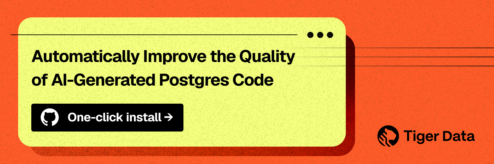
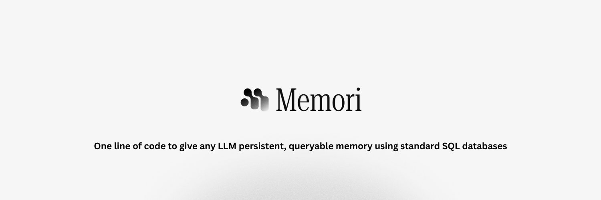
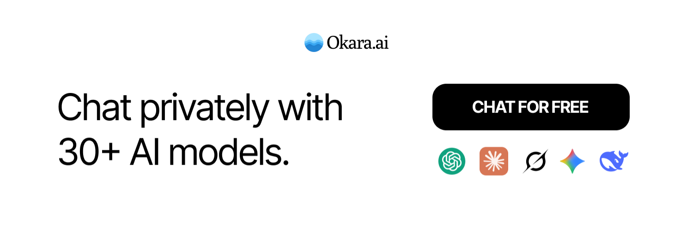
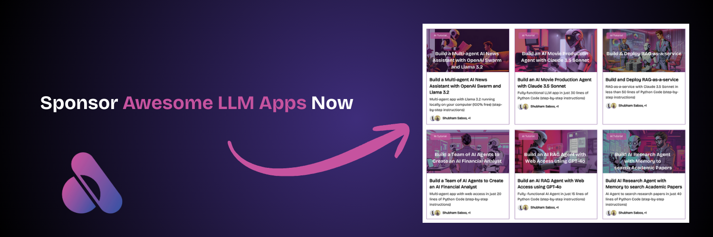

<p align="center">
  <a href="http://www.theunwindai.com">
    
  </a>
</p>

<p align="center">
  <a href="https://www.linkedin.com/in/shubhamsaboo/">
    
  </a>
  <a href="https://twitter.com/Saboo_Shubham_">
    
  </a>
</p>

<p align="center">
  <!-- Keep these links. Translations will automatically update with the README. -->
  <a href="https://www.readme-i18n.com/Shubhamsaboo/awesome-llm-apps?lang=de">Deutsch</a> | 
  <a href="https://www.readme-i18n.com/Shubhamsaboo/awesome-llm-apps?lang=es">Español</a> | 
  <a href="https://www.readme-i18n.com/Shubhamsaboo/awesome-llm-apps?lang=fr">français</a> | 
  <a href="https://www.readme-i18n.com/Shubhamsaboo/awesome-llm-apps?lang=ja">日本語</a> | 
  <a href="https://www.readme-i18n.com/Shubhamsaboo/awesome-llm-apps?lang=ko">한국어</a> | 
  <a href="https://www.readme-i18n.com/Shubhamsaboo/awesome-llm-apps?lang=pt">Português</a> | 
  <a href="https://www.readme-i18n.com/Shubhamsaboo/awesome-llm-apps?lang=ru">Русский</a> | 
  <a href="https://www.readme-i18n.com/Shubhamsaboo/awesome-llm-apps?lang=zh">中文</a>
</p>

<hr/>

# 🌟 Awesome LLM Apps

A curated collection of **Awesome LLM apps built with RAG, AI Agents, Multi-agent Teams, MCP, Voice Agents, and more.** This repository features LLM apps that use models from **OpenAI** , **Anthropic**, **Google**, **xAI** and open-source models like **Qwen** or  **Llama** that you can run locally on your computer.

<p align="center">
  <a href="https://trendshift.io/repositories/9876" target="_blank">
    
  </a>
</p>

## 🤔 Why Awesome LLM Apps?

- 💡 Discover practical and creative ways LLMs can be applied across different domains, from code repositories to email inboxes and more.
- 🔥 Explore apps that combine LLMs from OpenAI, Anthropic, Gemini, and open-source alternatives with AI Agents, Agent Teams, MCP & RAG.
- 🎓 Learn from well-documented projects and contribute to the growing open-source ecosystem of LLM-powered applications.

## 🙏 Thanks to our sponsors

<table align="center" cellpadding="16" cellspacing="12">
  <tr>
    <td align="center">
      <a href="https://tsdb.co/shubham-gh" target="_blank" rel="noopener" title="Tiger Data">
        
      </a>
      <br>
      <a href="https://tsdb.co/shubham-gh" target="_blank" rel="noopener" style="text-decoration: none; color: #333; font-weight: bold; font-size: 18px;">
        Tiger Data MCP
      </a>
    </td>
    <td align="center">
      <a href="https://github.com/GibsonAI/Memori" target="_blank" rel="noopener" title="Memori">
        
      </a>
      <br>
      <a href="https://github.com/GibsonAI/Memori" target="_blank" rel="noopener" style="text-decoration: none; color: #333; font-weight: bold; font-size: 18px;">
        Memori
      </a>
    </td>
  </tr>
  <tr>
    <td align="center">
      <a href="https://okara.ai/?utm_source=oss&utm_medium=sponsorship&utm_campaign=awesome-llm-apps" title="Okara">
        
      </a>
      <br>
      <a href="https://okara.ai/?utm_source=oss&utm_medium=sponsorship&utm_campaign=awesome-llm-apps" style="text-decoration: none; color: #333; font-weight: bold; font-size: 18px;">
        Okara AI
      </a>
    </td>
    <td align="center">
      <a href="https://sponsorunwindai.com/" title="Become a Sponsor">
        
      </a>
      <br>
      <a href="https://sponsorunwindai.com/" style="text-decoration: none; color: #333; font-weight: bold; font-size: 18px;">
        Become a Sponsor
      </a>
    </td>
  </tr>
</table>

## 📂 Featured AI Projects

### AI Agents

### 🌱 Starter AI Agents

*   [🎙️ AI Blog to Podcast Agent](starter_ai_agents/ai_blog_to_podcast_agent/)
*   [❤️‍🩹 AI Breakup Recovery Agent](starter_ai_agents/ai_breakup_recovery_agent/)
*   [📊 AI Data Analysis Agent](starter_ai_agents/ai_data_analysis_agent/)
*   [🩻 AI Medical Imaging Agent](starter_ai_agents/ai_medical_imaging_agent/)
*   [😂 AI Meme Generator Agent (Browser)](starter_ai_agents/ai_meme_generator_agent_browseruse/)
*   [🎵 AI Music Generator Agent](starter_ai_agents/ai_music_generator_agent/)
*   [🛫 AI Travel Agent (Local & Cloud)](starter_ai_agents/ai_travel_agent/)
*   [✨ Gemini Multimodal Agent](starter_ai_agents/gemini_multimodal_agent_demo/)
*   [🔄 Mixture of Agents](starter_ai_agents/mixture_of_agents/)
*   [📊 xAI Finance Agent](starter_ai_agents/xai_finance_agent/)
*   [🔍 OpenAI Research Agent](starter_ai_agents/opeani_research_agent/)
*   [🕸️ Web Scraping AI Agent (Local & Cloud SDK)](starter_ai_agents/web_scrapping_ai_agent/)

### 🚀 Advanced AI Agents
*   [🏚️ 🍌 AI Home Renovation Agent with Nano Banana](advanced_ai_agents/multi_agent_apps/ai_home_renovation_agent)
*   [🔍 AI Deep Research Agent](advanced_ai_agents/single_agent_apps/ai_deep_research_agent/)
*   [🤝 AI Consultant Agent](advanced_ai_agents/single_agent_apps/ai_consultant_agent)
*   [🏗️ AI System Architect Agent](advanced_ai_agents/single_agent_apps/ai_system_architect_r1/)
*   [💰 AI Financial Coach Agent](advanced_ai_agents/multi_agent_apps/ai_financial_coach_agent/)
*   [🎬 AI Movie Production Agent](advanced_ai_agents/single_agent_apps/ai_movie_production_agent/)
*   [📈 AI Investment Agent](advanced_ai_agents/single_agent_apps/ai_investment_agent/)
*   [🏋️‍♂️ AI Health & Fitness Agent](advanced_ai_agents/single_agent_apps/ai_health_fitness_agent/)
*   [🚀 AI Product Launch Intelligence Agent](advanced_ai_agents/multi_agent_apps/product_launch_intelligence_agent)
*   [🗞️ AI Journalist Agent](advanced_ai_agents/single_agent_apps/ai_journalist_agent/)
*   [🧠 AI Mental Wellbeing Agent](advanced_ai_agents/multi_agent_apps/ai_mental_wellbeing_agent/)
*   [📑 AI Meeting Agent](advanced_ai_agents/single_agent_apps/ai_meeting_agent/)
*   [🧬 AI Self-Evolving Agent](advanced_ai_agents/multi_agent_apps/ai_Self-Evolving_agent/)
*   [🎧 AI Social Media News and Podcast Agent](advanced_ai_agents/multi_agent_apps/ai_news_and_podcast_agents/)

### 🎮 Autonomous Game Playing Agents

*   [🎮 AI 3D Pygame Agent](advanced_ai_agents/autonomous_game_playing_agent_apps/ai_3dpygame_r1/)
*   [♜ AI Chess Agent](advanced_ai_agents/autonomous_game_playing_agent_apps/ai_chess_agent/)
*   [🎲 AI Tic-Tac-Toe Agent](advanced_ai_agents/autonomous_game_playing_agent_apps/ai_tic_tac_toe_agent/)

### 🤝 Multi-agent Teams

*   [🧲 AI Competitor Intelligence Agent Team](advanced_ai_agents/multi_agent_apps/agent_teams/ai_competitor_intelligence_agent_team/)
*   [💲 AI Finance Agent Team](advanced_ai_agents/multi_agent_apps/agent_teams/ai_finance_agent_team/)
*   [🎨 AI Game Design Agent Team](advanced_ai_agents/multi_agent_apps/agent_teams/ai_game_design_agent_team/)
*   [👨‍⚖️ AI Legal Agent Team (Cloud & Local)](advanced_ai_agents/multi_agent_apps/agent_teams/ai_legal_agent_team/)
*   [💼 AI Recruitment Agent Team](advanced_ai_agents/multi_agent_apps/agent_teams/ai_recruitment_agent_team/)
*   [🏠 AI Real Estate Agent Team](advanced_ai_agents/multi_agent_apps/agent_teams/ai_real_estate_agent_team)
*   [👨‍💼 AI Services Agency (CrewAI)](advanced_ai_agents/multi_agent_apps/agent_teams/ai_services_agency/)
*   [👨‍🏫 AI Teaching Agent Team](advanced_ai_agents/multi_agent_apps/agent_teams/ai_teaching_agent_team/)
*   [💻 Multimodal Coding Agent Team](advanced_ai_agents/multi_agent_apps/agent_teams/multimodal_coding_agent_team/)
*   [✨ Multimodal Design Agent Team](advanced_ai_agents/multi_agent_apps/agent_teams/multimodal_design_agent_team/)
*   [🎨 🍌 Multimodal UI/UX Feedback Agent Team with Nano Banana](advanced_ai_agents/multi_agent_apps/agent_teams/multimodal_uiux_feedback_agent_team/)
*   [🌏 AI Travel Planner Agent Team](/advanced_ai_agents/multi_agent_apps/agent_teams/ai_travel_planner_agent_team/)

### 🗣️ Voice AI Agents

*   [🗣️ AI Audio Tour Agent](voice_ai_agents/ai_audio_tour_agent/)
*   [📞 Customer Support Voice Agent](voice_ai_agents/customer_support_voice_agent/)
*   [🔊 Voice RAG Agent (OpenAI SDK)](voice_ai_agents/voice_rag_openaisdk/)


###  MCP AI Agents 

*   [♾️ Browser MCP Agent](mcp_ai_agents/browser_mcp_agent/)
*   [🐙 GitHub MCP Agent](mcp_ai_agents/github_mcp_agent/)
*   [📑 Notion MCP Agent](mcp_ai_agents/notion_mcp_agent) 
*   [🌍 AI Travel Planner MCP Agent](mcp_ai_agents/ai_travel_planner_mcp_agent_team)

### 📀 RAG (Retrieval Augmented Generation)
*   [🔥 Agentic RAG with Embedding Gemma](rag_tutorials/agentic_rag_embedding_gemma)
*   [🧐 Agentic RAG with Reasoning](rag_tutorials/agentic_rag_with_reasoning/)
*   [📰 AI Blog Search (RAG)](rag_tutorials/ai_blog_search/)
*   [🔍 Autonomous RAG](rag_tutorials/autonomous_rag/)
*   [🔄 Contextual AI RAG Agent](rag_tutorials/contextualai_rag_agent/)
*   [🔄 Corrective RAG (CRAG)](rag_tutorials/corrective_rag/)
*   [🐋 Deepseek Local RAG Agent](rag_tutorials/deepseek_local_rag_agent/)
*   [🤔 Gemini Agentic RAG](rag_tutorials/gemini_agentic_rag/)
*   [👀 Hybrid Search RAG (Cloud)](rag_tutorials/hybrid_search_rag/)
*   [🔄 Llama 3.1 Local RAG](rag_tutorials/llama3.1_local_rag/)
*   [🖥️ Local Hybrid Search RAG](rag_tutorials/local_hybrid_search_rag/)
*   [🦙 Local RAG Agent](rag_tutorials/local_rag_agent/)
*   [🧩 RAG-as-a-Service](rag_tutorials/rag-as-a-service/)
*   [✨ RAG Agent with Cohere](rag_tutorials/rag_agent_cohere/)
*   [⛓️ Basic RAG Chain](rag_tutorials/rag_chain/)
*   [📠 RAG with Database Routing](rag_tutorials/rag_database_routing/)
*   [🖼️ Vision RAG](rag_tutorials/vision_rag/)

### 💾 LLM Apps with Memory Tutorials

*   [💾 AI ArXiv Agent with Memory](advanced_llm_apps/llm_apps_with_memory_tutorials/ai_arxiv_agent_memory/)
*   [🛩️ AI Travel Agent with Memory](advanced_llm_apps/llm_apps_with_memory_tutorials/ai_travel_agent_memory/)
*   [💬 Llama3 Stateful Chat](advanced_llm_apps/llm_apps_with_memory_tutorials/llama3_stateful_chat/)
*   [📝 LLM App with Personalized Memory](advanced_llm_apps/llm_apps_with_memory_tutorials/llm_app_personalized_memory/)
*   [🗄️ Local ChatGPT Clone with Memory](advanced_llm_apps/llm_apps_with_memory_tutorials/local_chatgpt_with_memory/)
*   [🧠 Multi-LLM Application with Shared Memory](advanced_llm_apps/llm_apps_with_memory_tutorials/multi_llm_memory/)


### 💬 Chat with X Tutorials

*   [💬 Chat with GitHub (GPT & Llama3)](advanced_llm_apps/chat_with_X_tutorials/chat_with_github/)
*   [📨 Chat with Gmail](advanced_llm_apps/chat_with_X_tutorials/chat_with_gmail/)
*   [📄 Chat with PDF (GPT & Llama3)](advanced_llm_apps/chat_with_X_tutorials/chat_with_pdf/)
*   [📚 Chat with Research Papers (ArXiv) (GPT & Llama3)](advanced_llm_apps/chat_with_X_tutorials/chat_with_research_papers/)
*   [📝 Chat with Substack](advanced_llm_apps/chat_with_X_tutorials/chat_with_substack/)
*   [📽️ Chat with YouTube Videos](advanced_llm_apps/chat_with_X_tutorials/chat_with_youtube_videos/)

### 🎯 LLM Optimization Tools

*   [🎯 Toonify Token Optimization](advanced_llm_apps/llm_optimization_tools/toonify_token_optimization/) - Reduce LLM API costs by 30-60% using TOON format

### 🔧 LLM Fine-tuning Tutorials

*  [Gemma 3 Fine-tuning](advanced_llm_apps/llm_finetuning_tutorials/gemma3_finetuning/)
*  [Llama 3.2 Fine-tuning](advanced_llm_apps/llm_finetuning_tutorials/llama3.2_finetuning/)


### 🧑‍🏫 AI Agent Framework Crash Course

 [Google ADK Crash Course](ai_agent_framework_crash_course/google_adk_crash_course/)
  - Starter agent; model‑agnostic (OpenAI, Claude)
  - Structured outputs (Pydantic)
  - Tools: built‑in, function, third‑party, MCP tools
  - Memory; callbacks; Plugins
  - Simple multi‑agent; Multi‑agent patterns

 [OpenAI Agents SDK Crash Course](ai_agent_framework_crash_course/openai_sdk_crash_course/)
  - Starter agent; function calling; structured outputs
  - Tools: built‑in, function, third‑party integrations
  - Memory; callbacks; evaluation
  - Multi‑agent patterns; agent handoffs
  - Swarm orchestration; routing logic

## 🚀 Getting Started

1. **Clone the repository** 

    ```bash 
    git clone https://github.com/Shubhamsaboo/awesome-llm-apps.git 
    ```

2. **Navigate to the desired project directory**

    ```bash 
    cd awesome-llm-apps/starter_ai_agents/ai_travel_agent
    ```

3. **Install the required dependencies**

    ```bash
    pip install -r requirements.txt
    ```

4. **Follow the project-specific instructions** in each project's `README.md` file to set up and run the app.


###  Thank You, Community, for the Support! 🙏

[](https://star-history.com/#Shubhamsaboo/awesome-llm-apps&Date)

🌟 **Don’t miss out on future updates! Star the repo now and be the first to know about new and exciting LLM apps with RAG and AI Agents.**

- [AgentsKB](https://agentskb.com) - Upgrade your AI with researched answers. We did the research so your AI gets it right the first time.
