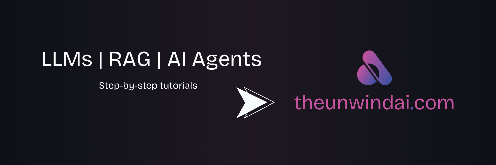

<p align="center">
  <a href="http://www.theunwindai.com">
    
  </a>
</p>

<p align="center">
  <a href="https://www.linkedin.com/in/shubhamsaboo/">
    
  </a>
  <a href="https://twitter.com/Saboo_Shubham_">
    
  </a>
</p>

<hr/>

# Awesome LLM Apps

A curated collection of awesome LLM apps built with RAG and AI agents. This repository features LLM apps that use models from OpenAI, Anthropic, Google, and open-source models like DeepSeek, Qwen or Llama that you can run locally on your computer.

<p align="center">
  <a href="https://trendshift.io/repositories/9876" target="_blank">
    
  </a>
</p>

## Table of Contents

- [Why Awesome LLM Apps?](#why-awesome-llm-apps)
- [AI Agent Hackathon](#open-source-ai-agent-hackathon)
- [Featured AI Projects](#featured-ai-projects)
  - [Starter AI Agents](#-starter-ai-agents)
  - [Advanced AI Agents](#-advanced-ai-agents)
  - [Autonomous Game Playing Agents](#-autonomous-game-playing-agents)
  - [Multi-agent Teams](#-multi-agent-teams)
  - [Voice AI Agents](#-voice-ai-agents)
  - [MCP AI Agents](#-mcp-ai-agents)
  - [MCP Exercises](#mcp-exercises---build-your-own-mcp-servers)
  - [RAG Tutorials](#rag-retrieval-augmented-generation)
  - [Chat with X Tutorials](#-chat-with-x-tutorials)
  - [LLM Apps with Memory](#-llm-apps-with-memory-tutorials)
  - [LLM Fine-tuning](#-llm-fine-tuning-tutorials)
  - [Cursor AI Experiments](#-cursor-ai-experiments)
- [Tech Stack](#tech-stack)
- [Project Structure](#project-structure)
- [Getting Started](#getting-started)
- [Contributing](#contributing-to-open-source)
- [License](#license)

## Why Awesome LLM Apps?

- Discover practical and creative ways LLMs can be applied across different domains, from code repositories to email inboxes and more.
- Explore apps that combine LLMs from OpenAI, Anthropic, Gemini, and open-source alternatives with RAG and AI Agents.
- Learn from well-documented projects and contribute to the growing open-source ecosystem of LLM-powered applications.

## Open Source AI Agent Hackathon

We're launching a Global AI Agent Hackathon in collaboration with AI Agent ecosystem partners -- open to all developers, builders, and startups working on agents, RAG, tool use, or multi-agent systems.

- Win up to **$25,000** in cash by building Agents
- Top 5 projects will be featured in the top trending [Awesome LLM Apps](https://github.com/Shubhamsaboo/awesome-llm-apps) repo.
- **$20,000** worth of API and tool use credits from the partners

### Participate Now: [Global AI Agent Hackathon](https://github.com/global-agent-hackathon/global-agent-hackathon-may-2025)

Star this repo and subscribe to [Unwind AI](https://www.theunwindai.com) for latest updates.

---

## Featured AI Projects

### AI Agents

#### Starter AI Agents

| Project | Description |
|---------|-------------|
| [AI Blog to Podcast Agent](starter_ai_agents/ai_blog_to_podcast_agent/) | Convert blog posts into podcast-style audio using ElevenLabs |
| [AI Breakup Recovery Agent](starter_ai_agents/ai_breakup_recovery_agent/) | Emotional support and recovery guidance agent |
| [AI Data Analysis Agent](starter_ai_agents/ai_data_analysis_agent/) | Analyze datasets using pandas and numpy |
| [AI Data Visualisation Agent](starter_ai_agents/ai_data_visualisation_agent/) | Generate visualizations with matplotlib and plotly |
| [AI Medical Imaging Agent](starter_ai_agents/ai_medical_imaging_agent/) | Analyze medical images with multimodal LLMs |
| [AI Meme Generator Agent (Browser)](starter_ai_agents/ai_meme_generator_agent_browseruse/) | Generate memes with browser automation |
| [AI Music Generator Agent](starter_ai_agents/ai_music_generator_agent/) | Compose and generate music |
| [AI Reasoning Agent](starter_ai_agents/ai_reasoning_agent/) | Complex reasoning tasks with local models |
| [AI Startup Trend Analysis Agent](starter_ai_agents/ai_startup_trend_analysis_agent/) | Analyze startup market trends |
| [AI Travel Agent (Local & Cloud)](starter_ai_agents/ai_travel_agent/) | Plan travel itineraries with AI |
| [Gemini Multimodal Agent](starter_ai_agents/gemini_multimodal_agent_demo/) | Google Gemini multimodal capabilities demo |
| [Local News Agent (OpenAI Swarm)](starter_ai_agents/local_news_agent_openai_swarm/) | News aggregation with OpenAI Swarm |
| [Mixture of Agents](starter_ai_agents/mixture_of_agents/) | Ensemble approach with multiple agents |
| [Multimodal AI Agent](starter_ai_agents/multimodal_ai_agent/) | Handle multiple input modalities |
| [OpenAI Research Agent](starter_ai_agents/opeani_research_agent/) | Research automation with OpenAI Agents SDK |
| [Web Scraping AI Agent (Local & Cloud)](starter_ai_agents/web_scrapping_ai_agent/) | Web scraping and content extraction |
| [xAI Finance Agent](starter_ai_agents/xai_finance_agent/) | Financial analysis with xAI (Grok) |

#### Advanced AI Agents

| Project | Description |
|---------|-------------|
| [AI Customer Support Agent](advanced_ai_agents/single_agent_apps/ai_customer_support_agent/) | Automated customer service agent |
| [AI Deep Research Agent](advanced_ai_agents/single_agent_apps/ai_deep_research_agent/) | Deep web research with Firecrawl |
| [AI Health & Fitness Agent](advanced_ai_agents/single_agent_apps/ai_health_fitness_agent/) | Health and fitness coaching |
| [AI Investment Agent](advanced_ai_agents/single_agent_apps/ai_investment_agent/) | Investment analysis and recommendations |
| [AI Journalist Agent](advanced_ai_agents/single_agent_apps/ai_journalist_agent/) | Automated news writing |
| [AI Lead Generation Agent](advanced_ai_agents/single_agent_apps/ai_lead_generation_agent/) | Sales lead identification and outreach |
| [AI Meeting Agent](advanced_ai_agents/single_agent_apps/ai_meeting_agent/) | Meeting scheduling and summarization |
| [AI Movie Production Agent](advanced_ai_agents/single_agent_apps/ai_movie_production_agent/) | Entertainment project planning |
| [AI Personal Finance Agent](advanced_ai_agents/single_agent_apps/ai_personal_finance_agent/) | Personal finance management |
| [AI Real Estate Agent](advanced_ai_agents/single_agent_apps/ai_real_estate_agent/) | Real estate assistance and search |
| [AI System Architect Agent](advanced_ai_agents/single_agent_apps/ai_system_architect_r1/) | System design using reasoning models |
| [AI Financial Coach Agent](advanced_ai_agents/multi_agent_apps/ai_financial_coach_agent/) | Multi-agent financial coaching (Google ADK) |
| [AI Mental Wellbeing Agent](advanced_ai_agents/multi_agent_apps/ai_mental_wellbeing_agent/) | Mental health support system |
| [AI AQI Analysis Agent](advanced_ai_agents/multi_agent_apps/ai_aqi_analysis_agent/) | Air quality index analysis |
| [Multi-Agent Researcher](advanced_ai_agents/multi_agent_apps/multi_agent_researcher/) | Distributed multi-agent research system |

#### Autonomous Game Playing Agents

| Project | Description |
|---------|-------------|
| [AI 3D Pygame Agent](advanced_ai_agents/autonomous_game_playing_agent_apps/ai_3dpygame_r1/) | 3D game playing with Pygame |
| [AI Chess Agent](advanced_ai_agents/autonomous_game_playing_agent_apps/ai_chess_agent/) | Chess playing agent |
| [AI Tic-Tac-Toe Agent](advanced_ai_agents/autonomous_game_playing_agent_apps/ai_tic_tac_toe_agent/) | Tic-tac-toe playing agent |

#### Multi-agent Teams

| Project | Description |
|---------|-------------|
| [AI Competitor Intelligence Agent Team](advanced_ai_agents/multi_agent_apps/agent_teams/ai_competitor_intelligence_agent_team/) | Market and competitor intelligence |
| [AI Finance Agent Team](advanced_ai_agents/multi_agent_apps/agent_teams/ai_finance_agent_team/) | Collaborative financial planning |
| [AI Game Design Agent Team](advanced_ai_agents/multi_agent_apps/agent_teams/ai_game_design_agent_team/) | Game design collaboration |
| [AI Legal Agent Team (Cloud & Local)](advanced_ai_agents/multi_agent_apps/agent_teams/ai_legal_agent_team/) | Legal document analysis |
| [AI Recruitment Agent Team](advanced_ai_agents/multi_agent_apps/agent_teams/ai_recruitment_agent_team/) | Hiring process automation |
| [AI Services Agency (CrewAI)](advanced_ai_agents/multi_agent_apps/agent_teams/ai_services_agency/) | General services with CrewAI |
| [AI Teaching Agent Team](advanced_ai_agents/multi_agent_apps/agent_teams/ai_teaching_agent_team/) | Educational content generation |
| [Multimodal Coding Agent Team](advanced_ai_agents/multi_agent_apps/agent_teams/multimodal_coding_agent_team/) | Code generation team |
| [Multimodal Design Agent Team](advanced_ai_agents/multi_agent_apps/agent_teams/multimodal_design_agent_team/) | Design automation team |

### Voice AI Agents

| Project | Description |
|---------|-------------|
| [AI Audio Tour Agent](voice_ai_agents/ai_audio_tour_agent/) | Audio-guided tour agent |
| [Customer Support Voice Agent](voice_ai_agents/customer_support_voice_agent/) | Voice-based customer support |
| [Voice RAG Agent (OpenAI SDK)](voice_ai_agents/voice_rag_openaisdk/) | Voice interface for RAG |

### MCP AI Agents

| Project | Description |
|---------|-------------|
| [MCP Browser Agent](mcp_ai_agents/browser_mcp_agent/) | Browser automation with Model Context Protocol |
| [MCP GitHub Agent](mcp_ai_agents/github_mcp_agent/) | GitHub integration with Model Context Protocol |

### MCP Exercises - Build Your Own MCP Servers

A hands-on tutorial and reference implementations for building Model Context Protocol servers from scratch. [Full guide here.](mcp_exercises/)

| Project | Description | Concepts |
|---------|-------------|----------|
| [Weather MCP Server](mcp_exercises/01_weather_mcp_server/) | Weather lookup using Open-Meteo API | Async tools, API integration |
| [Calculator MCP Server](mcp_exercises/02_calculator_mcp_server/) | Scientific calculator with history | Tools, Resources, state management |
| [File Search MCP Server](mcp_exercises/03_file_search_mcp_server/) | Search and read local files | File I/O, path safety, prompts |
| [Notes MCP Server](mcp_exercises/04_notes_mcp_server/) | Notes & todo CRUD management | Full CRUD, persistent storage |
| [MCP Client Example](mcp_exercises/05_mcp_client_example/) | Python client for any MCP server | Client SDK, tool discovery |

### RAG (Retrieval Augmented Generation)

| Project | Description |
|---------|-------------|
| [Agentic RAG](rag_tutorials/agentic_rag/) | RAG with agent capabilities |
| [AI Blog Search (RAG)](rag_tutorials/ai_blog_search/) | Blog search using RAG |
| [Autonomous RAG](rag_tutorials/autonomous_rag/) | Self-improving RAG pipeline |
| [Corrective RAG (CRAG)](rag_tutorials/corrective_rag/) | Error correction in RAG |
| [Deepseek Local RAG Agent](rag_tutorials/deepseek_local_rag_agent/) | Local RAG with DeepSeek |
| [Gemini Agentic RAG](rag_tutorials/gemini_agentic_rag/) | Google Gemini powered RAG |
| [Hybrid Search RAG (Cloud)](rag_tutorials/hybrid_search_rag/) | Keyword + semantic search |
| [Llama 3.1 Local RAG](rag_tutorials/llama3.1_local_rag/) | Local RAG with Ollama/Llama |
| [Local Hybrid Search RAG](rag_tutorials/local_hybrid_search_rag/) | Local hybrid search implementation |
| [Local RAG Agent](rag_tutorials/local_rag_agent/) | Fully local RAG stack |
| [RAG-as-a-Service](rag_tutorials/rag-as-a-service/) | RAG deployed as a service |
| [RAG Agent with Cohere](rag_tutorials/rag_agent_cohere/) | Cohere-based RAG agent |
| [Basic RAG Chain](rag_tutorials/rag_chain/) | Basic RAG chain implementation |
| [RAG with Database Routing](rag_tutorials/rag_database_routing/) | Smart database routing for RAG |

### Advanced LLM Apps

#### Chat with X Tutorials

| Project | Description |
|---------|-------------|
| [Chat with GitHub (GPT & Llama3)](advanced_llm_apps/chat_with_X_tutorials/chat_with_github/) | Analyze GitHub repositories |
| [Chat with Gmail](advanced_llm_apps/chat_with_X_tutorials/chat_with_gmail/) | Analyze and interact with emails |
| [Chat with PDF (GPT & Llama3)](advanced_llm_apps/chat_with_X_tutorials/chat_with_pdf/) | PDF document interaction |
| [Chat with Research Papers (ArXiv)](advanced_llm_apps/chat_with_X_tutorials/chat_with_research_papers/) | ArXiv paper analysis (GPT & Llama3) |
| [Chat with Substack](advanced_llm_apps/chat_with_X_tutorials/chat_with_substack/) | Substack newsletter analysis |
| [Chat with YouTube Videos](advanced_llm_apps/chat_with_X_tutorials/chat_with_youtube_videos/) | Video transcript analysis |

#### LLM Apps with Memory Tutorials

| Project | Description |
|---------|-------------|
| [AI ArXiv Agent with Memory](advanced_llm_apps/llm_apps_with_memory_tutorials/ai_arxiv_agent_memory/) | ArXiv research with persistent memory |
| [AI Travel Agent with Memory](advanced_llm_apps/llm_apps_with_memory_tutorials/ai_travel_agent_memory/) | Stateful travel planning |
| [Llama3 Stateful Chat](advanced_llm_apps/llm_apps_with_memory_tutorials/llama3_stateful_chat/) | Conversation with state management |
| [LLM App with Personalized Memory](advanced_llm_apps/llm_apps_with_memory_tutorials/llm_app_personalized_memory/) | Personalized user experiences |
| [Local ChatGPT Clone with Memory](advanced_llm_apps/llm_apps_with_memory_tutorials/local_chatgpt_with_memory/) | Local ChatGPT alternative with memory |
| [Multi-LLM App with Shared Memory](advanced_llm_apps/llm_apps_with_memory_tutorials/multi_llm_memory/) | Multiple LLMs with shared memory |

#### LLM Fine-tuning Tutorials

| Project | Description |
|---------|-------------|
| [Llama 3.2 Fine-tuning](advanced_llm_apps/llm_finetuning_tutorials/llama3.2_finetuning/) | Fine-tune Llama 3.2 models |

#### Cursor AI Experiments

| Project | Description |
|---------|-------------|
| [LLM Router App](advanced_llm_apps/cursor_ai_experiments/llm_router_app/) | Intelligent request routing across LLMs |
| [Local ChatGPT Clone](advanced_llm_apps/cursor_ai_experiments/local_chatgpt_clone/) | Local ChatGPT alternative |

---

## Tech Stack

The projects in this repository use a variety of technologies and frameworks:

**LLM Providers**

| Provider | Models |
|----------|--------|
| OpenAI | GPT-4o, GPT-4, GPT-3.5 |
| Google | Gemini, Google ADK |
| Anthropic | Claude |
| Open-source | Llama 3/3.1/3.2, DeepSeek, Qwen |
| Specialized | Groq, Together.ai, Cohere, xAI (Grok) |

**Agent Frameworks**: agno, LangChain, OpenAI Agents SDK, CrewAI, phidata, OpenAI Swarm, Google ADK, MCP

**Web Frameworks**: Streamlit (primary), FastAPI, Gradio

**Vector Databases**: Qdrant, LanceDB, Chroma, PGVector

**Voice/Audio**: OpenAI Audio APIs, ElevenLabs

**Web Scraping**: Firecrawl, Playwright, Browser-use, DuckDuckGo Search

## Project Structure

```
awesome-llm-apps/
├── starter_ai_agents/              # 17 beginner-friendly AI agent projects
├── advanced_ai_agents/
│   ├── single_agent_apps/          # 11 domain-specific single agents
│   ├── multi_agent_apps/           # 4 collaborative multi-agent apps
│   │   └── agent_teams/            # 9 specialized agent team projects
│   └── autonomous_game_playing_agent_apps/  # 3 game-playing agents
├── rag_tutorials/                  # 14 RAG implementation tutorials
├── advanced_llm_apps/
│   ├── chat_with_X_tutorials/      # 6 "chat with" data source apps
│   ├── llm_apps_with_memory_tutorials/  # 6 memory-augmented apps
│   ├── llm_finetuning_tutorials/   # Fine-tuning guides
│   └── cursor_ai_experiments/      # Experimental Cursor AI projects
├── voice_ai_agents/                # 3 voice-based AI applications
├── mcp_ai_agents/                  # 2 Model Context Protocol agents
├── mcp_exercises/                  # MCP tutorial with 4 reference servers + client
├── docs/                           # Documentation assets and banners
└── LICENSE                         # Apache License 2.0
```

Each project is self-contained with its own `README.md` and `requirements.txt`.

## Getting Started

1. **Clone the repository**

    ```bash
    git clone https://github.com/Shubhamsaboo/awesome-llm-apps.git
    ```

2. **Navigate to the desired project directory**

    ```bash
    cd awesome-llm-apps/starter_ai_agents/ai_travel_agent
    ```

3. **Install the required dependencies**

    ```bash
    pip install -r requirements.txt
    ```

4. **Follow the project-specific instructions** in each project's `README.md` file to set up and run the app.

Most projects use **Streamlit** for the UI. After installing dependencies and configuring API keys, you can typically run a project with:

```bash
streamlit run app.py
```

Refer to each project's README for specific API key requirements and configuration details.

## Contributing to Open Source

Contributions are welcome! If you have any ideas, improvements, or new apps to add, please create a new [GitHub Issue](https://github.com/Shubhamsaboo/awesome-llm-apps/issues) or submit a pull request. Make sure to follow the existing project structure and include a detailed `README.md` for each new app.

## License

This project is licensed under the Apache License 2.0 - see the [LICENSE](LICENSE) file for details.

---

### Thank You, Community, for the Support!

[](https://star-history.com/#Shubhamsaboo/awesome-llm-apps&Date)

**Don't miss out on future updates! Star the repo now and be the first to know about new and exciting LLM apps with RAG and AI Agents.**
