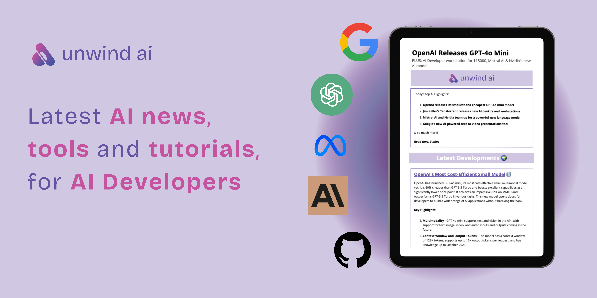

<p align="center">
  <a href="https://unwindai.substack.com">
    
  </a>
</p>

<p align="center">
  <a href="https://www.linkedin.com/in/shubhamsaboo/">
    
  </a>
  <a href="https://twitter.com/Saboo_Shubham_">
      </a>
</p>
<hr/>

# 🌟 Awesome LLM Apps
A curated collection of awesome LLM apps built with RAG and AI agents. This repository features LLM apps that use models from OpenAI, Anthropic, Google, and even open-source models like LLaMA that you can run locally on your computer.

## 🤔 Why Awesome LLM Apps?
- 💡 Discover practical and creative ways LLMs can be applied across different domains, from code repositories to email inboxes and more.
- 🔥 Explore apps that combines LLMs from OpenAI, Anthropic, Gemini, and open-source alternatives with RAG and AI Agents.
- 🎓 Learn from well-documented projects and contribute to the growing opensource ecosystem of LLM-powered applications.

## 📂 Featured Projects

### 💻 Local Lllama-3 with RAG
Chat with any webpage using local Llama-3 and Retrieval Augmented Generation (RAG) in a Streamlit app. Enjoy 100% free and offline functionality.

### 💬 Chat with GitHub Repo
Engage in natural conversations with your GitHub repositories using GPT-4. Uncover valuable insights and documentation effortlessly.

### 📨 Chat with Gmail
Interact with your Gmail inbox using natural language. Get accurate answers to your questions based on the content of your emails with Retrieval Augmented Generation (RAG).

### 📝 Chat with Substack Newsletter
Chat with a Substack newsletter using OpenAI's API and the Embedchain library in a Streamlit app. Leverage GPT-4 for precise answers based on newsletter content.

### 📄 Chat with PDF
Engage in intelligent conversation and question-answering based on the content of your PDF documents. Simply upload and start asking questions.

### 📽️ Chat with YouTube Videos
Dive into video content with interactive conversation and question-answering based on YouTube videos. Provide a URL and engage with the video's content through natural language.

### 💻 Web Scraping AI Agent
Intelligently scrape websites using OpenAI API and the scrapegraphai library. Specify the URL and extraction requirements, and let the AI agent handle the rest.


## 🚀 Getting Started

1. Clone the repository 

```bash 
git clone https://github.com/Shubhamsaboo/awesome-llm-apps.git 
```

2. Navigate to the desired project directory

```bash 
cd awesome-llm-apps/chat_with_gmail 
```

3. Install the required dependencies

```bash
pip install -r requirements.txt
```

4. Follow the project-specific instructions in each project's README.md file to set up and run the app.

## 🤝 Contributing to Opensource
Contributions are welcome! If you have any ideas, improvements, or new apps to add, please create a new [GitHub Issue](https://github.com/Shubhamsaboo/awesome-llm-apps/issues) or submit a pull request. Make sure to follow the existing project structure and include a detailed README.md for each new app.

### Thank you community for the support 🙏

[](https://star-history.com/#Shubhamsaboo/awesome-llm-apps&Date)

🌟 **Don’t miss out on future updates! Star the repo now and be the first to know about new and exciting LLM applications with RAG.**
