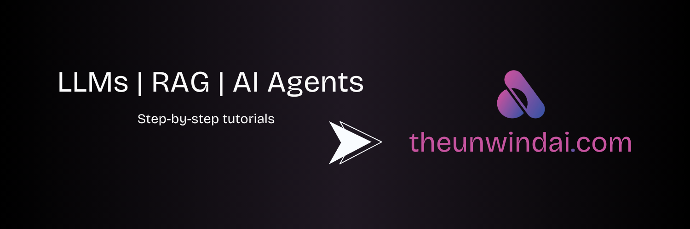
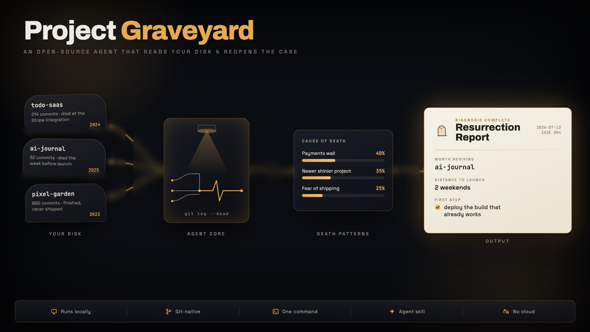
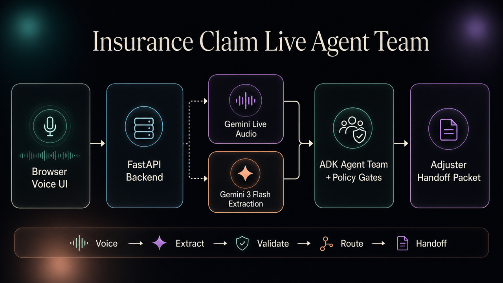
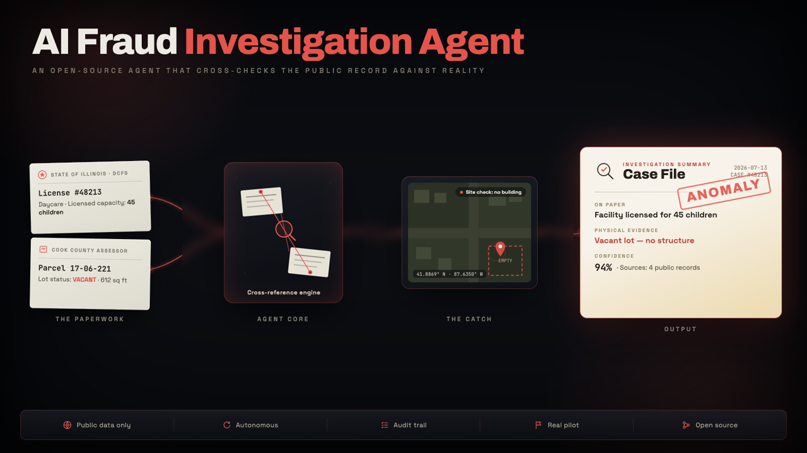
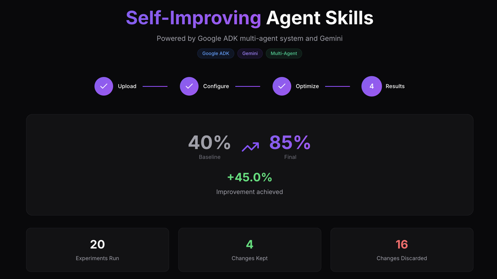
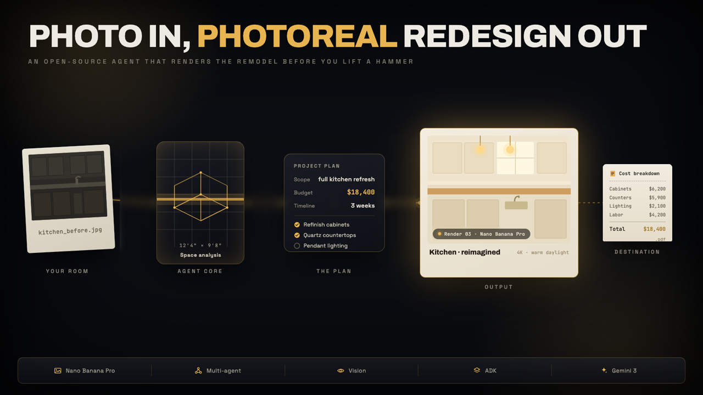
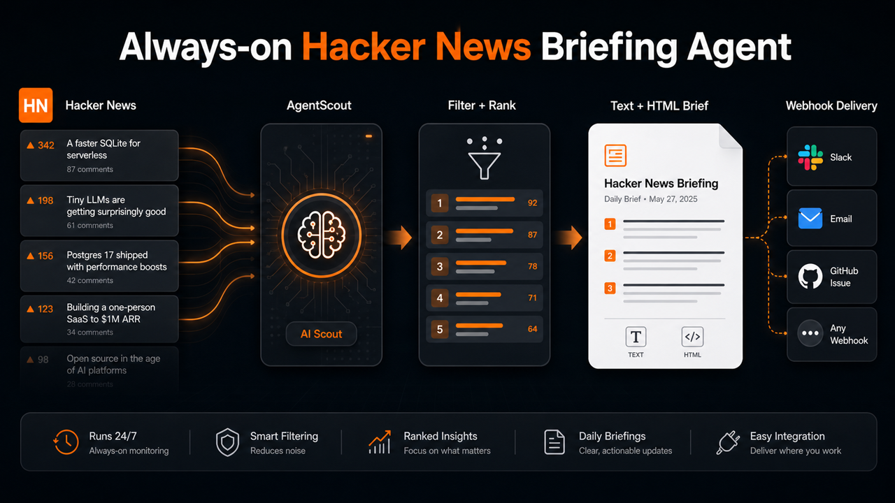

<p align="center">
  <a href="http://www.theunwindai.com">
    
  </a>
</p>

<div align="center">

# Awesome LLM 应用

**100+ 开源 AI 智能体、Agent 技能和 RAG 应用。纯手工打造，端到端测试通过，Apache-2.0 协议。**

克隆、部署、拿去卖 — 100% 免费开源

兼容 Claude、Gemini、GPT、DeepSeek、Llama、Qwen 以及其他开源模型。

**[在 Unwind AI 上手把手教程](https://www.theunwindai.com)** · **[快速上手](#-快速上手)** · **[浏览全部模板](#-浏览全部模板)**


<a href="https://trendshift.io/repositories/9876" target="_blank">
  
</a>

<br>

</div>

<table>
  <tr>
    <td width="33.3%" align="center">
      <a href="agent_skills/project-graveyard/"></a>
      <sub><b>Project Graveyard</b></sub>
    </td>
    <td width="33.3%" align="center">
      <a href="voice_ai_agents/insurance_claim_live_agent_team/"></a>
      <sub><b>Insurance Claim Live Agent Team</b></sub>
    </td>
    <td width="33.3%" align="center">
      <a href="advanced_ai_agents/single_agent_apps/ai_fraud_investigation_agent/"></a>
      <sub><b>AI Fraud Investigation Agent</b></sub>
    </td>
  </tr>
  <tr>
    <td align="center">
      <a href="agent_skills/self-improving-agent-skills/"></a>
      <sub><b>Self-Improving Agent Skills</b></sub>
    </td>
    <td align="center">
      <a href="advanced_ai_agents/multi_agent_apps/ai_home_renovation_agent"></a>
      <sub><b>AI Home Renovation Agent</b></sub>
    </td>
    <td align="center">
      <a href="always_on_agents/always_on_hn_briefing_agent/"></a>
      <sub><b>Always-on HN Briefing Agent</b></sub>
    </td>
  </tr>
</table>

## 🚀 快速上手

10 秒钟给你的编程助手加个新技能：

```bash
npx skills add https://github.com/Shubhamsaboo/awesome-llm-apps/tree/main/agent_skills/project-graveyard
```

然后问它：*「为什么我的副项目总是烂尾？」*

或者 30 秒克隆运行任意一个 Agent：

```bash
git clone https://github.com/Shubhamsaboo/awesome-llm-apps.git
cd awesome-llm-apps/starter_ai_agents/ai_travel_agent
pip install -r requirements.txt
streamlit run travel_agent.py
```

> 📬 每周上新模板。[去 Unwind AI 订阅，第一时间拿到手里](https://www.theunwindai.com)。

## 📂 浏览全部模板

### 🧩 Agent 技能

*给你的编程助手加点新本事。一行命令安装，自然语言调用。每个技能都附带真实代码，且通过了安全审查和自动化评测关。支持 Claude Code、Codex、Cursor 等主流编程助手。[浏览全部技能 →](agent_skills/)*

*   [⚰️ Project Graveyard](agent_skills/project-graveyard/) - 找出你所有烂尾的副项目，告诉你每个为什么凉了，帮你把最值得捡回来的那个做完
*   [🔭 Scope Creep Detector](agent_skills/scope-creep-detector/) - 检查代码 diff 是不是飘了，超出最初意图的部分给你标注：留着、拆出去、还是写清楚理由
*   [🏺 Commit Archaeologist](agent_skills/commit-archaeologist/) - 从首次提交、后续改动、协同变更和意图线索中，还原某个文件或代码片段为什么存在
*   [🩺 Dependency Doctor](agent_skills/dependency-doctor/) - 扫描依赖清单，揪出标准库锁定、过时兼容包、未锁版本、重复约束和已下架版本
*   [🧠 Advisor Orchestrator Worker](agent_skills/advisor-orchestrator-worker/) - 元循环：Claude Fable 5 当顾问，GPT-5.6 做调度，Gemini 3.5 Flash 做执行
*   [♾️ Self-Improving Agent Skills](agent_skills/self-improving-agent-skills/) - 用 Gemini 和 ADK 让 Agent 技能自己进化

### 🌱 入门 AI Agent

*单文件 Agent，一把 API Key 就能跑 — 新手最友好的打开方式。*

*   [🎙️ AI Blog to Podcast Agent](starter_ai_agents/ai_blog_to_podcast_agent/) - 把任意博客链接变成一期有旁白的播客节目
*   [❤️‍🩹 AI Breakup Recovery Agent](starter_ai_agents/ai_breakup_recovery_agent/) - 一个 Agent 团队陪你熬过分手后的情绪漩涡
*   [📊 AI Data Analysis Agent](starter_ai_agents/ai_data_analysis_agent/) - 用人话向 CSV 或 Excel 文件提问
*   [🩻 AI Medical Imaging Agent](starter_ai_agents/ai_medical_imaging_agent/) - 用 Gemini 对 X 光片和扫描影像做诊断分析
*   [😂 AI Meme Generator Agent (Browser)](starter_ai_agents/ai_meme_generator_agent_browseruse/) - 操控真实浏览器做表情包，不靠图片 API
*   [🎵 AI Music Generator Agent](starter_ai_agents/ai_music_generator_agent/) - 提示词进去，MP3 出来
*   [🛫 AI Travel Agent (Local & Cloud)](starter_ai_agents/ai_travel_agent/) - 生成个性化的逐日旅行行程
*   [✨ Gemini Multimodal Agent](starter_ai_agents/multimodal_ai_agent/) - 视频分析 + 联网搜索，一个 Agent 全搞定
*   [🔄 Mixture of Agents](starter_ai_agents/mixture_of_agents/) - 多个 LLM 各自作答，一个模型汇总最优回答
*   [📊 xAI Finance Agent](starter_ai_agents/xai_finance_agent/) - Grok 驱动的实时股票分析
*   [🔍 OpenAI Research Agent](starter_ai_agents/openai_research_agent/) - 基于 OpenAI Agents SDK 的多 Agent 主题调研
*   [🕸️ Web Scraping AI Agent](starter_ai_agents/web_scraping_ai_agent/) - 告诉它你想抓什么，Agent 帮你爬

### 🚀 进阶 AI Agent

*带工具调用、记忆模块和多步推理的准生产级 Agent。*

*   [🏚️ 🍌 AI Home Renovation Agent with Nano Banana Pro](advanced_ai_agents/multi_agent_apps/ai_home_renovation_agent) - 上传房间照片，输出装修方案和照片级效果图
*   [🧠 DevPulse AI - Multi-Agent Signal Intelligence](advanced_ai_agents/multi_agent_apps/devpulse_ai/) - 聚合技术信号并评分，生成每日技术情报简报
*   [🔍 AI Deep Research Agent](advanced_ai_agents/single_agent_apps/ai_deep_research_agent/) - OpenAI Agents SDK + Firecrawl，做全方位网络深度调研
*   [📊 AI VC Due Diligence Agent Team](advanced_ai_agents/multi_agent_apps/agent_teams/ai_vc_due_diligence_agent_team) - Gemini 3 驱动的多 Agent 创业投资尽调分析
*   [🔬 AI Research Planner & Executor (Google Interactions API)](advanced_ai_agents/single_agent_apps/research_agent_gemini_interaction_api) - 多阶段调研，支持有状态对话和自动生成信息图
*   [🤝 AI Consultant Agent](advanced_ai_agents/single_agent_apps/ai_consultant_agent) - 市场分析与策略建议，实时联网调研
*   [🏗️ AI System Architect Agent](advanced_ai_agents/single_agent_apps/ai_system_architect_r1/) - DeepSeek R1 推理 + Claude，给你的系统架构做评审
*   [💰 AI Financial Coach Agent](advanced_ai_agents/multi_agent_apps/ai_financial_coach_agent/) - 个性化的预算、债务和储蓄分析
*   [🎬 AI Movie Production Agent](advanced_ai_agents/single_agent_apps/ai_movie_production_agent/) - 一句话电影创意，输出剧本草稿和选角建议
*   [📈 AI Investment Agent](advanced_ai_agents/single_agent_apps/ai_investment_agent/) - 基于 Yahoo Finance 数据的股票对比报告
*   [📡 Earnings Call Analyst Agent](advanced_ai_agents/single_agent_apps/earnings_call_analyst_agent/) - 把 YouTube 财报电话会变成与播放实时同步的分析工作台
*   [🏋️‍♂️ AI Health & Fitness Agent](advanced_ai_agents/single_agent_apps/ai_health_fitness_agent/) - 根据你的目标定制饮食和训练计划
*   [🚀 AI Product Launch Intelligence Agent](advanced_ai_agents/multi_agent_apps/product_launch_intelligence_agent) - 竞品发布的市场进入情报分析
*   [🔍 AI Fraud Investigation Agent](advanced_ai_agents/single_agent_apps/ai_fraud_investigation_agent/) - 交叉比对公开记录，标记数据对不上的机构
*   [🗞️ AI Journalist Agent](advanced_ai_agents/single_agent_apps/ai_journalist_agent/) - 针对任意话题调研、撰稿、编辑一条龙
*   [🧠 AI Mental Wellbeing Agent](advanced_ai_agents/multi_agent_apps/ai_mental_wellbeing_agent/) - 多 Agent 协作，制定心理健康支持方案
*   [📑 AI Meeting Agent](advanced_ai_agents/single_agent_apps/ai_meeting_agent/) - 开会前帮你备好背景资料、行业洞察和策略简报
*   [🧬 AI Self-Evolving Agent](advanced_ai_agents/multi_agent_apps/ai_self_evolving_agent/) - 让 Agent 用 EvoAgentX 自己改写自己的工作流
*   [👨🏻‍💼 AI Sales Intelligence Agent Team](advanced_ai_agents/multi_agent_apps/agent_teams/ai_sales_intelligence_agent_team) - 实时生成竞品销售对阵卡
*   [🎧 AI Social Media News and Podcast Agent](advanced_ai_agents/multi_agent_apps/ai_news_and_podcast_agents/) - 把你信赖的信息源整理成简报和播客节目
*   [🌐 Openwork - Open Browser Automation Agent](https://github.com/accomplish-ai/openwork) <sub>↗ 外部项目</sub> - 开源 Agent，操控真实浏览器
*   [🛡️ Trust-Gated Multi-Agent Research Team](advanced_ai_agents/multi_agent_apps/trust_gated_agent_team/) - 每个 Agent 经过身份校验，每一步操作上链审计可追溯

### 🛰️ 常驻后台 Agent

*按计划或事件触发的后台 Agent，持续感知上下文变化，自主判断什么是关注重点，主动推送更新、产出或行动。*

*   [📰 Always-on Hacker News Briefing Agent](always_on_agents/always_on_hn_briefing_agent/) - 定时侦查 Hacker News，每日精选排行推送到 Slack 或邮箱
*   [📡 Release Radar Agent](always_on_agents/release_radar_agent/) - 监控依赖包版本发布，及时告知破坏性变更、废弃项、安全漏洞和主版本更新

### 🤝 多 Agent 协作团队

*多个 Agent 协同完成跨领域的复杂任务。*

*   [🧲 AI Competitor Intelligence Agent Team](advanced_ai_agents/multi_agent_apps/agent_teams/ai_competitor_intelligence_agent_team/) - 从竞品官网直接提取信息，生成结构化拆解报告
*   [💲 AI Finance Agent Team](advanced_ai_agents/multi_agent_apps/agent_teams/ai_finance_agent_team/) - 20 行 Python 搭一个金融分析师团队
*   [🎨 AI Game Design Agent Team](advanced_ai_agents/multi_agent_apps/agent_teams/ai_game_design_agent_team/) - 一群设计专家 Agent 为你爆完整的游戏概念方案
*   [🧭 AG2 Adaptive Research Team](advanced_ai_agents/multi_agent_apps/agent_teams/ag2_adaptive_research_team/) - 基于 AG2 的 Agent 协作，自带路由和降级策略
*   [👨‍⚖️ AI Legal Agent Team (Cloud & Local)](advanced_ai_agents/multi_agent_apps/agent_teams/ai_legal_agent_team/) - 一整套法律团队：法律研究、合同分析、策略制定
*   [💼 AI Recruitment Agent Team](advanced_ai_agents/multi_agent_apps/agent_teams/ai_recruitment_agent_team/) - 从简历筛选到面试安排，招聘全流程覆盖
*   [🏠 AI Real Estate Agent Team](advanced_ai_agents/multi_agent_apps/agent_teams/ai_real_estate_agent_team) - 房源搜索、市场分析和推荐一站式搞定
*   [👨‍💼 AI Services Agency (CrewAI)](advanced_ai_agents/multi_agent_apps/agent_teams/ai_services_agency/) - 一个数字工作室，帮你评估和规划软件项目
*   [👨‍🏫 AI Teaching Agent Team](advanced_ai_agents/multi_agent_apps/agent_teams/ai_teaching_agent_team/) - 一整个教师团队为你量身打造完整学习路径
*   [💻 Multimodal Coding Agent Team](advanced_ai_agents/multi_agent_apps/agent_teams/multimodal_coding_agent_team/) - 拍一道编程题，拿到沙箱里跑通的解答
*   [✨ Multimodal Design Agent Team](advanced_ai_agents/multi_agent_apps/agent_teams/multimodal_design_agent_team/) - Gemini 驱动的专家团给你的设计做评审
*   [🎨 🍌 Multimodal UI/UX Feedback Agent Team](advanced_ai_agents/multi_agent_apps/agent_teams/multimodal_uiux_feedback_agent_team/) - 落地页反馈 + 自动生成改进版
*   [🌏 AI Travel Planner Agent Team](/advanced_ai_agents/multi_agent_apps/agent_teams/ai_travel_planner_agent_team/) - 一个团队帮你量身规划完整旅行路线

### 🗣️ 语音 AI Agent

*基于实时语音 API 的端到端语音 Agent，语音进、语音出。*

*   [🗣️ AI Audio Tour Agent](voice_ai_agents/ai_audio_tour_agent/) - 根据你的位置、兴趣和节奏，生成自助语音导览
*   [📞 Customer Support Voice Agent](voice_ai_agents/customer_support_voice_agent/) - 基于你自己的文档给出语音答复
*   [🛡️ Insurance Claim Live Agent Team](voice_ai_agents/insurance_claim_live_agent_team/) - 用 Gemini Live 实现实时语音理赔受理
*   [🔊 Voice RAG Agent (OpenAI SDK)](voice_ai_agents/voice_rag_openaisdk/) - 对着 PDF 提问，听到答案
*   [🎙️ OpenSource Voice Dictation Agent (Wispr Flow clone)](https://github.com/akshayaggarwal99/jarvis-ai-assistant) <sub>↗ 外部项目</sub> - 开源语音输入工具，你说到哪它就打到哪

### 🖼️ 生成式 UI 与 Agent 驱动前端

*不止输出文字，还能渲染交互式 UI 组件的 Agent：表单、卡片、图表、可编辑方案。*

*   [🗂️ Generative UI Starter Project](generative_ui_agents/generative-ui-starter-project/) - 你和 Agent 共同维护的聊天驱动看板
*   [🪙 AI Financial Coach Agent](generative_ui_agents/ai-financial-coach-agent/) - 预算、储蓄和债务计划以交互卡片形式呈现
*   [📊 AI Dashboard Canvas Agent](generative_ui_agents/ai-dashboard-canvas-agent/) - 在聊天里描述你想要的仪表盘，图表在画布上实时拼出来
*   [🛠️ AI MCP App Builder](generative_ui_agents/ai-mcp-app-builder/) - 描述一个 MCP 应用，拿到一个实时沙箱实例
*   [✈️ MCP Apps Generative UI Showcase](generative_ui_agents/mcp-apps-generative-ui-showcase/) - 能渲染真实交互 UI 的 MCP 应用，含机票搜索
*   [🎛️ AI Shadcn Component Generator](generative_ui_agents/ai-shadcn-component-generator/) - 聊着天就能生成生产级 shadcn 组件
*   [🔍 AI Deep Research Agent](generative_ui_agents/ai-deep-research-agent/) - 每一次工具调用都渲染成活动工作区卡片的研究体验

### 🎮 自主游戏 Agent

*能从头到尾打游戏的 Agent：推理、策略、行动一体化。*

*   [🎮 AI 3D Pygame Agent](advanced_ai_agents/autonomous_game_playing_agent_apps/ai_3dpygame_r1/) - DeepSeek R1 写 PyGame 代码，浏览器 Agent 实时运行
*   [♜ AI Chess Agent](advanced_ai_agents/autonomous_game_playing_agent_apps/ai_chess_agent/) - 白方 Agent vs 黑方 Agent，每步走法经过合法性校验
*   [🎲 AI Tic-Tac-Toe Agent](advanced_ai_agents/autonomous_game_playing_agent_apps/ai_tic_tac_toe_agent/) - 两个不同的 LLM 轮流落子，一决胜负

### ♾️ MCP AI Agent

*通过模型上下文协议（MCP）连接外部工具和数据的 Agent。*

*   [♾️ Browser MCP Agent](mcp_ai_agents/browser_mcp_agent/) - 用自然语言通过 MCP 操控真实浏览器
*   [🐙 GitHub MCP Agent](mcp_ai_agents/github_mcp_agent/) - 用人话探索和分析任意仓库
*   [📑 Notion MCP Agent](mcp_ai_agents/notion_mcp_agent) - 在终端里和你的 Notion 页面对话
*   [🌍 AI Travel Planner MCP Agent](mcp_ai_agents/ai_travel_planner_mcp_agent_team) - 基于 Airbnb 和 Google Maps 实时数据的行程规划
*   [🔀 Multi-MCP Agent Router](mcp_ai_agents/multi_mcp_agent_router/) - 每个专业 Agent 各自对接专属 MCP 服务端

### 📀 RAG（检索增强生成）

*检索流水线，从简单链路到 Agent 驱动的多源检索。*

*   [🔥 Agentic RAG with Embedding Gemma](rag_tutorials/agentic_rag_embedding_gemma) - 完全本地运行的 Agentic RAG：EmbeddingGemma + Llama 3.2
*   [🧐 Agentic RAG with Reasoning](rag_tutorials/agentic_rag_with_reasoning/) - 亲眼看看 Agent 检索时的逐步推理过程
*   [📰 AI Blog Search (RAG)](rag_tutorials/ai_blog_search/) - 基于 LangGraph 的博客内容 Agent 搜索
*   [🔍 Autonomous RAG](rag_tutorials/autonomous_rag/) - GPT-4o 从你的 PDF 中作答，检索不到就自动联网搜
*   [🔄 Contextual AI RAG Agent](rag_tutorials/contextualai_rag_agent/) - 托管式 RAG：几分钟从数据存储到能对话
*   [🔄 Corrective RAG (CRAG)](rag_tutorials/corrective_rag/) - 检索结果自我评分，不合格就重来，满意了再回答
*   [📎 Typed Agentic RAG with Pydantic AI](rag_tutorials/agentic_typed_rag_pydanticai/) - 带精确引用的验证答案，证据不足时直接拒答
*   [🐋 Deepseek Local RAG Agent](rag_tutorials/deepseek_local_rag_agent/) - 本地 DeepSeek 针对你的文档做推理
*   [🤔 Gemini Agentic RAG](rag_tutorials/gemini_agentic_rag/) - Gemini Flash Thinking 驱动的查询改写和联网兜底
*   [👀 Hybrid Search RAG (Cloud)](rag_tutorials/hybrid_search_rag/) - 关键词 + 向量混合搜索，喂给 Claude
*   [🔄 Llama 3.1 Local RAG](rag_tutorials/llama3.1_local_rag/) - 完全离线，和任意网页对话
*   [🖥️ Local Hybrid Search RAG](rag_tutorials/local_hybrid_search_rag/) - 全部跑在本机的混合搜索
*   [🧬 Multimodal Agentic RAG](rag_tutorials/multimodal_agentic_rag/) - 文本、PDF、图片、音频、视频，带引用作答
*   [🦙 Local RAG Agent](rag_tutorials/local_rag_agent/) - Llama 3.2 + Qdrant，不需要任何 API Key
*   [🧩 RAG-as-a-Service](rag_tutorials/rag-as-a-service/) - 不到 50 行代码的生产级 RAG 服务
*   [✨ RAG Agent with Cohere](rag_tutorials/rag_agent_cohere/) - Command R7B 检索，联网兜底
*   [⛓️ Basic RAG Chain](rag_tutorials/rag_chain/) - 最简检索管线，以医药研究场景为例
*   [📠 RAG with Database Routing](rag_tutorials/rag_database_routing/) - 自动将每个问题路由到正确的数据库
*   [🖼️ Vision RAG](rag_tutorials/vision_rag/) - 用 Embed-4 对图片和 PDF 页面提问
*   [🩺 RAG Failure Diagnostics Clinic](rag_tutorials/rag_failure_diagnostics_clinic/) - 系统性地排查你的 RAG 管线到底哪里出了问题
*   [🕸️ Knowledge Graph RAG with Citations](rag_tutorials/knowledge_graph_rag_citations/) - 多跳推理答案，带可验证的来源标注

### 💾 带记忆的 LLM 应用

*能跨会话记住对话内容和用户状态的 Agent 和聊天机器人。*

*   [💾 AI ArXiv Agent with Memory](advanced_llm_apps/llm_apps_with_memory_tutorials/ai_arxiv_agent_memory/) - 记住你研究兴趣的论文搜索
*   [🛩️ AI Travel Agent with Memory](advanced_llm_apps/llm_apps_with_memory_tutorials/ai_travel_agent_memory/) - 记住你偏好的旅行助手
*   [💬 Llama3 Stateful Chat](advanced_llm_apps/llm_apps_with_memory_tutorials/llama3_stateful_chat/) - Llama 3 会话持久化聊天
*   [📝 LLM App with Personalized Memory](advanced_llm_apps/llm_apps_with_memory_tutorials/llm_app_personalized_memory/) - 跨对话保持上下文的聊天机器人
*   [🗄️ Local ChatGPT Clone with Memory](advanced_llm_apps/llm_apps_with_memory_tutorials/local_chatgpt_with_memory/) - 完全本地运行，每个用户有专属记忆
*   [🧠 Multi-LLM Application with Shared Memory](advanced_llm_apps/llm_apps_with_memory_tutorials/multi_llm_memory/) - 不同模型共享同一份对话记忆

### 💬 和 X 聊天

*把任意数据源变成聊天界面。*

*   [💬 Chat with GitHub (GPT & Llama3)](advanced_llm_apps/chat_with_X_tutorials/chat_with_github/) - 30 行 RAG 代码，回答任意仓库的问题
*   [📨 Chat with Gmail](advanced_llm_apps/chat_with_X_tutorials/chat_with_gmail/) - 直接问你的收件箱
*   [📄 Chat with PDF (GPT & Llama3)](advanced_llm_apps/chat_with_X_tutorials/chat_with_pdf/) - 经典玩法，30 行 Python
*   [📚 Chat with Research Papers (ArXiv) (GPT & Llama3)](advanced_llm_apps/chat_with_X_tutorials/chat_with_research_papers/) - 用 GPT-4o 对话式探索 arXiv 论文
*   [📝 Chat with Substack](advanced_llm_apps/chat_with_X_tutorials/chat_with_substack/) - 和任意 Substack 通讯录的历史文章对话
*   [📽️ Chat with YouTube Videos](advanced_llm_apps/chat_with_X_tutorials/chat_with_youtube_videos/) - 借助字幕向 YouTube 视频提问

### 🎯 LLM 优化工具

*不牺牲质量的前提下，省 Token、省上下文、省 API 费用。*

*   [🎯 Toonify Token Optimization](advanced_llm_apps/llm_optimization_tools/toonify_token_optimization/) - 用 TOON 格式将 LLM API 成本砍掉 30-60%
*   [🧠 Headroom Context Optimization](advanced_llm_apps/llm_optimization_tools/headroom_context_optimization/) - 将 LLM API 成本降低 50-90%

### 🔧 LLM 微调

*开源模型端到端微调配方。*

*   [🦥 Gemma 3 Fine-tuning](advanced_llm_apps/llm_finetuning_tutorials/gemma3_finetuning/) - 4-bit LoRA + Unsloth，代码精简好读
*   [🦙 Llama 3.2 Fine-tuning](advanced_llm_apps/llm_finetuning_tutorials/llama3.2_finetuning/) - 30 行代码微调，Colab 免费跑

### 🧑‍🏫 AI Agent 框架速成课

*主流 Agent 框架深度教程。*

*   [Google ADK Crash Course](ai_agent_framework_crash_course/google_adk_crash_course/) - 从入门 Agent、结构化输出、工具（内置、函数、第三方、MCP）、记忆、回调、插件，到多 Agent 模式。模型无关。
*   [OpenAI Agents SDK Crash Course](ai_agent_framework_crash_course/openai_sdk_crash_course/) - 从入门 Agent、函数调用、结构化输出、工具、记忆、评测、交接、Swarm 编排，到路由逻辑。

---

<div align="center">

⭐ **[给仓库点 Star](https://github.com/Shubhamsaboo/awesome-llm-apps/stargazers)**，新模板上线第一时间知道。

<sub>
<!-- 请保留这些链接。翻译版本会随 README 自动更新。 -->
<a href="https://www.readme-i18n.com/Shubhamsaboo/awesome-llm-apps?lang=de">Deutsch</a> ·
<a href="https://www.readme-i18n.com/Shubhamsaboo/awesome-llm-apps?lang=es">Español</a> ·
<a href="https://www.readme-i18n.com/Shubhamsaboo/awesome-llm-apps?lang=fr">français</a> ·
<a href="https://www.readme-i18n.com/Shubhamsaboo/awesome-llm-apps?lang=ja">日本語</a> ·
<a href="https://www.readme-i18n.com/Shubhamsaboo/awesome-llm-apps?lang=ko">한국어</a> ·
<a href="https://www.readme-i18n.com/Shubhamsaboo/awesome-llm-apps?lang=pt">Português</a> ·
<a href="https://www.readme-i18n.com/Shubhamsaboo/awesome-llm-apps?lang=ru">Русский</a> ·
<a href="https://www.readme-i18n.com/Shubhamsaboo/awesome-llm-apps?lang=zh">中文</a>
</sub>

<sub>Apache-2.0 · 详见 <a href="LICENSE">LICENSE</a> · Fork 它，部署它，卖它。</sub>

</div>
