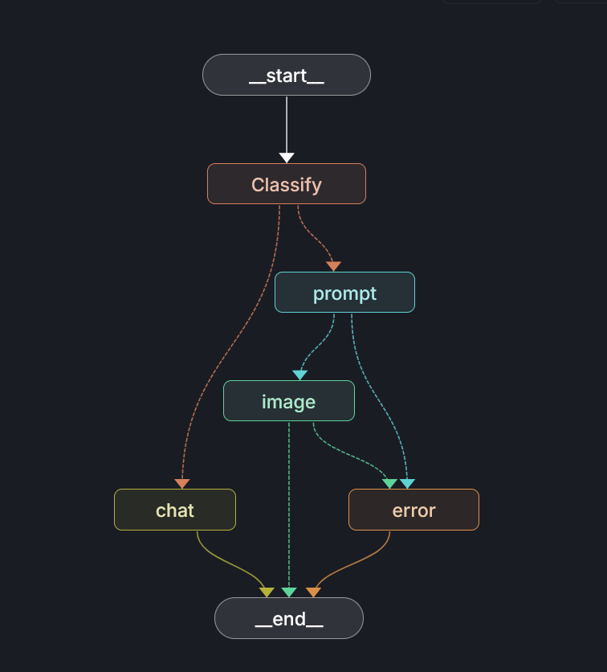

# 💭 Multimodal Agent 🧠✨


An intelligent multi-modal agent built with LangGraph that can both generate high-quality images and engage in conversational interactions. The agent uses advanced prompt engineering to refine your descriptions and generate stunning visuals, while also providing helpful responses to general questions.

## 🚀 Features

- **Smart Message Classification**: Automatically detects whether you want an image generated or just want to chat
- **Advanced Prompt Refinement**: Enhances basic descriptions into detailed, AI-optimized prompts for image generation
- **High-Quality Image Generation**: Uses FLUX.1-schnell-Free model for professional-grade image creation
- **Dual Functionality**: Seamlessly switches between image generation and conversational AI
- **Error Handling**: Robust error handling and recovery mechanisms
- **Interactive Interface**: Simple command-line interface for easy interaction
- **Multiple Image Output**: Generates 4 variations of your concept

## 🛠️ Installation

### Prerequisites

- Python 3.13 or higher

### Setup

1. **Clone the repository**

   ```bash
   git clone https://github.com/devgomesai/imageagents.git
   cd image-gen-agent
   ```
2. **Install dependencies**

   ```bash
   pip install -e .
   ```

   or using uv:

   ```bash
   uv sync
   ```
3. **Environment Configuration**

   Create a `.env` file in the project root:

   ```env
   # Required for image generation
   TOGETHER_API_KEY=b4xxxx

   # Any one for different chat models (uncomment the one you want to use)
   OPENAI_API_KEY=sk-xx
   ANTHROPIC_API_KEY=sk-xxx
   GOOGLE_API_KEY=Azxxx
   ```

   Get your API keys from:

   - [Together AI](https://together.ai/) (required)
   - Any one
   - [OpenAI](https://platform.openai.com/) (optional)
   - [Anthropic](https://console.anthropic.com/) (optional)
   - [Google AI Studio](https://aistudio.google.com/) (optional)

## 🎯 Usage

### ⚡ Minimal (M)

```bash
# Run interactive agent (CLI)
python test.py

# Run with LangGraph Studio
uv run langgraph dev

```
## 🏗️ Architecture

The project uses LangGraph to create a sophisticated workflow with intelligent routing:

### Core Components

- **`graph.py`**: Defines the main workflow graph with nodes for message classification, chat, prompt refinement, and image generation
- **`models.py`**: Handles AI model initialization (GPT-4o-mini for chat and prompt refinement, Together AI for image generation)
- **`prompts.py`**: Contains expert prompt engineering templates and chat prompts
- **`state.py`**: Manages the application state throughout the workflow

### Workflow Steps

1. **Message Classification**: Your input is analyzed to determine if it's an image request or chat
2. **Routing**: Based on classification, routes to either chat or image generation path
3. **For Images**:
   - **Prompt Refinement**: Your input is enhanced by GPT-4o-mini using expert prompt engineering techniques
   - **Image Generation**: The refined prompt generates 4 images using FLUX.1-schnell-Free
4. **For Chat**: Direct response using GPT-4o-mini
5. **Error Handling**: Robust error handling ensures graceful failure recovery

## 🔧 Configuration

### Environment Variables

- `TOGETHER_API_KEY`: Your Together AI API key (required for image generation)
- `OPENAI_API_KEY`: Your OpenAI API key (optional, for GPT models)
- `ANTHROPIC_API_KEY`: Your Anthropic API key (optional, for Claude models)
- `GOOGLE_API_KEY`: Your Google API key (optional, for Gemini models)

### Model Configuration

The agent uses:

- **GPT-4o-mini** for chat responses and prompt refinement (temperature: 0)
- **FLUX.1-schnell-Free** for image generation (4 steps, 4 images)

### Available Model Options

The project supports multiple AI models for chat and prompt refinement. You can switch between them by modifying the `get_chat_model()` function in `src/imageagents/models.py`:

#### OpenAI (Default)

```python
def get_chat_model():
    return init_chat_model("openai:gpt-4o-mini-2024-07-18", temperature=0)
```

#### Anthropic Claude

```python
def get_chat_model():
    return init_chat_model("anthropic:claude-3-5-sonnet-latest", temperature=0)
```

#### Google Gemini

```python
def get_chat_model():
    return init_chat_model("google_genai:gemini-2.5-flash", temperature=0)
```

**Note**: You'll need the appropriate API keys for each model:

- OpenAI: `OPENAI_API_KEY`
- Anthropic: `ANTHROPIC_API_KEY`
- Google: `GOOGLE_API_KEY`

## 📁 Project Structure

```
image-gen-agent/
├── src/
│   └── imageagents/
│       ├── __init__.py
│       ├── graph.py          # Main workflow definition with routing
│       ├── models.py          # AI model initialization
│       ├── prompts.py         # Prompt engineering and chat templates
│       └── state.py           # State management and message classification
├── test.py                    # Interactive demo script
├── pyproject.toml            # Project configuration
├── uv.lock                   # Dependency lock file
├── my_graph.png              # Workflow visualization
└── README.md                 # This file
```
## 🙏 Acknowledgments

- Built with [LangGraph](https://github.com/langchain-ai/langgraph)
- Powered by [Together AI](https://together.ai/)
- Uses [GPT-4o-mini](https://openai.com/) for chat and prompt refinement
- Image generation via [FLUX.1-schnell-Free](https://huggingface.co/black-forest-labs/FLUX.1-schnell-Free)

## 🐛 Troubleshooting

### Common Issues

1. **Missing API Key**: Ensure your `TOGETHER_API_KEY` is set in the `.env` file
2. **Python Version**: Make sure you're using Python 3.13 or higher
3. **Dependencies**: Run `pip install -e .` to install all required packages

### Getting Help

If you encounter any issues, please:

1. Check the error messages for specific details
2. Verify your API key is correct
3. Ensure all dependencies are installed
4. Open an issue on GitHub with detailed error information

---

**Happy Image Generating and Chatting! 🎨✨**
