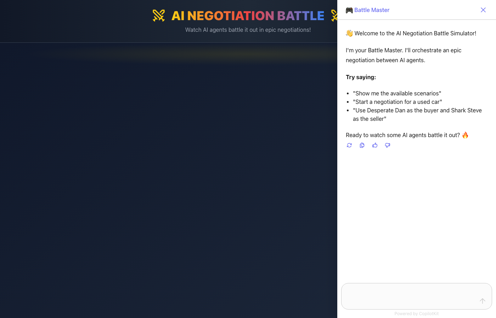
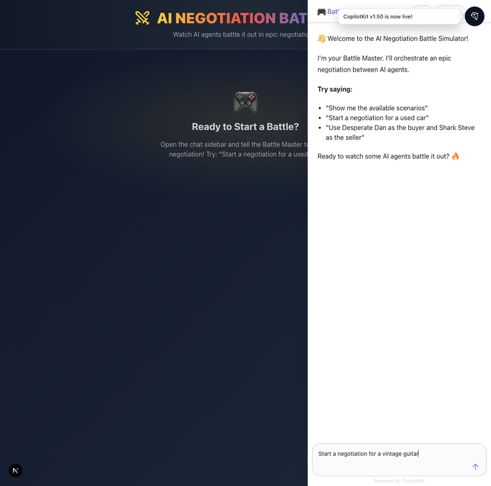

# 🎮 AI Negotiation Battle Simulator

### A Real-Time Agent vs Agent Showdown with AG-UI!

Watch two AI agents battle it out in an epic used car negotiation! Built with **Google ADK** for the backend agents and **AG-UI + CopilotKit** for a jaw-dropping reactive frontend.




### 🎬 See It In Action



## ✨ Features

- **🤖 Dual AI Agents**: Buyer vs Seller with distinct personalities and negotiation strategies
- **🔄 AG-UI Protocol**: Real-time streaming of agent actions, tool calls, and state changes
- **💅 Jaw-Dropping UI**: Animated battle arena with live negotiation timeline
- **🎭 8 Unique Personalities**: 4 buyers + 4 sellers with different negotiation styles
- **📊 Generative UI**: Custom React components render tool calls in real-time
- **🔗 Shared State**: Agent state syncs bidirectionally with the frontend

## 🏗️ Architecture

```
┌─────────────────────────────────────────────────────────────────┐
│                    Next.js + CopilotKit Frontend                │
│   ┌─────────────┐    ┌──────────────┐    ┌─────────────┐       │
│   │ Battle Arena│    │  VS Display  │    │Chat Sidebar │       │
│   │   Timeline  │    │ Buyer/Seller │    │ (AG-UI)     │       │
│   └──────┬──────┘    └──────────────┘    └──────┬──────┘       │
└──────────┼────────────────────────────────────────┼─────────────┘
           │              AG-UI Events              │
           └────────────────────┬───────────────────┘
                                │
                    ┌───────────▼───────────┐
                    │   CopilotKit Runtime  │
                    │   (/api/copilotkit)   │
                    └───────────┬───────────┘
                                │ HTTP/SSE
                    ┌───────────▼───────────┐
                    │    FastAPI + AG-UI    │
                    │    ADK Middleware     │
                    └───────────┬───────────┘
                                │
                    ┌───────────▼───────────┐
                    │  ADK Negotiation Agent │
                    │  (Battle Master)       │
                    │                        │
                    │  Tools:                │
                    │  • configure_negotiation│
                    │  • start_negotiation   │
                    │  • buyer_make_offer    │
                    │  • seller_respond      │
                    └────────────────────────┘
```

## 🚀 Quick Start

### Prerequisites

- Python 3.11+
- Node.js 18+
- Google AI API Key ([Get one here](https://aistudio.google.com/))

### 1. Clone and Navigate

```bash
git clone https://github.com/Shubhamsaboo/awesome-llm-apps.git
cd advanced_ai_agents/multi_agent_apps/ai_negotiation_battle_simulator
```

### 2. Set Up Backend

```bash
cd backend
pip install -r requirements.txt

# Create .env file
echo "GOOGLE_API_KEY=your_api_key_here" > .env

# Start the backend
python agent.py
```

The backend will start on `http://localhost:8000`

### 3. Set Up Frontend

```bash
cd frontend
npm install

# Start the frontend
npm run dev
```

The frontend will start on `http://localhost:3000`

### 4. Start Negotiating! 🎮

Open `http://localhost:3000` and tell the Battle Master:
- "Start a negotiation for a used car"
- "Show me available scenarios"
- "Use Desperate Dan as buyer and Shark Steve as seller"

## 🎭 Personalities

### Buyers
| Personality | Emoji | Style |
|-------------|-------|-------|
| Desperate Dan | 😰 | Needs car TODAY, weak poker face |
| Analytical Alex | 🧮 | Cites every data point, very logical |
| Cool-Hand Casey | 😎 | Master of the walkaway bluff |
| Fair-Deal Fran | 🤝 | Just wants a win-win |

### Sellers
| Personality | Emoji | Style |
|-------------|-------|-------|
| Shark Steve | 🦈 | Never drops more than 5% |
| By-The-Book Beth | 📊 | Goes strictly by KBB |
| Motivated Mike | 😅 | Really needs to sell |
| Drama Queen Diana | 🎭 | Everything is "final offer" |

## 📁 Project Structure

```
ai_negotiation_battle_simulator/
├── README.md
├── .env.example
│
├── backend/                    # Python ADK + AG-UI
│   ├── agent.py               # Main agent with tools
│   ├── requirements.txt
│   ├── config/
│   │   ├── personalities.py   # 8 unique personalities
│   │   └── scenarios.py       # 3 negotiation scenarios
│   └── agents/
│       ├── buyer_agent.py
│       ├── seller_agent.py
│       └── orchestrator.py
│
└── frontend/                   # Next.js + CopilotKit
    ├── package.json
    ├── src/
    │   └── app/
    │       ├── layout.tsx     # CopilotKit provider
    │       ├── page.tsx       # Battle Arena UI
    │       ├── globals.css    # Battle animations
    │       └── api/
    │           └── copilotkit/
    │               └── route.ts  # CopilotKit runtime
    └── tailwind.config.js
```

## 🎬 Sample Battle

```
🔔 NEGOTIATION BEGINS: 2019 Honda Civic EX

📋 ASKING PRICE: $15,500

━━━━━━━━━━━━━━━━━━━━━━━━━━━━━━━━━━━━

😎 COOL-HAND CASEY (Round 1):
"I've seen similar Civics go for less. $11,500 seems fair 
given the market. Cash in hand today."

🦈 SHARK STEVE (Round 1):
"$15,000. This car is pristine. I've got two other 
interested buyers coming this weekend."

😎 COOL-HAND CASEY (Round 2):
"$12,500 is my limit. Take it or I walk."

🦈 SHARK STEVE (Round 2):
*considers* "$14,000. Final offer."

😎 COOL-HAND CASEY (Round 3):
"$13,000. Meet me in the middle."

🦈 SHARK STEVE (Round 3):
"...$13,500 and you've got a deal."

😎 COOL-HAND CASEY (Round 4):
"$13,250. Final answer."

🦈 SHARK STEVE (Round 4):
"Deal. 🤝"

━━━━━━━━━━━━━━━━━━━━━━━━━━━━━━━━━━━━

✅ DEAL CLOSED AT $13,250 🎉
   Buyer saved: $2,250 (14.5% off asking)
```

## 🧠 How It Works

1. **User Request**: You tell the Battle Master what kind of negotiation to run
2. **Configuration**: The agent sets up the scenario and personalities
3. **Tool Calls**: The agent alternates between `buyer_make_offer` and `seller_respond` tools
4. **AG-UI Streaming**: Each tool call streams to the frontend via AG-UI protocol
5. **Generative UI**: Custom React components render each offer/response beautifully
6. **Shared State**: The negotiation timeline updates in real-time
7. **Outcome**: Deal or no-deal is celebrated with animations!

## 📚 Learn More

- [Google ADK Documentation](https://google.github.io/adk-docs/)
- [AG-UI Protocol Docs](https://docs.ag-ui.com/)
- [CopilotKit Documentation](https://docs.copilotkit.ai/)

## 🤝 Contributing

Feel free to add:
- New negotiation scenarios (salary, apartment, contracts)
- Additional personality types
- More dramatic UI effects
- Cross-framework agents (LangChain, CrewAI via A2A)

---

*May the best negotiator win!* 🏆
