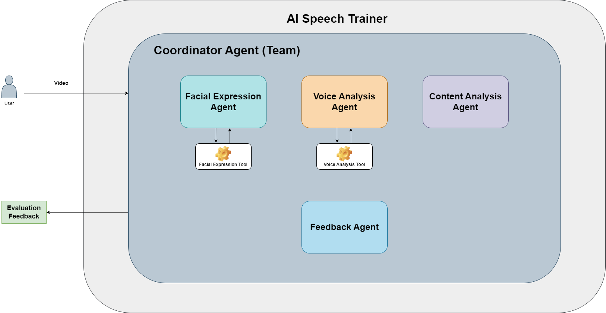
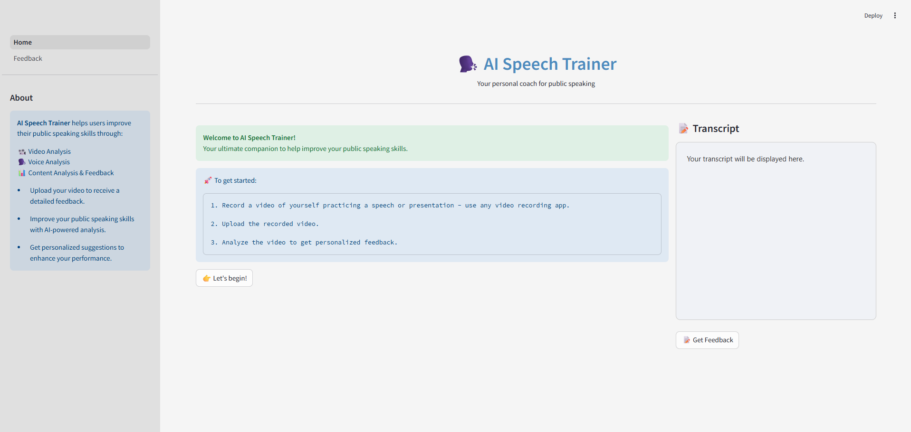
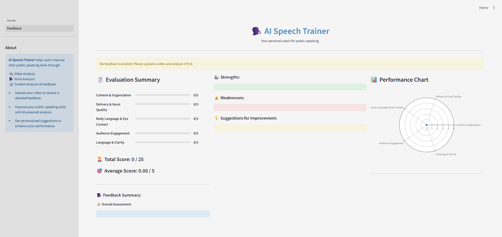

# AI Speech Trainer Agent

## Overview
AI Speech Trainer is an AI-powered multi-agent, multimodal public speaking coach that listens to how you speak, watches how you express, and evaluates what you say - helping you become a confident public speaker.

Whether you're preparing for a TED talk, interview, or school presentation, AI Speech Trainer provides you with personalized feedback, helping you improve your public speaking skills - highlighting your strengths and weaknesses and giving you valuable suggestions to speak better, clearer, and more confidently.

This project has been built as part of the **Global Agent Hackathon (May 2025)**. It leverages the power of multi-agent collaboration, real-time feedback, and multimodal analysis to help anyone become a confident and effective speaker.

## Features
### Core Features
- **Facial Expression Analysis**: Emotion recognition and eye contact estimation
- **Audio Analysis**: Pace, pitch, clarity, and filler words
- **Content Evaluation**: GPT-based feedback on structure, tone, and clarity
- **Personalized Feedback**: Average score, overall assessment, strengths, weaknesses, and suggestions for improvement

### Agents
- **Facial Agent**: Analyzes expression, engagement, and eye contact
- **Vocal Agent**: Detects speech issues (speed, filler words, pitch)
- **Content Agent**: Uses LLMs to assess and improve content clarity
- **Feedback Agent**: Uses the responses from other agents to evaluate the speaker based on a scoring rubric
- **Coordinator Agent**: A team of agents - Orchestrates all analysis and feedback generation

## How It Works
### **User Flow**: 
1. User opens the Streamlit app and uploads a video of themselves practicing a speech or presentation.

2. Multiple agents get into action:

- Facial Agent analyzes expressions and eye contact.
- Vocal Agent transcribes the speech and detects voice attributes.
- Content Agent evaluates grammar, structure, and coherence.
- Feedback agent provides feedback on the overall effectiveness of the speech.
- A Coordinator Agent aggregates all agent insights.

AI Speech Trainer presents a detailed feedback report including scores based on a rubric and summary of the feedback.

### **Core Functionality**:
- Facial emotion recognition using OpenCV, DeepFace, and Mediapipe landmarks.
- Voice transcription and analysis.
- Content analysis using GPT-based feedback.
- Aggregated evaluation score and feedback summary.

### **Multimodal Elements**:
- **Audio**: Speech input & voice quality analysis.
- **Video**: Facial expression tracking and feedback.
- **Text**: GPT-based feedback on structure, clarity, and tone.

## Tech Stack
### AI/ML Tools
- **Agno**: For building multi-agent collaboration and coordination.
- **Facial Expression Tool**: Facial emotion analysis - New customized tool.
- **Voice Analysis Tool**: Voice transcription and analysis - New customized tool.
- **Together API (Llama-3.3-70B-Instruct-Turbo-Free)**: LLM - Content analysis and feedback generation.

### Application Framework
- **Streamlit**: Frontend for user interface.
- **FastAPI**: For backend API endpoints.

### Languages & Packages
- **Python**: Core language for backend logic and agent implementation.
- **OpenCV + DeepFace + Mediapipe**: For facial expression analysis
- **Moviepy + Faster-Whisper + Librosa**: For voice analysis

## UI Approach
Built with Streamlit, the UI includes:

- Home page with Video Upload section, buttons, and a space for displaying the Transcript.
- Feedback page to display evaluation scores, detailed feedback, strengths, weaknesses, suggestions for improvement, and a performance chart.

## Visuals
### High Level Architecture


### Home Page


### Feedback Page


## Setup Instructions
### 1. Clone the repo
```sh
git clone https://github.com/aminajavaid30/ai_speech_trainer.git
cd ai_speech_trainer
```

### 2. Install dependencies
```sh
pip install -r requirements.txt
```

### 3. **Add your API keys** - Create a .env file with:
```sh
TOGETHER_API_KEY=...
```

### 4. Initialize the backend
Navigate to the **backend** folder and run the following command:
```sh
uvicorn main:app --reload
```

### 5. Run the app
Navigate to the **frontend** folder and run the following command:
```sh
streamlit run Home.py
```

## Team Information
- **Team Lead**: https://github.com/aminajavaid30 - Agentic System Designer and Developer
- **Team Members**: https://github.com/aminajavaid30 - Individual Project
- **Background/Experience**: Data Scientist with a background in Software Engineering and Web Development. Experienced in building AI products and agentic workflows.

## Demo Video Link
https://youtu.be/Sb0JPUpJTGQ

## Folder Structure
```sh
/backend
  /agents
    /tools
      - facial_expression_tool.py
      - voice_analysis_tool.py
    - content_analysis_agent.py
    - coordinator_agent.py
    - facial_expression_agent.py
    - feedback_agent.py
    - voice_analysis_agent.py
  main.py (FastAPI App)
/frontend
  /pages
    - 1 - Feedback.py
  Home.py
  page_config.py
  sidebar.py
  style.css
.env
LICENSE
README.md
requirements.txt
```

## Additional Notes
- This project has been designed to utilize the capabilities of **Agno** as an AI agent development platform. It depicts the potential of Agno as a team of collaborative agents working together seamlessly in order to address a real-world challenge - analyzing speech presentations by users and providing them with comprehensive evaluation and feedback to improve their public speaking skills. Each individual agent has a clear cut goal to follow and together they coordinate as a team to solve a complex multimodal problem.

- This project has a huge potential for further enhancements. It could be a starting point for a more comprehensive and useful agentic systsem. Some of the proposed additional functionalities could be:
  1. Incorporating real-time video recording and conversational capabilities through different role scenarios.
  2. Playing back the user speech through an AI avatar to help users learn and understand best speaking practices.
  3. Keeping a record of user sessions.
  4. Including a performance dashboard to track user performance over time.

   Each of these additional functionalities could be added by implementing specific goal-oriented agents in the system.

## Limitations
- **Together API** with **meta-llama/Llama-3.3-70B-Instruct-Turbo-Free** as LLM has a small token limit, therefore, it works with small video clips (15-30 seconds).
- Use other LLM options for longer video clips. Don't forget to add their API keys in the *.env* file. 

## Acknowledgements
Built for the **#GlobalAgentHackathonMay2025** using Agno, Streamlit, Together API, and FastAPI.