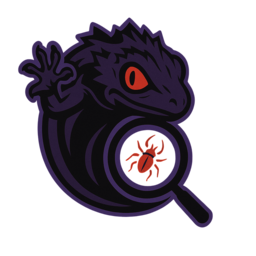

## **AI Vibe Hacking Agent Team, [Decepticon](https://github.com/PurpleAILAB/Decepticon)**


<div align="center">



</div>

A revolutionary red team testing framework that implements "Vibe Hacking" paradigm using autonomous AI agents to perform comprehensive security assessments. Built on LangChain/LangGraph, Decepticon automates repetitive manual red team tasks while maintaining strategic oversight.

## **Features**
* **Autonomous Red Team Operations**: AI agents independently perform reconnaissance, initial access, privilege escalation, and defense evasion
* **Multi-Agent Architecture**: Specialized agents including Reconnaissance, Initial Access, Planner, Summary, and Supervisor agents
* **Flexible Orchestration**: Supports Swarm, Supervisor, and Hybrid architectures for different operational needs
* **Extensive AI Model Support**: Compatible with 15+ providers (OpenAI, Anthropic, Google) and 30+ models including GPT-4o, Claude Sonnet 4, o1, o3
* **MCP Protocol Integration**: Extensible tool system using Modular Command Protocol for custom security tools
* **Docker Environment**: Secure testing environment with Kali Linux container integration
* **Multiple Interfaces**: Both CLI and Streamlit web interface for different user preferences

## **How It Works**
1. **Planning Phase**: Planner Agent develops strategic approach based on target assessment
2. **Reconnaissance Phase**: Automated network scanning, service enumeration, and vulnerability discovery
3. **Initial Access Phase**: Exploitation attempts, credential attacks, and system compromise
4. **Privilege Escalation Phase**: Rights elevation and lateral movement (Planned)
5. **Defense Evasion Phase**: Anti-detection and stealth techniques (Planned)
6. **Persistence Phase**: Maintaining access and backdoor installation (Planned)
7. **Reporting Phase**: Summary Agent compiles analysis, findings, and documentation

## **Requirements**
* Python 3.11+
* Docker and Docker Compose
* AI Provider API keys (OpenAI, Anthropic, or others)
* LangSmith API key (optional, for tracing)
* UV package manager (recommended

## **Quick Start**

**1. Set up the environment with**
```bash
git clone https://github.com/PurpleAILAB/Decepticon.git
cd Decepticon
uv venv
uv pip install -e .
```

2. Copy environment file
```bash
cp .env.example .env
```

3. Docker (10m ~ 20m)
```bash
docker-compose up -d --build
```

4. Run MCP servers
```bash
Option 1: Use provided scripts
On Windows:
./run_mcp.ps1

On macOS/Linux:
./run_mcp.sh

Option 2: Run manually
bashpython src/tools/mcp/(your mcp server).py
```

5. Run CLI or Web interface
```bash
python frontend/cli/cli.py
streamlit run frontend/web/streamlit_app.py
```