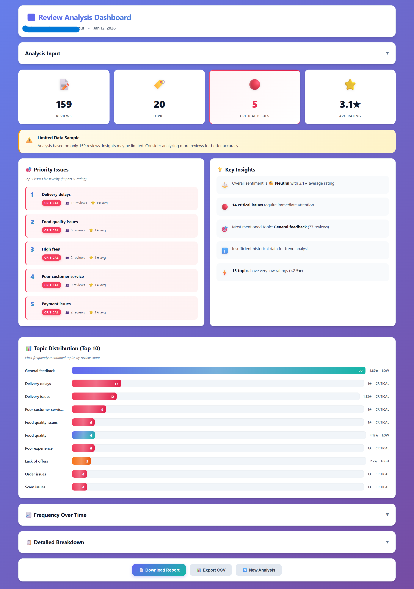
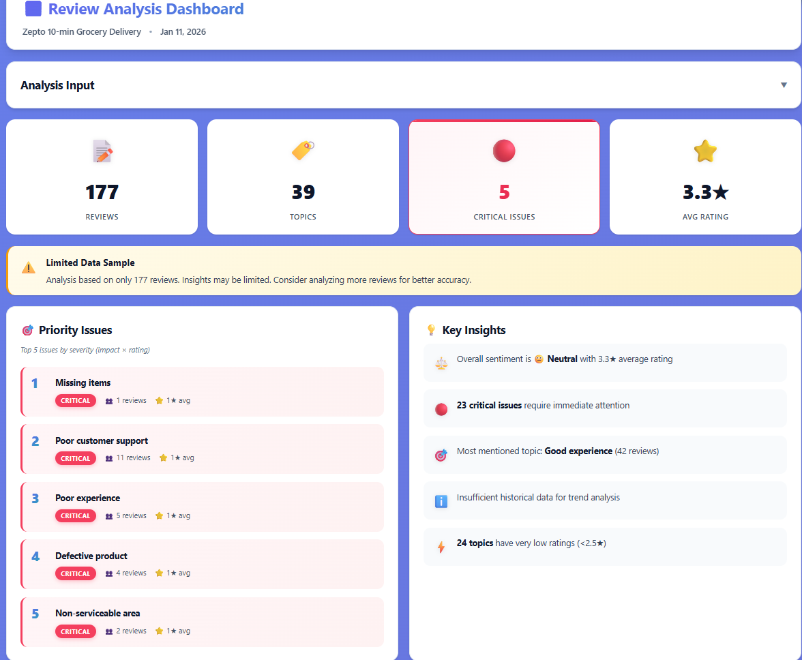
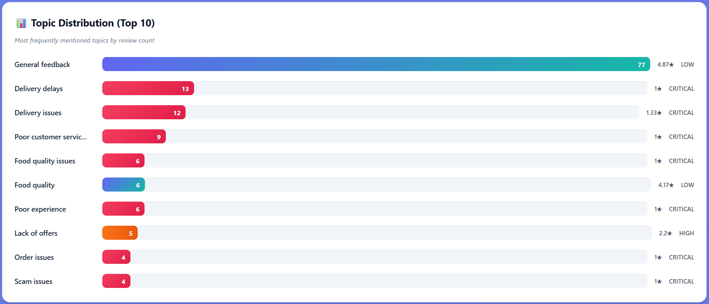

# AI Agent Analyst

**Analyze trends, topics, and issues in Google Play Store reviews using an LLM-powered pipeline.**

Drop in any Play Store app ID, and the agent scrapes reviews, classifies them into topics, surfaces critical issues with severity scores, and generates a clean downloadable report — no manual data prep needed.



---

## What it does

- Scrapes Google Play reviews for any app (by package ID or Play Store URL)
- Classifies reviews into consolidated topics using LLM (high recall, low hallucination)
- Ranks topics by frequency and severity (Critical / High / Medium / Low)
- Detects trends over a rolling date window
- Exports Markdown and HTML reports





---

## Supported LLM Providers

| Provider | Notes |
|---|---|
| **Groq** | Recommended — fast and free tier available |
| **Gemini** | Free tier available via Google AI Studio |
| **OpenAI** | GPT-4o / GPT-4o-mini |
| **Anthropic Claude** | Claude 3.x models |
| **Ollama (local)** | Run fully offline with any local model |

---

## Quickstart

### 1. Clone

```bash
git clone https://github.com/abhiteshbhardwaj9319/agentic_ai_analyst.git
cd agentic_ai_analyst
```

### 2. Install dependencies (Python 3.10+ required)

```bash
pip install uv
conda create -n review_analyst python=3.10 -y
conda activate review_analyst
uv pip install -r requirements.txt
```

### 3. Add your API key

Copy the example config and fill in your key:

```bash
cp config/llm_config_exampl.yaml config/llm_config.yaml
```

Then open `config/llm_config.yaml` and set your provider and key:

```yaml
llm:
  provider: "groq"   # groq | gemini | openai | claude | local
  model: "llama-3.3-70b-versatile"

api_keys:
  groq: "YOUR_GROQ_API_KEY"
  gemini: "YOUR_GEMINI_API_KEY"
```

### 4. Start the server

```bash
python -m uvicorn backend.main:app --reload
```

Open [http://localhost:8000](http://localhost:8000) in your browser.

### 5. Run an analysis

- Enter a Play Store **package ID** (e.g. `com.swiggy.android`) or the full Play Store URL
- Optionally set a start date for the analysis window
- Click **Start Analysis** — results appear in the dashboard within a few minutes
- Download the **Markdown** or **HTML** report

---

## Configuration

| File | What to change |
|---|---|
| `config/llm_config.yaml` | Provider, model, API keys |
| `config/config.yaml` | Scraping batch size, start date, output format, topic extraction mode |

**Topic extraction modes** (in `config/config.yaml`):

```yaml
topic_extraction:
  mode: "batch"   # single | batch | day
  batch_size: 120
```

- `single` — one review at a time (highest accuracy, slowest)
- `batch` — groups of N reviews (recommended balance)
- `day` — all reviews from the same day together (fastest for large datasets)

---

## Project Structure

```
├── backend/
│   ├── agents/        # LLM agents (classifier, trend analyzer, orchestrator, ...)
│   ├── llm/           # Provider adapters (Groq, Gemini, OpenAI, Claude, Ollama)
│   ├── scraper/       # Play Store scraper + data validator
│   └── main.py        # FastAPI app entry point
├── frontend/
│   ├── index_optimized.html
│   └── app_optimized.js
├── config/
│   ├── config.yaml            # App settings
│   └── llm_config_exampl.yaml # API key template
└── requirements.txt
```

---

## Troubleshooting

- **Analysis fails:** check `app.log` for backend errors; most common cause is an invalid or rate-limited API key
- **Server won't start:** confirm Python 3.10+ with `python --version`
- **Slow results:** switch to `mode: "day"` in `config/config.yaml`, or use Groq (fastest free API)

---

## License

MIT — see [LICENSE](LICENSE)
