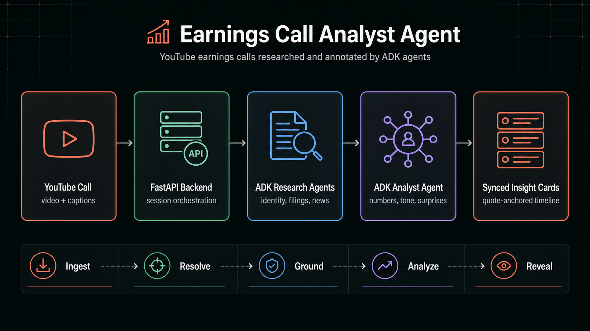
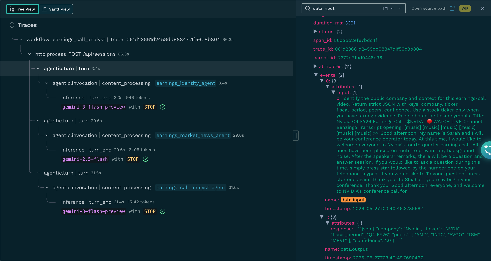

# 📡 Earnings Call Analyst Agent

An investor-grade earnings call companion that turns any YouTube earnings call into a playback-synced analyst workspace. Paste a call URL, watch the video, and let ADK agents surface the numbers, tone shifts, filing context, and market-moving surprises that are easy to miss in a live call.

This is built for the real earnings workflow: instead of reading a transcript after the fact, you can follow management commentary with an agentic research layer that keeps every insight tied to the quote that triggered it.



## Features

### Agentic Call Research

- Identifies the company, ticker, fiscal period, and peer set from the YouTube metadata and transcript opening
- Builds a research pack with SEC filings and current market context
- Uses an ADK news agent with Google Search grounding for current market context
- Hides unresolved context instead of showing empty research panels

### Quote-Anchored Signal Detection

- Creates analyst cards only when the transcript contains a real investor signal
- Anchors every card to the exact quote and timestamp that triggered it
- Filters out greetings, safe-harbor boilerplate, and generic upbeat commentary
- Reveals cards as playback reaches the relevant moment in the call

### Earnings Intelligence Cards

- Flags financial metrics, margin pressure, guidance language, demand commentary, pricing, cash flow, and capex signals
- Separates company-specific statements from peer or sector context when evidence is available
- Calls out CFO hedging, confidence shifts, defensiveness, and unusually specific language
- Adds compact tables or chart summaries only when they clarify the finding

### Caption + Audio Resilience

- Uses YouTube captions when available for precise timestamps
- Falls back to ADK-powered audio transcription for captionless videos
- Realigns generated cards to the closest caption segment so the video and quote stay in sync
- Keeps the transcript, research pack, and analyst cards tied to the same source timeline

### Production Observability with Monocle

- Every real Gemini call, ADK agent turn, and tool invocation is auto-instrumented through [Monocle](https://github.com/monocle2ai/monocle) without changing application code
- A single idempotent `setup_telemetry()` call from `telemetry.py` wires up OpenTelemetry-compatible spans across all entry points (FastAPI server, agent module, eval tests) and is safe to call multiple times
- Spans capture the workflow tree `workflow → agentic.turn → agentic.invocation → inference` so you can see exactly which sub-agent (numbers_reconciler, surprise_detector, news search) emitted each insight and how long it took
- Configurable exporters via `MONOCLE_EXPORTER` env var — write traces to local JSON (`./.monocle/`) for offline debugging, ship them to Okahu for hosted monitoring, or both at once
- Turns the demo into something you can actually run in front of investors: latency, token spend, model errors, and prompt-version drift are visible in one place instead of buried in stdout

### LLM Evaluation Suite

Two pytest tests exercise the agent end-to-end against real Gemini calls and validate the captured trace through [`monocle_test_tools`](https://github.com/monocle2ai/monocle/tree/main/test_tools):

- `tests/test_eval_with_real_llm.py` — synthetic transcript with seeded facts, deterministic for CI
- `tests/test_eval_with_real_youtube.py` — pulls a real public earnings call (default: Alphabet Q1) through the same ingest pipeline the demo uses

Both apply the same structural checks (agent invoked, output references input, token/duration guardrails) and the same set of LLM-as-judge labels against the trace.

## How to get Started?

This agent lives in `advanced_ai_agents/single_agent_apps/earnings_call_analyst_agent`.

1. Clone the GitHub repository

```bash
git clone https://github.com/Shubhamsaboo/awesome-llm-apps.git
cd advanced_ai_agents/single_agent_apps/earnings_call_analyst_agent
```

2. Install the required dependencies:

```bash
python3 -m venv .venv
source .venv/bin/activate
pip install -r requirements.txt
```

3. Configure Gemini API key (default) or Vertex AI:

```bash
cp .env.example .env
```

Default — Gemini Developer API:

```bash
GOOGLE_API_KEY=your-google-api-key
```

Optional — switch to Vertex AI / Google Cloud auth instead. Only set these if you want Vertex; `google-genai` defaults to the Developer API path when `GOOGLE_GENAI_USE_VERTEXAI` is unset or `False`:

```bash
GOOGLE_GENAI_USE_VERTEXAI=True
GOOGLE_CLOUD_PROJECT=your-google-cloud-project-id
GOOGLE_CLOUD_LOCATION=global
```

4. (Optional) Enable observability exporters:

```bash
# Write traces to local JSON only (default behavior, no extra setup needed):
export MONOCLE_EXPORTER=file

# Or ship traces to Okahu in addition to writing local JSON:
export MONOCLE_EXPORTER=okahu,file
export OKAHU_API_KEY=your-okahu-key
```

Telemetry is opt-out — the agent initializes Monocle automatically on import. Without any exporter env vars, traces are still produced and dropped into `./.monocle/` as JSON for inspection.

5. Run the FastAPI app:

```bash
PYTHONPATH=.. python -m uvicorn earnings_call_analyst_agent.live_demo.server:app --host 127.0.0.1 --port 4188
```

6. Open the app:

```text
http://127.0.0.1:4188
```

Paste a YouTube earnings call URL. The app builds the research pack first, then reveals analyst cards as the video reaches each quote.

## Run the eval suite

The eval test calls Gemini, captures the Monocle trace, and submits it to four LLM-as-judge templates — `hallucination`, `contextual_relevancy`, `summarization`, `pii_leakage` — each scored against the same input the agent received. A failing label aborts the pytest run. Traces carry `scope.test_name` and `scope.git.commit.hash` so results are queryable per commit.



### Prerequisites

| Requirement | Description |
|---|---|
| Python 3.12+ with `requirements.txt` installed in `.venv` | Pulls in `google-adk`, `google-genai`, `monocle-apptrace`, and `monocle_test_tools` |
| `GOOGLE_API_KEY` | Gemini Developer API auth for the ADK client |
| `OKAHU_API_KEY` | Used by both the trace ingestion exporter and the evaluation client |
| `MONOCLE_EXPORTER=okahu,file` | Ship spans to Okahu and write a local JSON copy under `./.monocle/test_traces/` |
| Okahu evaluation templates `hallucination`, `contextual_relevancy`, `summarization`, `pii_leakage` (all with `group_by: traces`) | The test references these template names |

A working `.env`:

```bash
export GOOGLE_API_KEY=your-google-api-key
export OKAHU_API_KEY=your-okahu-api-key
export MONOCLE_EXPORTER="okahu,file"
```

`GOOGLE_GENAI_USE_VERTEXAI` is optional — leave it unset (or `False`) for Gemini Developer API auth via `GOOGLE_API_KEY`. Set it to `True` plus `GOOGLE_CLOUD_PROJECT` and `GOOGLE_CLOUD_LOCATION` if you want Vertex AI instead.

The app also reads optional `EARNINGS_GEMINI_MODEL`, `EARNINGS_SEARCH_GEMINI_MODEL`, `EARNINGS_TRANSCRIPT_MODEL`, `EARNINGS_AUDIO_CHUNK_SECONDS`, and `EARNINGS_USER_AGENT` overrides — see `agent.py`, `research.py`, and `youtube_ingest.py`. The test fixtures default these to `gemini-2.5-flash` if you don't override them.

### Run

```bash
pytest tests/test_eval_with_real_llm.py -v
```

Runtime: ~2–4 min. Each run writes a JSON trace under `./.monocle/test_traces/`.

### Run against a real YouTube video

`tests/test_eval_with_real_youtube.py` runs the same checks against a real public earnings call (default: Alphabet Q1 at `https://www.youtube.com/watch?v=LPJoiDiVkTI`). Override with `YOUTUBE_EVAL_URL`, skip with `SKIP_YOUTUBE_EVAL=true`. The test caps the prompt at the first 40 transcript chunks (~30 min of call).

```bash
pytest tests/test_eval_with_real_youtube.py -v
```

Runtime: ~4–6 min.
