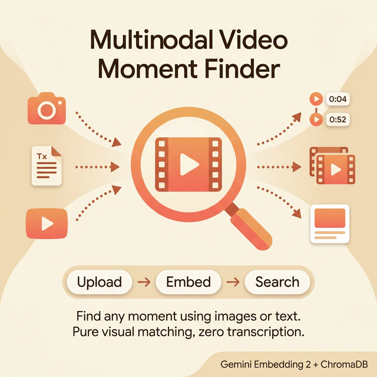
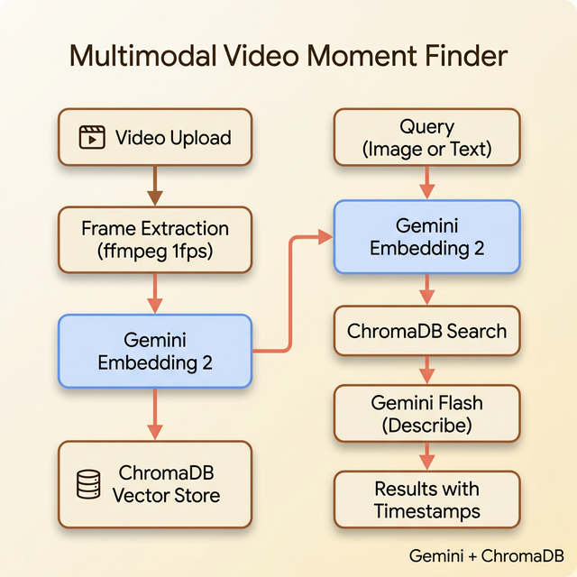

# 🎬 Multimodal Video Moment Finder

<p align="center">
  
</p>

Find any moment in a video using images or text. Drop a screenshot to find where it appears, or describe a scene in words. Pure visual matching, zero transcription.

Powered by **Gemini Embedding 2** for native cross-modal search.

## How It Works

1. **Upload a video** — frames are extracted at 1fps using ffmpeg
2. **Each frame is embedded** natively with `gemini-embedding-2-preview`
3. **Search by image** — embed your photo, cosine similarity against all frames
4. **Search by text** — embed your description, cross-modal match against frames
5. **Jump to the moment** — click any result to play the video at that timestamp

No transcription. No captions. No OCR. The embedding model understands visual content directly.

## Stack

- **Backend**: FastAPI + Gemini Embedding 2 + ChromaDB
- **Frontend**: Next.js (dark theme, split panel)
- **Frame extraction**: ffmpeg (1fps)
- **Frame descriptions**: Gemini 3 Flash
- **Models**: `gemini-embedding-2-preview` (embeddings), `gemini-3-flash-preview` (descriptions)

## Project Structure

```
advanced_llm_apps/multimodal_video_moment_finder/
├── backend/
│   ├── server.py           # FastAPI server with upload, search & video management endpoints
│   ├── video_store.py      # Video processing, frame extraction, embedding & ChromaDB storage
│   └── requirements.txt    # Python dependencies
├── frontend/
│   ├── app/
│   │   ├── page.tsx        # Main UI — video upload, image/text search, result playback
│   │   ├── layout.tsx      # Root layout
│   │   └── globals.css     # Global styles
│   ├── package.json
│   ├── next.config.ts
│   └── tsconfig.json
└── README.md
```

## Setup

### Prerequisites

- Python 3.10+
- Node.js 18+
- ffmpeg installed (`brew install ffmpeg` or `apt install ffmpeg`)
- [Google AI API key](https://aistudio.google.com/apikey)

### Backend

```bash
cd advanced_llm_apps/multimodal_video_moment_finder/backend
python -m venv venv
source venv/bin/activate
pip install -r requirements.txt

export GOOGLE_API_KEY="your-api-key"
python server.py
```

Backend runs on `http://localhost:8890`.

### Frontend

```bash
cd advanced_llm_apps/multimodal_video_moment_finder/frontend
npm install
echo 'NEXT_PUBLIC_API_URL=http://localhost:8890' > .env.local
npm run dev
```

Frontend runs on `http://localhost:3000`.

## Usage

1. Open `http://localhost:3000`
2. Upload a video (any format ffmpeg supports)
3. Wait for frame extraction and embedding (1 frame/second)
4. Search:
   - **Image**: drop a screenshot or photo to find where it appears
   - **Text**: describe a scene ("person on stage", "aerial view of city")
5. Click any result to jump the video to that moment

## API Endpoints

| Method | Endpoint | Description |
|--------|----------|-------------|
| POST | `/upload-video` | Upload and index a video |
| POST | `/find-moment` | Search by image (multipart form) |
| POST | `/find-moment-text` | Search by text description |
| GET | `/videos` | List indexed videos |
| DELETE | `/videos/{id}` | Remove a video |
| GET | `/health` | Status check |

## Architecture

<p align="center">
  
</p>

## Key Insight

Gemini Embedding 2 embeds images and text into the same vector space natively. This means you can search for a visual moment using either another image or a text description, without any intermediate captioning or transcription step. The model understands what's in the frame directly.
