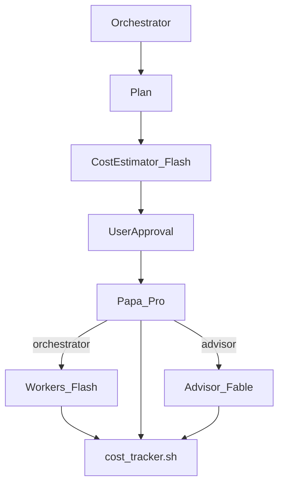

# Advisor Orchestrator Worker

**One model is a bottleneck. A team with one brain, twenty hands, a routing gate, and a board advisor is not.**

This skill turns your coding agent into the orchestrator of a five-tier model team. Big tasks get split into self-contained briefs, cost-estimated before dispatch, routed through Papa (Gemini Pro-tier) before any Fable advisor consult, blasted across cheap parallel workers, verified one by one, and judged by the advisor only when Papa says so.

## What changed in 1.1

- **Papa** (Gemini Pro-tier, different provider than Fable) sits between orchestrator and advisor — routes `advisor` or `orchestrator` only
- **Cost control** — Flash pre-flight estimate (tokens + USD), user approves ceiling, `cost_tracker.sh` tracks actual spend
- Advisor plan review and taste pass are **no longer mandatory** when Papa routes `orchestrator`

## Architecture (v1.1)




*Original 3-tier diagram (v1.0) — v1.1 adds cost estimate and Papa routing gate.*

## The team

| Role | Default model <sub>(July 2026, swap freely)</sub> | What it does | What it never does |
|---|---|---|---|
| **Orchestrator** | GPT-5.6 | Frames success criteria, plans waves, dispatches briefs, verifies every result, synthesizes the deliverable | Worker-level grunt work |
| **Cost control** | Gemini 3.5 Flash + `scripts/cost_tracker.sh` | Pre-flight token/USD estimate; user approves ceiling; tracks actual spend vs approved budget | Guess silently or bleed past approval |
| **Papa** | Gemini 3.5 Pro (`PAPA_MODEL=gemini-3.1-pro-preview` for current APIs) | Routes `advisor` or `orchestrator` — different provider than Fable advisor | Execute or rewrite deliverables |
| **Workers** | Gemini 3.5 Flash | One self-contained subtask each, in parallel, stateless | Talk to each other, expand scope |
| **Advisor** | Claude Fable 5 | Full critique when Papa routes `advisor`; commitment boundaries | Execute anything |

Papa uses a different model family than the advisor so routing stays adversarial, not biased toward escalation.

## Why it doesn't fall apart

- **Stateless briefs** ([references/worker-brief.md](references/worker-brief.md)): full inputs inline, temp files only.
- **Cost estimate before dispatch** ([references/cost-estimate.md](references/cost-estimate.md), [references/cost-control.md](references/cost-control.md)): whole-run tokens + USD, user approves, runtime tracker enforces ceiling.
- **Papa before advisor** ([references/papa-routing.md](references/papa-routing.md)): advisor consults only when Papa routes `advisor`.
- **Verify before merge**: PASS / FIX / ESCALATE per subtask.
- **Advisor is a critic** ([references/advisor-consult.md](references/advisor-consult.md)): verdict, risks, fixes; every note applied or rebutted.

## Install

```bash
npx skills add https://github.com/Shubhamsaboo/awesome-llm-apps/tree/main/agent_skills/advisor-orchestrator-worker
```

Or copy this folder into your agent's skills dir.

**Needs:** `agy`, `claude` CLI, `jq`, `python3`, `scripts/cost_tracker.sh`, `scripts/parse_estimate.sh`, `scripts/parse_papa_route.sh`. API keys: `GEMINI_API_KEY` (or `GOOGLE_API_KEY`) for workers, estimator, and Papa; `ANTHROPIC_API_KEY` for advisor.

## Files

```
advisor-orchestrator-worker/
├── SKILL.md
├── README.md
├── scripts/cost_tracker.sh
├── scripts/parse_estimate.sh
├── scripts/parse_papa_route.sh
├── references/worker-brief.md
├── references/advisor-consult.md
├── references/papa-routing.md
├── references/cost-estimate.md
├── references/cost-control.md
├── references/pricing.json
└── references/fallbacks.md
```

Evals live repo-side in `agent_skills/evals/advisor-orchestrator-worker/`.

Part of [awesome-llm-apps](https://github.com/Shubhamsaboo/awesome-llm-apps) · Apache-2.0 · Last verified: July 2026
