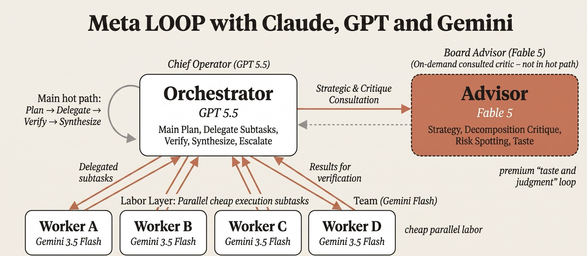

# 🧠 Advisor Orchestrator Worker

**One model is a bottleneck. A team with one brain, twenty hands, and a board advisor is not.**

This skill turns your coding agent into the orchestrator of a three-tier model team. Big tasks get split into self-contained briefs, blasted across cheap parallel workers, verified one by one, and judged by a stronger model exactly twice — before the work starts and before it ships.



## The team

| Role | Default model <sub>(July 2026 — swap freely)</sub> | What it does | What it never does |
|---|---|---|---|
| **Orchestrator** | GPT-5.5 | Frames success criteria, plans waves, dispatches briefs, verifies every result, synthesizes the deliverable | Worker-level grunt work |
| **Workers** | Gemini 3.5 Flash | One self-contained subtask each, in parallel, stateless — each sees only its brief | Talk to each other, expand scope, get a second chance on the same call |
| **Advisor** | Claude Fable 5 | Plan review before any dispatch, taste pass before delivery, called mid-run only at commitment boundaries | Execute anything |

The economics are the point: cheap parallel generation where volume wins, expensive judgment only where it changes a decision. Budgeted — **20 worker calls, 5 consults** — so a run can't quietly burn a hole in your API bill. Models are knobs: the tier pattern is the durable part, the defaults were current in July 2026.

## Why it doesn't fall apart

Multi-model loops usually die from context leaks, silent partial failures, or judgment applied too late. Each has a rule here:

- **Stateless briefs** ([references/worker-brief.md](references/worker-brief.md)) — every dispatch carries its full inputs and acceptance criteria inline. No shared context, no "as discussed above." Briefs travel as temp files with jq-built payloads, never interpolated into shell strings.
- **Verify before merge** — every result is judged against its own acceptance criteria: PASS, FIX (redispatched with the named failure), or ESCALATE. No silent partial passes, no hand-patching.
- **The advisor is a critic, not an executor** ([references/advisor-consult.md](references/advisor-consult.md)) — verdict, ranked risks, concrete fixes, under 300 words. Every note gets applied or explicitly rebutted.

## Install

```bash
npx skills add https://github.com/Shubhamsaboo/awesome-llm-apps/tree/main/agent_skills/advisor-orchestrator-worker
```

Or copy this folder into your agent's skills dir (`~/.claude/skills/`, `~/.codex/skills/`, `~/.agents/skills/`).

**Needs** (declared up front, per this repo's rules): `GEMINI_API_KEY` (falls back to `GOOGLE_API_KEY`) for workers, the `claude` CLI for the advisor, `jq`, and optionally the `agy` CLI for tool-using workers. Anything missing degrades gracefully — your agent plays the missing role itself and says so.

## Use it

> "This is too big for one pass — orchestrate it across a model team."
> "Fan this out: research all 12 competitors in parallel and synthesize."
> "Run the advisor-worker loop on this."

Every run ends with the deliverable, the plan, a per-subtask verification ledger, advisor notes applied and rejected, and remaining risks.

## Files

```
advisor-orchestrator-worker/
├── SKILL.md                          # the loop, the team, budgets, escalation rules
├── README.md                         # this file
├── architecture.jpeg                 # the diagram above
├── references/worker-brief.md        # the stateless dispatch format workers receive
└── references/advisor-consult.md     # the consult format the advisor answers in
```

Evals live repo-side in `agent_skills/evals/advisor-orchestrator-worker/` — you install only what runs.

Part of [awesome-llm-apps](https://github.com/Shubhamsaboo/awesome-llm-apps) · Apache-2.0 · Last verified: July 2026
