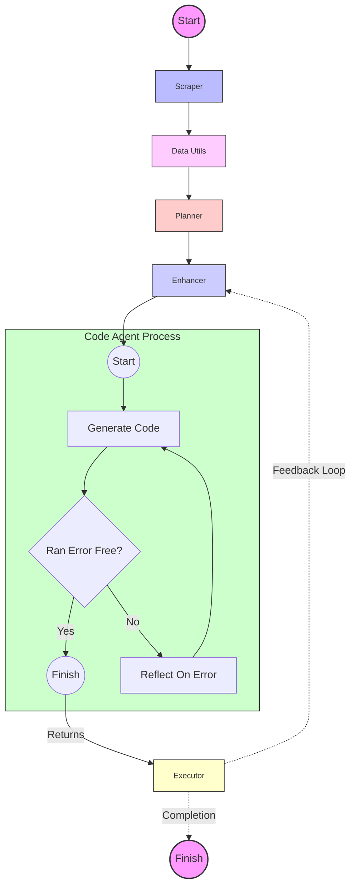

## 🌟 Kaggle Challenge Solver

This isn't just any old problem solver – it's your AI-powered companion in the wild world of Kaggle competitions. Using a "plan and execute" strategy that would make any project manager jealous, our system tackles ML problems with the finesse of a seasoned data scientist and the tireless energy of a thousand interns. **code generation agent is inspired from langgraph agent [<u>link</u>](https://blog.langchain.dev/code-execution-with-langgraph/)**

## 🧠 Key Components

1. **The Mastermind (KaggleProblemPlanner)**: Plans your path to Kaggle glory!
2. **The Perfectionist (KaggleTaskEnhancer)**: Turns good tasks into great ones!
3. **The Code Wizard (CodeGenerationAgent)**: Conjures code like magic! ✨
4. **The Strategist (KaggleProblemRePlanner)**: Adapts faster than a chameleon in a rainbow!
5. **The Executor (KaggleCodeExecutor)**: Runs code faster than you can say "machine learning"!

## 🔄 Workflow: The Circle of AI Life

1. Scrape → 2. Data analyze → 3. Plan →( 4. Enhance → 5. Code → 6. Execute )→ Repeat!

It's like a never-ending dance party, but with more algorithms and less awkward small talk.

## 🎭 The Agent Graph: A Visual Spectacle

Behold, the pièce de résistance of our project – the Agent Graph! 📊



### How to get Started?

1. Clone this repo faster than you can say "git":

   ```bash
   git clone https://github.com/msnp1381/kaggle-agent.git
   ```

2. Install Poetry if you haven't already:

   ```bash
   curl -sSL https://install.python-poetry.org | python3 -
   ```

3. Set up the Python environment:

   ```bash
   poetry install
   ```

4. Run pip install for notebook requirements:

    ```bash
    pip install -r notebook_requirements.txt 
    ```

5. Configure the project:

   - Copy the `.env.template` file to `.env`:

     ```bash
     cp .env.template .env
     ```

   - Open the `.env` file and fill in the required environment variables.
   - **Review** and update the `config.ini` file if necessary.

5. Run the main script:

   ```bash
   poetry run python main.py
   ```
