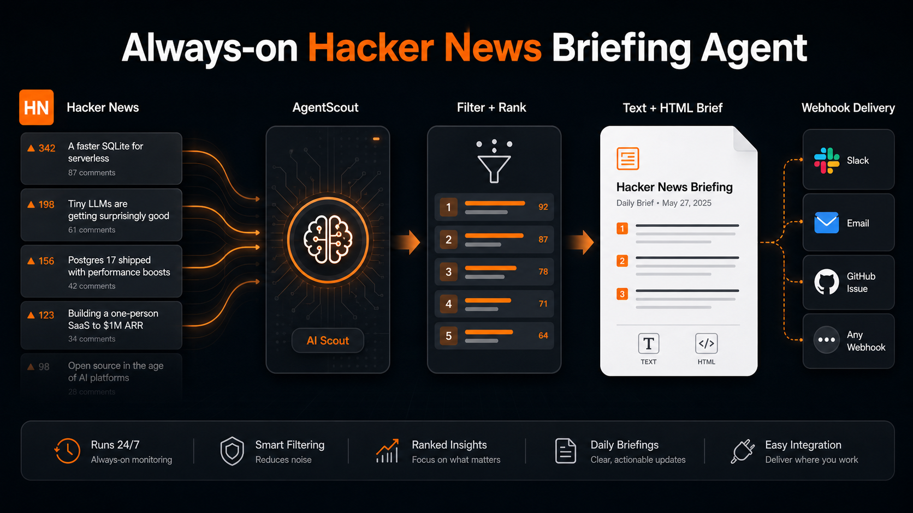

# 📰 Always-on Hacker News Briefing Agent

AgentScout is an always-on Hacker News briefing agent built with Google ADK. It scans Hacker News for high-signal stories about AI agents, MCP, coding agents, workflow automation, and LLM apps, then turns the best links into a concise engineering brief.

The app can run as an interactive ADK agent or as a scheduled backend service. Use ADK Web to ask for a brief manually, or run the FastAPI scheduler hook so Cloud Scheduler can trigger a daily Hacker News briefing and send it through Gmail, Slack, Linear, Jira, or an internal digest workflow.



## Features

- **Hacker News monitoring**: Finds AI agent, MCP, coding agent, automation, and LLM app stories from Hacker News.
- **Signal ranking**: Scores stories by relevance, points, comments, and front-page position.
- **Brief generation**: Produces a clean text and HTML briefing with summaries, links, and next actions.
- **Google ADK agent**: Exposes a `root_agent` so users can request briefs in ADK Web.
- **Scheduler-ready backend**: Includes HTTP and Pub/Sub endpoints for Cloud Scheduler or other automation systems.
- **Gmail and webhook delivery**: Sends briefs through Gmail API or a generic webhook when `dry_run=false`.
- **Safe delivery flow**: Defaults to dry-run mode and skips delivery unless credentials are explicitly configured.

## How It Works

1. AgentScout collects stories from deterministic sample data or the live Hacker News front page.
2. It filters for AI agent and LLM app topics.
3. It ranks the most useful stories for engineers and product builders.
4. It renders a daily briefing in text and HTML.
5. ADK Web, an HTTP trigger, or a Pub/Sub push endpoint returns the result.
6. If delivery is enabled, the scheduler API sends the brief through Gmail or posts it to `AGENTSCOUT_WEBHOOK_URL`.

## Requirements

- Python 3.10+
- Gemini API key for ADK Web
- Optional Gmail OAuth credentials for direct email delivery
- Optional webhook URL for Slack, Linear, Jira, GitHub Issues, SendGrid, or internal workflows

## Installation

```bash
git clone https://github.com/Shubhamsaboo/awesome-llm-apps.git
cd awesome-llm-apps/always_on_agents/always_on_hn_briefing_agent
pip install -r requirements.txt
export GOOGLE_API_KEY="your_gemini_api_key"
```

## Option 1: Run in ADK Web

Use ADK Web when you want to chat with the agent and ask for a brief manually.

```bash
adk web .
```

Open the ADK Web UI and select `always_on_hn_briefing_agent`.

Try prompts like:

```text
Give me today's AgentScout brief.
```

```text
Scout the top 3 Hacker News stories about AI agents and LLM apps.
```

```text
Show me the highest-signal Hacker News items about MCP, coding agents, and workflow automation.
```

## Option 2: Run the Scheduler API Locally

Use the scheduler API when you want AgentScout to run like an always-on backend service. This is the same surface you can deploy behind Cloud Run and trigger from Cloud Scheduler.

Start the scheduler backend:

```bash
uvicorn scheduler_api:app --host 0.0.0.0 --port 8000
```

In another terminal, preview a scheduled run without delivery:

```bash
curl "http://127.0.0.1:8000/agent-scout/dry-run?top_n=3&live=false"
```

Trigger the scheduler path in dry-run mode:

```bash
curl -X POST "http://127.0.0.1:8000/agent-scout/trigger" \
  -H "Content-Type: application/json" \
  -d '{"dry_run": true, "top_n": 5, "live": false}'
```

Dry-run mode returns the rendered brief and delivery status, but it does not send anything.

Enable live Hacker News scanning for the current process:

```bash
export AGENTSCOUT_LIVE_HN=true
```

You can also override live mode per request:

```bash
curl -X POST "http://127.0.0.1:8000/agent-scout/trigger" \
  -H "Content-Type: application/json" \
  -d '{"dry_run": true, "top_n": 5, "live": true}'
```

## Option 3: Enable Scheduled Delivery

Delivery is opt-in. AgentScout will not send email or call a webhook unless the request body includes `"dry_run": false` and one delivery method is configured.

Delivery mode behavior:

- `AGENTSCOUT_DELIVERY=gmail` sends through Gmail API.
- `AGENTSCOUT_DELIVERY=webhook` posts to `AGENTSCOUT_WEBHOOK_URL`.
- If `AGENTSCOUT_DELIVERY` is not set, AgentScout uses Gmail when Gmail is fully configured, otherwise webhook when a webhook URL is configured.

### Gmail Delivery

Use Gmail when you want AgentScout to send the daily brief directly to an inbox. Create a Google OAuth client with Gmail API access, generate a refresh token with the `https://www.googleapis.com/auth/gmail.send` scope, then set:

```bash
export AGENTSCOUT_DELIVERY="gmail"
export AGENTSCOUT_EMAIL_TO="you@example.com"
export AGENTSCOUT_EMAIL_FROM="you@example.com"
export AGENTSCOUT_GMAIL_CLIENT_ID="your_google_oauth_client_id"
export AGENTSCOUT_GMAIL_CLIENT_SECRET="your_google_oauth_client_secret"
export AGENTSCOUT_GMAIL_REFRESH_TOKEN="your_gmail_refresh_token"

curl -X POST "http://127.0.0.1:8000/agent-scout/trigger" \
  -H "Content-Type: application/json" \
  -d '{"dry_run": false, "top_n": 5, "live": true}'
```

AgentScout sends a multipart email with both plain text and HTML versions of the brief.

### Webhook Delivery

Use webhook delivery when you want to route the brief to Slack, Linear, Jira, GitHub Issues, SendGrid, or your own internal workflow.

```bash
export AGENTSCOUT_DELIVERY="webhook"
export AGENTSCOUT_WEBHOOK_URL="https://example.com/agent-brief-webhook"
export AGENTSCOUT_WEBHOOK_TOKEN="optional_bearer_token"

curl -X POST "http://127.0.0.1:8000/agent-scout/trigger" \
  -H "Content-Type: application/json" \
  -d '{"dry_run": false, "top_n": 5, "live": true}'
```

The webhook receives `subject`, `text`, `html`, `stories`, and `next_actions`.

## Cloud Scheduler Hook

Deploy the scheduler API behind Cloud Run or another HTTP service, configure Gmail or webhook delivery in that environment, then call one of these endpoints from Cloud Scheduler.

Direct HTTP trigger:

```text
https://YOUR_CLOUD_RUN_URL/agent-scout/trigger
```

Request body:

```json
{
  "dry_run": false,
  "top_n": 5,
  "live": true
}
```

Set `dry_run` to `true` while testing the schedule. Set it to `false` only after Gmail or webhook delivery is configured.

Recommended weekday briefing schedule:

```text
0 9 * * 1-5
```

Pub/Sub push endpoint:

```text
https://YOUR_CLOUD_RUN_URL/agent-scout/pubsub
```

For Pub/Sub push, send the same JSON payload as base64-encoded message data.

## Example Output

```json
{
  "subject": "AgentScout Hacker News brief - 2026-06-08",
  "watch_mode": "sample",
  "stories": [
    {
      "title": "Show HN: An open-source framework for reliable AI agent workflows",
      "points": 428,
      "comments": 116,
      "summary": "Framework discussion with practical tradeoffs around orchestration, retries, state, and tool execution."
    }
  ],
  "next_actions": [
    "Open the highest-comment thread and extract objections or implementation patterns."
  ]
}
```
