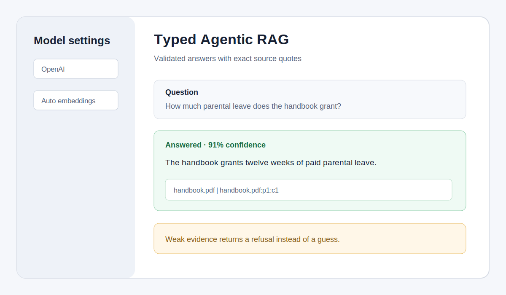

# Typed Agentic RAG with Pydantic AI

This Streamlit app answers questions from uploaded PDFs or a documentation URL.
Every response is a validated `Answer` object with exact source quotes, chunk IDs,
a confidence score, and an `answered` decision. If retrieval is too weak, the app
refuses before calling the language model.



## Features

- Pydantic AI `Agent`, `RunContext`, and dependency injection
- A typed `retrieve` tool with source metadata and cosine scores
- Pydantic models for answers, citations, and retrieval evidence
- Exact quote checks against indexed chunks after model output validation
- A deterministic refusal gate for out-of-corpus questions
- OpenAI or Anthropic answer models
- OpenAI embeddings with a local hashing fallback for Anthropic-only setups
- A session-scoped NumPy vector store with no database service

## How it works

1. `rag.py` extracts PDF or web text, splits it into overlapping chunks, embeds
   the chunks, and stores normalized vectors in memory.
2. `agent.py` injects the vector store through `RagDependencies`. The Pydantic AI
   agent must call the typed `retrieve` tool before producing an `Answer`.
3. A preflight search compares the best cosine score with the refusal threshold.
   Low scores return `answered=False` without an LLM request.
4. For an answered response, each citation must match a stored source, chunk ID,
   and verbatim quoted span. An invalid or missing citation becomes a refusal.
5. `app.py` renders the answer, confidence, citations, or refusal state.

When `OPENAI_API_KEY` is available, Auto mode uses Pydantic AI's OpenAI
`Embedder` with `text-embedding-3-small`. With only `ANTHROPIC_API_KEY`, Auto mode
uses the local hashing backend because Anthropic has no embeddings API. The local
backend is best for keyword-oriented demos. Select OpenAI embeddings for semantic
retrieval across paraphrases.

## Prerequisites

- Python 3.12 or newer
- An OpenAI API key or an Anthropic API key

## Setup

From the repository root:

```bash
cd rag_tutorials/agentic_typed_rag_pydanticai
python3 -m venv .venv
source .venv/bin/activate
pip install -r requirements.txt
cp .env.example .env
```

Add one key to `.env`:

```text
OPENAI_API_KEY=your-key
```

or:

```text
ANTHROPIC_API_KEY=your-key
```

The default answer models are `openai:gpt-5.2` and
`anthropic:claude-sonnet-4-6`. Change the model field in the sidebar or set
`RAG_MODEL` to another Pydantic AI model string.

## Run

From `rag_tutorials/agentic_typed_rag_pydanticai`:

```bash
streamlit run app.py
```

Upload one or more PDFs, optionally add a docs URL, and select **Build knowledge
base**. Ask an in-corpus question to see a cited answer. Then ask about an
unrelated topic to see the refusal state.

## Tests

The deterministic suite uses Pydantic AI's `TestModel`, so it makes no provider
requests:

```bash
python3 test_typed_rag.py
```

## Files

```text
agentic_typed_rag_pydanticai/
├── app.py
├── agent.py
├── rag.py
├── test_typed_rag.py
├── requirements.txt
├── .env.example
└── assets/screenshot-placeholder.svg
```

Licensed under Apache-2.0 as part of `awesome-llm-apps`.
