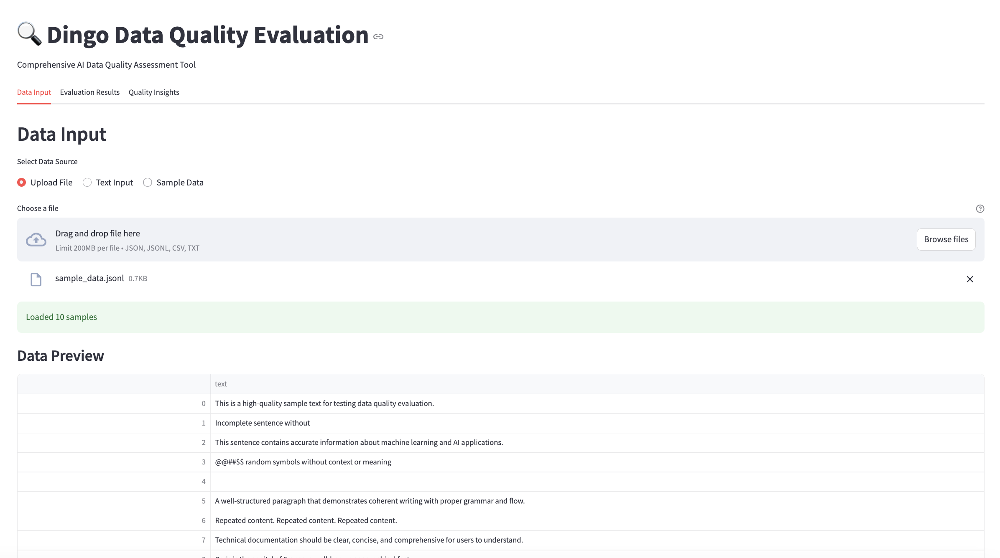
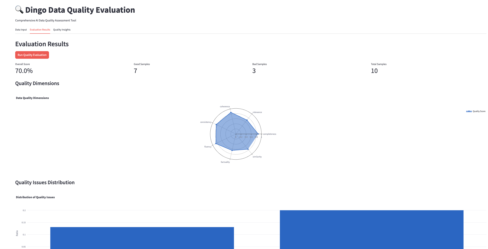
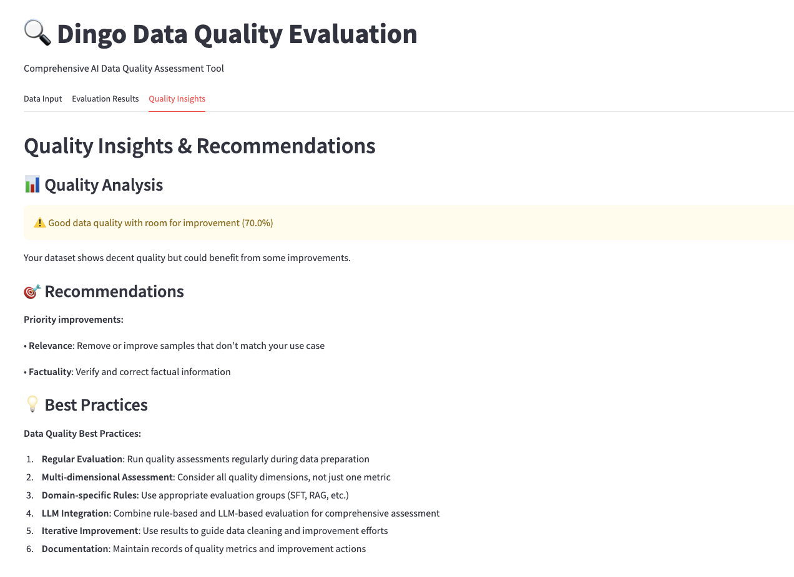

# 🔍 Dingo Data Quality Evaluation

A comprehensive Streamlit application that demonstrates the integration of [Dingo](https://github.com/MigoXLab/dingo) for AI data quality assessment. This tool provides multi-dimensional evaluation of datasets used in machine learning and AI applications.

## 🚀 Quick Start

```bash
cd awesome-llm-apps/rag_tutorials/dingo_data_quality_evaluation

pip install -r requirements.txt

streamlit run dingo_quality_assessment.py
```

## 📸 Application Screenshots

### Main Interface


### Quality Evaluation Results


### Quality Insights Dashboard


## Features

### 🎯 Multi-dimensional Quality Assessment
- **Completeness**: Check for incomplete or truncated content
- **Relevance**: Evaluate content relevance to the intended use case
- **Coherence**: Assess logical flow and structure
- **Consistency**: Verify consistent formatting and style
- **Fluency**: Check language quality and grammar
- **Factuality**: Validate factual accuracy (with LLM integration)
- **Similarity**: Detect duplicate or near-duplicate content

### 🤖 Evaluation Methods
- **Rule-based Evaluation**: 20+ built-in heuristic rules
- **LLM-based Assessment**: Integration with OpenAI, Anthropic, and local models
- **Hallucination Detection**: Specialized detection for RAG systems
- **Custom Rules**: Extensible framework for domain-specific evaluation

### 📊 Evaluation Groups
- **Default**: General text quality evaluation
- **SFT**: Supervised fine-tuning dataset evaluation
- **RAG**: RAG system evaluation with hallucination detection
- **Hallucination**: Specialized hallucination detection
- **Pretrain**: Pre-training dataset evaluation

### 🔧 Data Source Support
- **File Upload**: JSON, JSONL, CSV, TXT formats
- **Text Input**: Direct text input for quick evaluation
- **Sample Data**: Built-in examples for testing


## Usage

### Basic Usage

1. **Run the Streamlit app**:
   ```bash
   streamlit run dingo_quality_assessment.py
   ```

2. **Configure evaluation settings** in the sidebar:
   - Select evaluation group (default, sft, rag, etc.)
   - Choose whether to use LLM-based evaluation
   - If using LLM, select model and provide API key

3. **Input your data**:
   - Upload a file (JSON, JSONL, CSV, TXT)
   - Enter text directly
   - Use sample data for testing

4. **Run evaluation** and view results:
   - Overall quality score
   - Dimensional breakdown
   - Issue distribution
   - Detailed recommendations

### Advanced Usage with Real Dingo

#### 1. Evaluate LLM chat data

```python
from dingo.config.input_args import EvaluatorLLMArgs
from dingo.io.input import Data
from dingo.model.llm.llm_text_quality_model_base import LLMTextQualityModelBase
from dingo.model.rule.rule_common import RuleEnterAndSpace

data = Data(
    data_id='123',
    prompt="hello, introduce the world",
    content="Hello! The world is a vast and diverse place, full of wonders, cultures, and incredible natural beauty."
)


def llm():
    LLMTextQualityModelBase.dynamic_config = EvaluatorLLMArgs(
        key='YOUR_API_KEY',
        api_url='https://api.openai.com/v1/chat/completions',
        model='gpt-4o',
    )
    res = LLMTextQualityModelBase.eval(data)
    print(res)


def rule():
    res = RuleEnterAndSpace().eval(data)
    print(res)
```

#### 2. Evaluate Dataset

```python
from dingo.config import InputArgs
from dingo.exec import Executor

# Evaluate a dataset from Hugging Face
input_data = {
    "input_path": "tatsu-lab/alpaca",  # Dataset from Hugging Face
    "dataset": {
        "source": "hugging_face",
        "format": "plaintext"  # Format: plaintext
    },
    "executor": {
        "eval_group": "sft",  # Rule set for SFT data
        "result_save": {
            "bad": True  # Save evaluation results
        }
    }
}

input_args = InputArgs(**input_data)
executor = Executor.exec_map["local"](input_args)
result = executor.execute()
print(result)
```


## Customization

### Adding Custom Rules

```python
from dingo.model import Model
from dingo.model.rule.base import BaseRule

@Model.rule_register('MY_CUSTOM_RULE', ['default'])
class MyCustomRule(BaseRule):
    """Custom quality rule"""
    
    @classmethod
    def eval(cls, input_data):
        # Your custom evaluation logic
        pass
```

### Custom LLM Integration

```python
from dingo.model import Model
from dingo.model.llm.base_openai import BaseOpenAI

@Model.llm_register('my_custom_model')
class MyCustomModel(BaseOpenAI):
    # Custom model implementation
    pass
```


## About Dingo

Dingo is a comprehensive AI data quality evaluation tool that supports:
- Multi-source and multi-modal data evaluation
- Rule-based and model-based assessment
- Hallucination detection for AI systems
- Integration with various LLM providers
- Extensible framework for custom evaluation

For more information, visit the [Dingo GitHub repository](https://github.com/MigoXLab/dingo).


