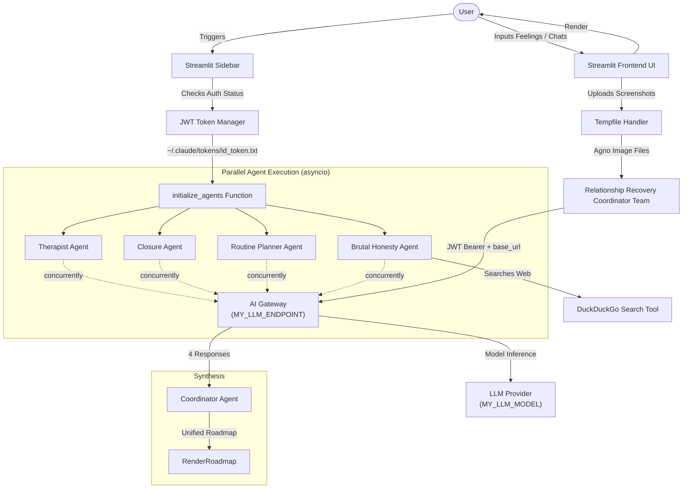

# 🏗️ Breakup Recovery Squad: Code Architecture

The **Breakup Recovery Squad** is designed as a multi-agent application using **Streamlit** for the frontend interface and the **Agno (formerly Phidata)** framework for agent orchestration, powered by **Anthropic's Claude Haiku 4.5** model via **Zuora's AI infrastructure**.

Below is a detailed breakdown of the application layers, components, and data flow.

---

## 🗺️ Architecture Overview Diagram



---

## 📂 Core Architectural Layers

### 1. Frontend & Presentation Layer ([Streamlit](file:///Users/xili/Documents/codes/github/awesome-llm-apps/starter_ai_agents/ai_breakup_recovery_agent/ai_breakup_recovery_agent.py#L83-150))
*   **Zuora Auth Display**: Shows Zuora AI Gateway auth status, token expiry countdown, and troubleshooting help. No manual API key entry—uses cached JWT from `~/.claude/tokens/id_token.txt`.
*   **User Input Panel**: Collects a narrative of the breakup (text field) and optional chat screenshots (multi-file uploader).
*   **Response Renderer**: Groups outputs from individual agents into distinct sections using Markdown for structured formatting.

### 2. Multi-Agent Orchestration Layer ([Agno Framework](file:///Users/xili/Documents/codes/github/awesome-llm-apps/starter_ai_agents/ai_breakup_recovery_agent/ai_breakup_recovery_agent.py#L17-95))
Agno's Team class orchestrates a group of specialist agents sharing a model configuration ([Claude via Zuora](file:///Users/xili/Documents/codes/github/awesome-llm-apps/starter_ai_agents/ai_breakup_recovery_agent/ai_breakup_recovery_agent.py#L42-47)):
*   **Relationship Recovery Coordinator (Team)**: An Agno `Team` instance that manages four specialist agents as `members=`. Routes user input to specialists, collects responses, and synthesizes results into a cohesive recovery roadmap.
*   **Therapist Agent**: Empathetic counselor validating user feelings. Handles visual information (chat screenshot analysis).
*   **Closure Agent**: Focuses on releasing emotions, suggesting closure exercises, and drafting unsent releases.
*   **Routine Planner Agent**: Structured recovery architect proposing self-care steps, social rules, and playlists.
*   **Brutal Honesty Agent**: Objective reality check analyzing errors/opportunities. Uses a search tool to check relationship dynamics or common recovery strategies online.

### 3. AI Infrastructure Layer
*   **JWT Token Management** ([get_jwt_token](file:///Users/xili/Documents/codes/github/awesome-llm-apps/starter_ai_agents/ai_breakup_recovery_agent/ai_breakup_recovery_agent.py#L17-38)): Manages JWT tokens cached locally. Auto-refreshes if expired (24h TTL). Configured via `MY_TOKEN_FILE` and `MY_TOKEN_REFRESH_SCRIPT` env vars.
*   **Claude Model via Gateway** ([Claude + client_params](file:///Users/xili/Documents/codes/github/awesome-llm-apps/starter_ai_agents/ai_breakup_recovery_agent/ai_breakup_recovery_agent.py#L42-47)): Routes requests to configured LLM endpoint (`MY_LLM_ENDPOINT`) with Bearer JWT auth. Uses configured model alias (`MY_LLM_MODEL`).

### 4. Tool & External Services Layer ([DuckDuckGo Search](file:///Users/xili/Documents/codes/github/awesome-llm-apps/starter_ai_agents/ai_breakup_recovery_agent/ai_breakup_recovery_agent.py#L103))
*   Provides web search capability to the Brutal Honesty Agent via `DuckDuckGoTools()` and the underlying python `ddgs` package.

---

## 🔄 Execution & Data Flow

1.  **Token Retrieval**: On app start or user click, [get_jwt_token](file:///Users/xili/Documents/codes/github/awesome-llm-apps/starter_ai_agents/ai_breakup_recovery_agent/ai_breakup_recovery_agent.py#L17) fetches or refreshes JWT from local cache (path from `MY_TOKEN_FILE` env var).
2.  **Agent Initialization**: [initialize_agents](file:///Users/xili/Documents/codes/github/awesome-llm-apps/starter_ai_agents/ai_breakup_recovery_agent/ai_breakup_recovery_agent.py#L40) creates Claude model with configured gateway + Bearer header. Builds 5 standalone agents (4 sub-agents + coordinator) using shared Claude model.
3.  **Screenshot Handling**: If screenshots are uploaded, they are written to a temp folder and wrapped as Agno `Image` objects.
4.  **Parallel Execution**: [get_recovery_roadmap](file:///Users/xili/Documents/codes/github/awesome-llm-apps/starter_ai_agents/ai_breakup_recovery_agent/ai_breakup_recovery_agent.py#L19) uses `asyncio.gather()` to run all 4 sub-agents concurrently. Each agent processes the request per its role. Gateway authenticates each request via JWT Bearer token.
5.  **Synthesis**: Coordinator agent receives all 4 responses as context and synthesizes into a single, cohesive, beautifully-structured recovery roadmap, which is then rendered to Streamlit.

---

## 🏛️ Architectural Decisions

### Multi-Agent Orchestration: Parallel Asyncio vs. Sequential Team LLM

**Decision:** Use standalone agents with `asyncio.gather()` for parallel execution + dedicated coordinator agent for synthesis.

**Rationale:**

| Aspect | Parallel (Chosen) | Team LLM (Previous) |
|--------|-------------------|-------------------|
| **Agent Isolation** | ✅ Full: each agent has own system prompt, role, tools | ✅ Full: identical isolation |
| **Parallelism** | ✅ Parallel: all 4 agents run concurrently | ❌ Sequential: LLM calls agents one-by-one |
| **Response Time** | 🟢 ~4-5s (concurrent + synthesis) | 🟡 ~8-10s (4 sequential calls) |
| **Tool Assignment** | ✅ Honesty Agent only gets DuckDuckGo | ✅ Identical: natural tool isolation |
| **Role Preservation** | ✅ Therapist stays empathetic, Honesty stays blunt | ✅ Identical: roles isolated by system prompt |
| **Cross-Agent Context** | ❌ Agents unaware of each other's responses | ❌ Agents unaware of each other's responses |
| **Token Cost** | ~Same: 4 concurrent reads + 1 synthesis | ~Same: 4 sequential reads + 1 synthesis |
| **LLM Coordination** | ❌ Static: all agents always called | ✅ LLM decides routing via tool-calls |
| **Scalability** | 🟡 threadpool size fixed at 4 | ✅ Easy to add agents: LLM auto-discovers via tools |

**Why Parallel Asyncio chosen over Team LLM:**

1. **Speed**: 4 concurrent agents (~2s each) + synthesis (~2s) = ~4-5s total vs. 8-10s sequential.
2. **Tool isolation**: DuckDuckGo isolated to brutal_honesty_agent at definition time; no LLM decision overhead.
3. **No LLM coordination cost**: Eliminates Team LLM "thought" cycle (~2-3s).
4. **Predictable**: All agents always execute; no skip logic needed.

**Trade-offs accepted:**

- ⚠️ **Less extensible**: Adding a 5th agent requires threadpool size change. Team LLM pattern auto-scales.
- ⚠️ **Higher resource usage**: 4 concurrent API calls vs. sequential. For staging (no rate limits), acceptable.

---

## 📚 Appendix: LLM Tool Calls & Agent Orchestration

### How Agents Execute Multi-Step Workflows

**LLM Tool Calls** are the foundation of agent orchestration. They allow LLMs to invoke external functions in a structured, controlled manner.

#### Tool Call Mechanism

1. **Tool Registration**:
   - Agent/Team lists available tools in system prompt (as JSON schema)
   - Tools include: sub-agents, Toolkits (like DuckDuckGo), MCPs, functions
   - LLM sees tool definitions during initialization

2. **LLM Decision**:
   - LLM reads user prompt + instructions
   - LLM decides which tools to invoke based on reasoning
   - Generates structured JSON: `{"tool": "therapist_agent", "args": {...}}`

3. **Framework Interception**:
   - Agno framework intercepts tool call
   - Validates tool exists and arguments match schema
   - Executes the tool (calls agent, function, or MCP)

4. **Result Feedback**:
   - Tool returns result (text, JSON, etc.)
   - Framework sends result back to LLM
   - LLM sees result, decides next action (call more tools or synthesize)

5. **Loop Until Done**:
   - Process repeats until LLM generates final response
   - LLM may call multiple tools in sequence or parallel

#### Example: Team Orchestration via Tool Calls

When `team_leader.run("I'm heartbroken...")` executes:

```
System Prompt (auto-generated):
  Available Tools:
    - therapist_agent(situation): Empathetic support
    - closure_agent(situation): Emotional release
    - routine_planner_agent(situation): Recovery schedule
    - brutal_honesty_agent(situation): Reality check [has DuckDuckGo tool]

User Input:
  "I broke up after 3 years..."

LLM Reasoning:
  "I need emotional support, reality check, routine, and closure messaging"

Tool Calls (LLM generates):
  1. therapist_agent(situation="I broke up after 3 years...")
     → Returns: "I hear your pain..."
  
  2. brutal_honesty_agent(situation="I broke up after 3 years...")
     → LLM inside agent thinks: "Should search for breakup statistics"
     → Calls: DuckDuckGo.web_search("relationship breakup patterns")
     → Gets: [search results]
     → Returns: "Statistically, 40% of relationships..."
  
  3. routine_planner_agent(situation="I broke up after 3 years...")
     → Returns: "Day 1: Journaling + exercise..."
  
  4. closure_agent(situation="I broke up after 3 years...")
     → Returns: "Letter template: Dear [name]..."

LLM Synthesis:
  Combines all responses into single roadmap:
  "### Your Recovery Plan
   [therapist output]
   [honesty output with DuckDuckGo data]
   [routine output]
   [closure output]"
```

#### Tools in Agno (Universal Pattern)

All three sources inject tools into system prompt identically:

| Source | Example | Conversion |
|--------|---------|-----------|
| **Sub-agents (Team members)** | `members=[therapist_agent, ...]` | Agent metadata → tool schema → system prompt |
| **Toolkits** | `tools=[DuckDuckGoTools()]` | Toolkit methods (web_search, search_news) → tool schema → system prompt |
| **MCPs** | `mcp=[server]` | MCP resources + tools → wrapped as tools → system prompt |

Each becomes a callable tool. LLM sees unified interface.

#### Why Tool Calls Matter

- **Agentic Capability**: Without tools, LLM only generates text. Tools enable **actions**
- **Composition**: Agents coordinate via tools (no manual orchestration)
- **Safety**: Only whitelisted tools can execute (framework controls boundary)
- **Flexibility**: LLM decides tool sequence dynamically based on reasoning
- **Standard Pattern**: Used by LangChain, OpenAI Assistants, Claude API, CrewAI, AutoGen, etc.

#### System Prompt Generation

Agno automatically generates system prompt combining:

1. **Your instructions** (you provide):
   ```
   "You are the Relationship Recovery Coordinator..."
   ```

2. **Auto-generated tool definitions** (Agno injects):
   ```
   Tool: therapist_agent
   Description: Therapist Agent
   Instructions: You are an empathetic therapist...
   Input: situation (str)
   Output: str
   ```

Result: LLM has both strategic instructions + tactical tool list
