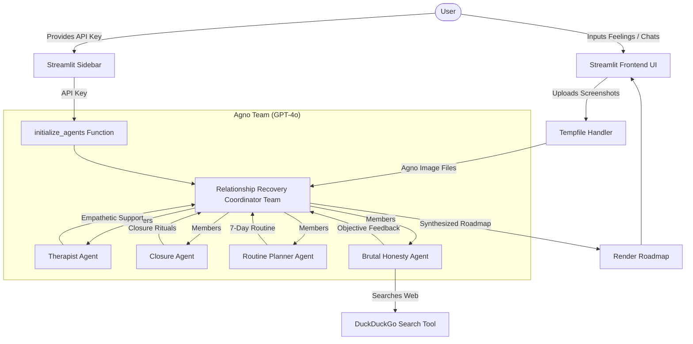

# 🏗️ Breakup Recovery Squad: Code Architecture

The **Breakup Recovery Squad** is designed as a multi-agent application using **Streamlit** for the frontend interface and the **Agno (formerly Phidata)** framework for agent orchestration, powered by **OpenAI's GPT-4o** model.

Below is a detailed breakdown of the application layers, components, and data flow.

---

## 🗺️ Architecture Overview Diagram

---

## 📂 Core Architectural Layers

### 1. Frontend & Presentation Layer ([Streamlit](file:///Users/xili/Documents/codes/github/awesome-llm-apps/starter_ai_agents/ai_breakup_recovery_agent/ai_breakup_recovery_agent.py#L83-150))
*   **Sidebar Config**: Securely takes the OpenAI API key, checks environment variables via `os.environ.get("OPENAI_API_KEY", "")` to auto-populate, and stores it in `st.session_state`.
*   **User Input Panel**: Collects a narrative of the breakup (text field) and optional chat screenshots (multi-file uploader).
*   **Response Renderer**: Groups outputs from individual agents into distinct sections using Markdown for structured formatting.

### 2. Multi-Agent Orchestration Layer ([Agno Framework](file:///Users/xili/Documents/codes/github/awesome-llm-apps/starter_ai_agents/ai_breakup_recovery_agent/ai_breakup_recovery_agent.py#L16-91))
Agno's Team class orchestrates a group of specialist agents sharing a model configuration ([OpenAIChat](file:///Users/xili/Documents/codes/github/awesome-llm-apps/starter_ai_agents/ai_breakup_recovery_agent/ai_breakup_recovery_agent.py#L19)):
*   **Relationship Recovery Coordinator (Team)**: An Agno `Team` instance that manages four specialist agents as `members=`. Routes user input to specialists, collects responses, and synthesizes results into a cohesive recovery roadmap.
*   **Therapist Agent**: Empathetic counselor validating user feelings. Handles visual information (chat screenshot analysis).
*   **Closure Agent**: Focuses on releasing emotions, suggesting closure exercises, and drafting unsent releases.
*   **Routine Planner Agent**: Structured recovery architect proposing self-care steps, social rules, and playlists.
*   **Brutal Honesty Agent**: Objective reality check analyzing errors/opportunities. Uses a search tool to check relationship dynamics or common recovery strategies online.

### 3. Tool & External Services Layer ([DuckDuckGo Search](file:///Users/xili/Documents/codes/github/awesome-llm-apps/starter_ai_agents/ai_breakup_recovery_agent/ai_breakup_recovery_agent.py#L66))
*   Provides web search capability to the Brutal Honesty Agent via `DuckDuckGoTools()` and the underlying python `ddgs` package.

---

## 🔄 Execution & Data Flow

1.  **Initialization**: When the user clicks **"Get Recovery Plan 💝"**, [initialize_agents](file:///Users/xili/Documents/codes/github/awesome-llm-apps/starter_ai_agents/ai_breakup_recovery_agent/ai_breakup_recovery_agent.py#L17) builds an Agno `Team` instance with four specialist agents as members, all using `gpt-4o` as the shared LLM model.
2.  **Screenshot Handling**: If screenshots are uploaded, they are written to a temp folder and wrapped as Agno `Image` objects.
3.  **Single Team Run**: The `team_leader.run(prompt, images=all_images)` method is called once. The Team internally routes the user situation and instructions to its member agents, each agent processes the request per its role, and the Team synthesizes all responses.
4.  **Unified Synthesis**: The Team compiles feedback from all specialists into a single, cohesive, beautifully-structured recovery roadmap and returns it as `response.content`, which is then rendered to Streamlit.
