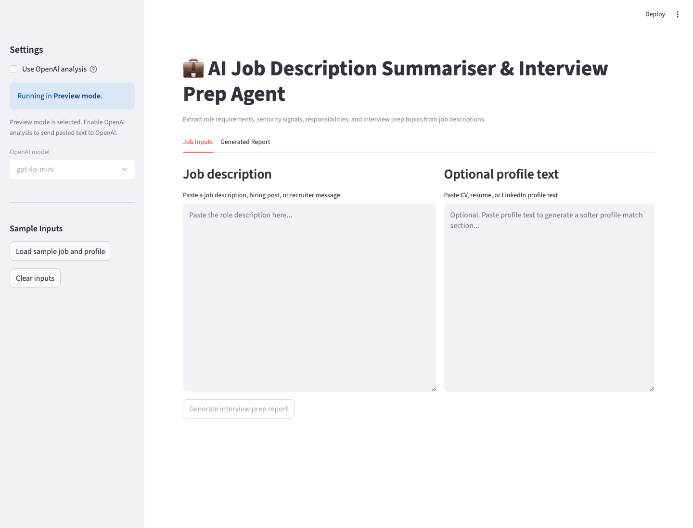

# 💼 AI Job Description Summariser & Interview Prep Agent

This Streamlit app helps candidates turn job descriptions, recruiter messages, and hiring posts into practical interview preparation reports.

It extracts the role requirements, seniority signals, skills, responsibilities, and likely interview topics. If the user adds CV, resume, or LinkedIn text, the app also generates a softer profile match section focused on preparation, not hiring judgement.



## Features

- **Job description summarisation**: Converts long job posts into a concise role snapshot.
- **Skill extraction**: Highlights technical skills, tools, platforms, and soft skills.
- **Seniority classification**: Identifies junior, mid-level, senior, lead, principal, or architect signals.
- **Interview preparation**: Generates likely technical topics, behavioural areas, and prep priorities.
- **Optional profile match**: Compares pasted profile text against the role in a preparation-focused way.
- **Markdown export**: Downloads the generated report as a Markdown file.
- **Preview mode**: Runs a local rule-based preview when `OPENAI_API_KEY` is not set.
- **Safety-first prompting**: Treats pasted job and profile text as untrusted content.
- **Markdown sanitisation**: Removes generated image embeds and raw HTML before display.

## Tech Stack

- **Python**
- **Streamlit**
- **OpenAI API**
- **python-dotenv**

## How To Get Started

1. Clone the repository:

   ```bash
   git clone https://github.com/Shubhamsaboo/awesome-llm-apps.git
   cd awesome-llm-apps/starter_ai_agents/ai_job_description_summariser_agent
   ```

2. Create and activate a virtual environment:

   ```bash
   python -m venv venv
   source venv/bin/activate
   ```

   For Windows:

   ```bash
   python -m venv venv
   .\venv\Scripts\activate
   ```

3. Install dependencies:

   ```bash
   pip install -r requirements.txt
   ```

4. Optionally add your OpenAI API key:

   ```bash
   export OPENAI_API_KEY="your-api-key-here"
   ```

   You can skip this step to use preview mode. Even when a key is configured, the app starts in preview mode and only sends pasted text to OpenAI if you enable **Use OpenAI analysis** in the sidebar.

5. Run the app:

   ```bash
   streamlit run app.py --server.address 127.0.0.1
   ```

6. Open the local Streamlit URL shown in your terminal.

## Example Workflow

1. Paste a job description, hiring post, or recruiter message.
2. Optionally paste CV, resume, or LinkedIn profile text.
3. Click **Generate interview prep report**.
4. Review the generated role summary, requirements, seniority signals, responsibilities, interview topics, and optional profile match.
5. Download the Markdown report for later preparation.

## Sample Data

The `sample_data` folder includes:

- `sample_job_description.txt`
- `sample_profile.txt`

Use **Load sample job and profile** in the sidebar to try the app quickly.

## Notes

- The app is designed for interview preparation and job-description understanding.
- The profile match section should not be treated as a hiring decision, score, or automated screening result.
- The app does not persist submitted job descriptions or profile text.
- In OpenAI mode, pasted job and profile text is sent to OpenAI for analysis.
- OpenAI mode is opt-in from the sidebar, even when `OPENAI_API_KEY` is configured.
- In preview mode, analysis stays local and uses only the text pasted by the user or the bundled synthetic samples.
- Do not paste secrets, private keys, passwords, or sensitive personal data into the app.
- The run command binds Streamlit to `127.0.0.1` so the local demo is not exposed on your network by default.
