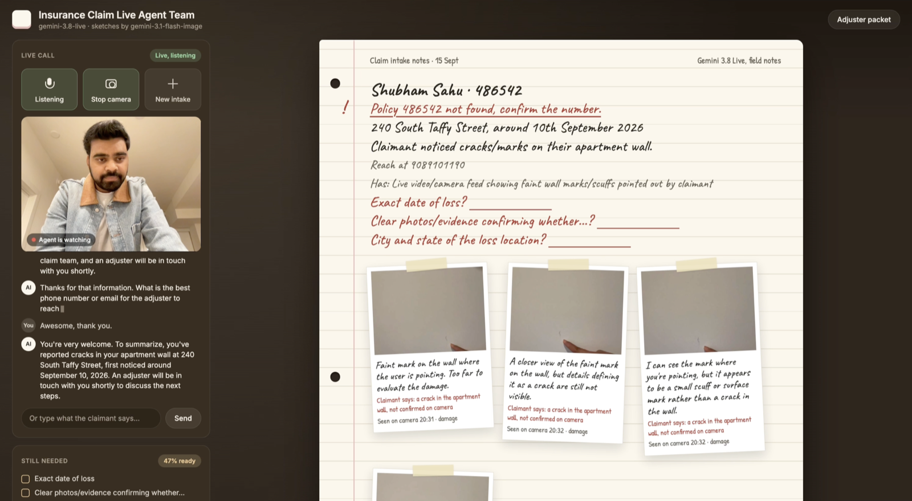

# Insurance Claim Live Agent Team

An insurance claim agent that can talk, listen, see damage through your camera, and draw incident sketches while the conversation continues. Built with Gemini 3.8 Live, with an optional live avatar for synchronized voice and video.

The agent records details in a field notebook, checks mock policy records, and asks for missing information. A background agent team applies intake rules and prepares a downloadable claim packet with notes, captured evidence, and illustrations for human review.



## Features

* **Live conversation:** speak or type, with live transcripts.
* **Optional avatar:** synchronized voice and video, with Kira and Kore as the example pairing.
* **Camera evidence:** captured frames include captions and verification status.
* **Incident sketches:** illustrations based on the claimant's description, updated after corrections.
* **Claim notebook:** extracted facts, missing information, policy checks, and routing.
* **Packet download:** ZIP with Markdown notes, an evidence manifest, captured photos, and sketches.
* **Desktop layout:** call and camera on the left, notes in the middle, transcript and checklist on the right. Mobile stacks the sections.

## Setup

Requires Python 3.12 and a Google API key with access to the configured models.

```bash
cd voice_ai_agents/insurance_claim_live_agent_team
python3.12 -m venv .venv
source .venv/bin/activate
pip install -r requirements.txt
cp .env.example .env
```

Set these values in `.env`:

```dotenv
GOOGLE_GENAI_USE_VERTEXAI=False
GOOGLE_API_KEY=your-google-api-key
```

Start the app:

```bash
python -m uvicorn live_demo.server:app --reload --host 127.0.0.1 --port 4177
```

Open [localhost:4177](http://127.0.0.1:4177/).

* **Talk:** start the voice conversation.
* **Show camera:** share the damage with the agent.
* **Text box:** send a typed turn through the same live session.
* **Adjuster packet:** preview and download the packet.
* **New intake:** clear the current intake and stop its media and background work.

Intake data is stored in memory. Download your packet before restarting or resetting; the app does not submit it to an insurer.

## Optional live avatar

Requires Google Cloud access to Gemini Live and Application Default Credentials. The Python requirements include avatar support.

```bash
gcloud auth application-default login
```

Add to `.env`, then restart the server:

```dotenv
FNOL_AVATAR_NAME=Kira
FNOL_AVATAR_PROJECT=your-project-id
FNOL_AVATAR_LOCATION=us-central1
FNOL_AVATAR_VOICE=Kore
```

* Keep `GOOGLE_API_KEY` and `GOOGLE_GENAI_USE_VERTEXAI=False` for claim processing and sketches.
* Only the avatar connection uses the Cloud project and credentials above.
* Leave both `FNOL_AVATAR_NAME` and `FNOL_AVATAR_IMAGE` unset for voice-only mode.
* Playback requires Media Source Extensions and H.264/AAC support. Unsupported browsers use voice mode.
* If autoplay is blocked, select **Play voice and video**. Decoder failures offer **Continue with voice**.
* Avatar video is separate from the claimant's camera and never counts as evidence.

### Custom appearance

Custom portraits require a Google Cloud project allowlisted for custom avatars.

```dotenv
FNOL_AVATAR_IMAGE=/path/to/your/avatar.png
FNOL_AVATAR_VOICE=Kore
```

* Supply a PNG under 5 MB, at least 704 × 1280 pixels.
* Paths can be absolute or relative to the app directory.
* The image overrides `FNOL_AVATAR_NAME` and also serves as the waiting portrait.
* Stock-avatar clothing cannot be changed through a prompt.

## Configuration

Restart the server after changing `.env`.

| Variable | Default | Purpose |
| --- | --- | --- |
| `FNOL_GEMINI_LIVE_MODEL` | `gemini-3.8-live` | Live conversation and avatar |
| `FNOL_SKETCH_MODEL` | `gemini-3.1-flash-image` | Incident sketches |
| `FNOL_VOICE` | `Kore` | Voice-only responses |
| `FNOL_TRANSCRIPTION_VOCABULARY` | Empty | Comma-separated speech-recognition hints |
| `FNOL_AVATAR_NAME` | Empty | Prebuilt avatar; empty disables it unless an image is set |
| `FNOL_AVATAR_PROJECT` | Empty | Avatar Cloud project |
| `FNOL_AVATAR_LOCATION` | `us-central1` | Avatar API region |
| `FNOL_AVATAR_VOICE` | `Kore` | Avatar voice |
| `FNOL_AVATAR_IMAGE` | Empty | Custom portrait path |

Vocabulary hints are optional, do not establish identity, and do not guarantee spelling. The template includes no personal name overrides or fixed conversation script.

## Camera and sketch behavior

| Input | Behavior |
| --- | --- |
| Camera off, with enough incident detail | Draw an illustration |
| Camera on, showing damage | Capture and independently verify the frame |
| Unclear camera view | Ask for a clearer view |
| Explicit diagram request | Draw in either camera mode |
| Correction to a sketch | Redraw using the corrected details |

* Greetings, vague descriptions, and no-loss inspections do not trigger automatic sketches.
* Generated sketches are illustrations, not photographic evidence.
* Documents described as available are not marked received until captured by the server.

## Try a claim

Use this fictional example with the camera off:

> I'm Maya Singh, policy H0-44721. Our basement flooded when the sump pump failed.
>
> Nobody is hurt. Water entered by the stairs and spread across the carpet toward the boxes.

The agent checks the mock policy, records the facts, asks for missing details, and sketches when it has enough scene information.

### Mock policies

| Policy | Policyholder | Type | Status |
| --- | --- | --- | --- |
| H0-44721 | Maya Singh | Homeowners | Active |
| AUTO-90210 | Jordan Lee | Auto | Active |
| RNT-3008 | Priya Shah | Renters | Active |
| TRV-7711 | Alex Chen | Travel | Active |
| MED-5520 | Sam Rivera | Medical reimbursement | Active |
| AUTO-11111 | Chris Park | Auto | Lapsed |

Unknown, lapsed, mismatched, and out-of-period policies route to human review. These records are examples, not a carrier connection.

## Architecture

| Component | Responsibility |
| --- | --- |
| `agent.py` | ADK graph: normalization, classification, validation, and packet generation |
| `policies.py`, `schemas.py` | Intake rules, routing, and structured data |
| `policy_directory.py` | Mock policy records |
| `live_demo/live_tools.py` | Live configuration, prompts, and tool declarations |
| `live_demo/server.py` | Sessions, WebSocket transport, tools, and downloads |
| `live_demo/app.js` | Conversation, camera input, and notebook updates |
| `live_demo/avatar.js` | Synchronized avatar playback, interruption, and fallback |
| `live_demo/index.html`, `styles.css` | Responsive interface |

* `gemini-3.8-live` handles conversation, camera input, and optional avatar output.
* `gemini-3.8-flash` extracts claim facts and verifies captured photos.
* `gemini-3.1-flash-image` generates sketches.
* Background tools: `lookup_policy`, `sync_claim_packet`, `pin_evidence_photo`, and `draw_incident_sketch`.
* Tools run without blocking conversation. Urgent results can interrupt; other results arrive when idle.
* The claim graph also runs after finalized claimant turns and caches results by claim revision.

## Tests

Run from the app directory. JavaScript tests require Node.js.

```bash
python -m unittest discover -s tests -p 'test_*.py'
node tests/client-regressions.cjs
node tests/avatar-player.cjs
```

Tests cover claim rules, evidence, sessions, transcripts, interruption, avatar playback, and downloads. Model calls and devices are mocked; verify live microphone and camera behavior separately.
